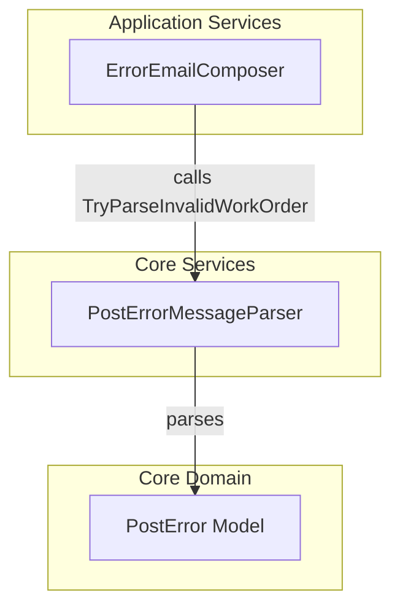

# Post Error Message Parser Feature Documentation

## Overview

The **PostErrorMessageParser** provides a utility for extracting structured data from standardized `PostError` messages emitted by the FSCM posting HTTP client. It specifically targets invalid work order error messages, isolating the work order GUID, number, informational text, and any associated error list.

By converting free-form error text into strongly-typed tuples, this parser enables downstream components—such as email composers—to present clear, machine-readable summaries of validation failures .

## Architecture Overview



This diagram shows how the parser lives in the **Core Services** layer and is invoked by higher-level components in the **Application Services** layer to build user-friendly error reports.

## Component Structure

### Parser Service 🛠️

#### PostErrorMessageParser

**Location:** `src/Rpc.AIS.Accrual.Orchestrator.Application/Deprecated/Services/PostErrorMessageParser.cs`

**Namespace:** `Rpc.AIS.Accrual.Orchestrator.Core.Services`

**Type:** `internal static partial class`

- **Purpose:** Parses `PostError.Message` when `PostError.Code` equals `"FSCM_VALIDATION_FAILED_WO"`.
- **Primary Method:**

| Method | Signature | Description |
| --- | --- | --- |
| `TryParseInvalidWorkOrder` | `bool TryParseInvalidWorkOrder(PostError error, out (string WoNumber, string WorkOrderGuid, string InfoMessage, string Errors) parsed)` | Returns `true` and populates `parsed` if the error message matches the expected pattern; otherwise returns `false`. |


```csharp
internal static bool TryParseInvalidWorkOrder(
    PostError error,
    out (string WoNumber, string WorkOrderGuid, string InfoMessage, string Errors) parsed)
{
    parsed = default;
    if (error is null) return false;
    if (!string.Equals(error.Code, "FSCM_VALIDATION_FAILED_WO", StringComparison.OrdinalIgnoreCase))
        return false;

    var msg = (error.Message ?? string.Empty).Trim();
    if (msg.Length == 0) return false;

    var m = InvalidWoRegex().Match(msg);
    if (!m.Success) return false;

    parsed = (
        WoNumber: m.Groups["wo"].Value.Trim(),
        WorkOrderGuid: m.Groups["guid"].Value.Trim(),
        InfoMessage: m.Groups["info"].Value.Trim(),
        Errors:     m.Groups["errs"].Success ? m.Groups["errs"].Value.Trim() : string.Empty
    );
    return true;
}
```

*Excerpt from source .*

## Regex Pattern

The parser relies on a compile-time generated regex:

```csharp
[GeneratedRegex(
    @"WO validation failed\.\s*WorkOrderGUID=(?<guid>[^,]+),\s*WO Number=(?<wo>[^.]+)\.\s*Info=(?<info>.*?)(?:\s+Errors:\s*(?<errs>.*))?$",
    RegexOptions.CultureInvariant | RegexOptions.Singleline)]
private static partial Regex InvalidWoRegex();
```

- `(?<guid>[^,]+)` captures the work order GUID up to the next comma.
- `(?<wo>[^.]+)` captures the work order number up to the period.
- `(?<info>.*?)` captures the informational text (non-greedy).
- `(?<errs>.*)` optionally captures the remainder of the string (error list).

## Integration Points

- **ErrorEmailComposer** uses this parser to build the "Invalid Work Orders" table in failure notification emails :

```csharp
  if (PostErrorMessageParser.TryParseInvalidWorkOrder(e, out var parsed))
  {
      rows.Add(new InvalidWoRow(
          parsed.WoNumber,
          parsed.WorkOrderGuid,
          parsed.InfoMessage,
          parsed.Errors));
      continue;
  }
```

## Dependencies

- **Domain Model:** `Rpc.AIS.Accrual.Orchestrator.Core.Domain.PostError`
- **Framework:** `System.Text.RegularExpressions` for the generated regex

## Key Classes Reference

| Class | Location | Responsibility |
| --- | --- | --- |
| **PostErrorMessageParser** | src/Rpc.AIS.Accrual.Orchestrator.Application/Deprecated/Services/PostErrorMessageParser.cs | Extracts structured fields from `PostError.Message` for invalid work orders. |


## Error Handling

- Returns `false` (no exception) when:- `error` is `null`
- `error.Code` is not `"FSCM_VALIDATION_FAILED_WO"`
- `error.Message` is empty
- The message fails to match the regex pattern
- Ensures safe, non-throwing behavior for fallback processing.

## Testing Considerations

- **Positive tests**:- Messages matching exactly the pattern, with and without the `Errors:` section.
- Variations in whitespace and casing.
- **Negative tests**:- `null` or empty `PostError`
- `Code` mismatches
- Malformed messages that should not match the regex
- Verify that the `parsed` tuple values are trimmed and correctly assigned.

---

This documentation captures the responsibilities, structure, and usage of the `PostErrorMessageParser` feature without speculating beyond the provided source code.