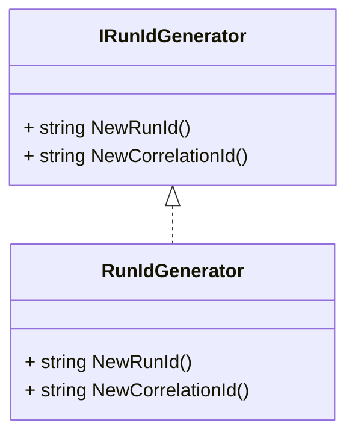

# Run Identifier Generation Feature Documentation 🚀

## Overview

The **Run Identifier Generation** feature provides a simple, consistent way to create unique identifiers for operations and correlate them across distributed components. It generates two types of IDs:

- **Run IDs**: Track the lifecycle of a specific execution or job.
- **Correlation IDs**: Associate related operations, such as HTTP requests and background tasks.

By using compact GUIDs with clear prefixes, this feature enhances observability, logging consistency, and debugging across the orchestration pipeline.

## Architecture Overview



## Component Structure

### 1. Core Abstraction: IRunIdGenerator

- **Location:** `src/Rpc.AIS.Accrual.Orchestrator.Application/Ports/Common/Abstractions/IRunIdGenerator.cs`
- **Purpose:** Defines the contract for generating run and correlation identifiers.
- **Methods:**- `NewRunId() : string`
- `NewCorrelationId() : string`

### 2. Implementation: RunIdGenerator 🔑

| Method | Description |
| --- | --- |
| `NewRunId()` | Returns a run identifier with prefix `RUN-` and a 32-char GUID (no hyphens). |
| `NewCorrelationId()` | Returns a correlation identifier with prefix `CORR-` and a 32-char GUID. |


- **Location:** `src/Rpc.AIS.Accrual.Orchestrator.Application/Deprecated/Services/RunIdGenerator.cs`
- **Purpose:** Provides a GUID-based implementation of `IRunIdGenerator` that produces compact, prefixed IDs.
- **Methods:**

```csharp
public sealed class RunIdGenerator : IRunIdGenerator
{
    public string NewRunId()        => $"RUN-{Guid.NewGuid():N}";
    public string NewCorrelationId() => $"CORR-{Guid.NewGuid():N}";
}
```

## Usage Integration

- **Durable Functions**: In `AccrualOrchestratorFunctions`, new IDs initialize each orchestration run:

```csharp
  var runId = _ids.NewRunId();
  var correlationId = _ids.NewCorrelationId();
```

- **HTTP Endpoints**: Response helpers add these IDs as headers (`x-run-id`, `x-correlation-id`) for traceability in `JobOperationsUseCaseBase`.

## Patterns and Design Decisions

- **Compact GUIDs**: Uses the `N` format specifier to omit hyphens, reducing string length.
- **Prefixing**: Distinguishes run vs. correlation contexts in logs and headers.
- **Sealed Implementation**: Ensures immutability and straightforward dependency injection without subclassing.

## Dependencies

- Rpc.AIS.Accrual.Orchestrator.Core.Abstractions.IRunIdGenerator
- System.Guid for GUID generation

## Key Classes Reference

| Class | Location | Responsibility |
| --- | --- | --- |
| IRunIdGenerator | `src/.../IRunIdGenerator.cs` | Defines the ID generation methods |
| RunIdGenerator | `src/.../RunIdGenerator.cs` | Implements GUID-based ID generation with `RUN-`/`CORR-` prefixes |


## Testing Considerations

- **Prefix Verification**: Ensure returned IDs start with `RUN-` or `CORR-`.
- **GUID Format**: Confirm exactly 36 characters including prefix (4 + 1 + 32).
- **Uniqueness**: Generate multiple IDs in tight loops and assert minimal collisions.

```card
{
    "title": "ID Format",
    "content": "Identifiers use a 32-character GUID without hyphens, prefixed with RUN- or CORR-."
}
```