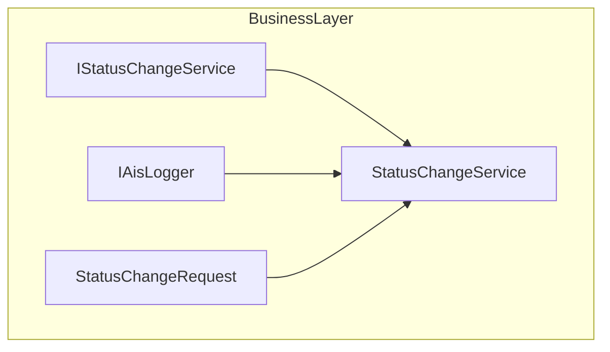

# Status Change Service Feature Documentation

## Overview

The **Status Change Service** centralizes the handling of status change events within the accrual orchestrator. When any component submits a `StatusChangeRequest`, this service logs the event details to the AIS logging infrastructure. It ensures consistent observability for status transitions across different workflows.

Although marked as deprecated and slated for replacement by newer orchestrator patterns, this service remains part of the **Business Layer**, implementing the `IStatusChangeService` contract and leveraging domain-level request data.

## Architecture Overview



## Component Structure

### 2. Business Layer

#### **StatusChangeService** (`src/Rpc.AIS.Accrual.Orchestrator.Application/Deprecated/Services/StatusChangeService.cs`)

- **Purpose**

Handles incoming status change requests by forwarding key details to the AIS logging system.

- **Dependencies**- `IAisLogger` for emitting structured log events

- **Key Method**

| Method | Description | Returns |
| --- | --- | --- |
| `Task HandleAsync(StatusChangeRequest request, CancellationToken ct)` | Validates the request, constructs a log payload, and calls<br/>the AIS logger to record the status change. | `Task` (logging operation) |


- **Sample Code**

```csharp
  public Task HandleAsync(StatusChangeRequest request, CancellationToken ct)
  {
      if (request is null) 
          throw new ArgumentNullException(nameof(request));

      var runId = string.IsNullOrWhiteSpace(request.RunId) ? "RUN-NA" : request.RunId!;
      var step = "StatusChange";
      var data = new
      {
          request.EntityName,
          request.RecordId,
          request.OldStatus,
          request.NewStatus,
          request.CorrelationId,
          request.Message,
          request.Payload
      };

      return _ais.InfoAsync(runId, step, "Status change received.", data, ct);
  }
```

## Data Models

#### **StatusChangeRequest** (`src/Rpc.AIS.Accrual.Orchestrator.Domain/Domain/StatusChangeRequest.cs`)

Carries all necessary details for a status update operation.

| Property | Type | Description |
| --- | --- | --- |
| `EntityName` | `string` | Name of the entity whose status changed. |
| `RecordId` | `string` | Identifier of the specific record. |
| `OldStatus` | `string` | Previous status value. |
| `NewStatus` | `string` | Updated status value. |
| `Message` | `string?` | Optional descriptive message. |
| `RunId` | `string?` | Correlation identifier for the run context. |
| `CorrelationId` | `string?` | Correlation identifier for cross-component tracing. |
| `Payload` | `object?` | Additional contextual data. |


## Integration Points

- **Contract Interface**

Implements `IStatusChangeService`, defined in the core abstractions to decouple callers from the concrete implementation:

```csharp
  public interface IStatusChangeService
  {
      Task HandleAsync(StatusChangeRequest request, CancellationToken ct);
  }
```

- **Logging Infrastructure**

Uses `IAisLogger` to emit structured log entries, ensuring that all status changes are consistently recorded for diagnostics and audit.

## Dependencies

- **IAisLogger** (`Rpc.AIS.Accrual.Orchestrator.Core.Abstractions`)

Provides methods for emitting information, warning, and error logs in a consistent AIS format.

## Testing Considerations

- **Null Validation**- Calling `HandleAsync` with `null` should raise `ArgumentNullException`.
- **RunId Fallback**- If `RunId` is null or empty, the service uses `"RUN-NA"` to avoid losing context in logs.
- **Payload Integrity**- The anonymous `data` object captures all fields of `StatusChangeRequest`; tests should verify correct mapping.

## Key Classes Reference

| Class | Location | Responsibility |
| --- | --- | --- |
| `StatusChangeService` | `.../Application/Deprecated/Services/StatusChangeService.cs` | Implements status change handling and logging. |
| `IStatusChangeService` | `.../Application/Ports/Common/Abstractions/IStatusChangeService.cs` | Defines the contract for status change operations. |
| `StatusChangeRequest` | `.../Domain/Domain/StatusChangeRequest.cs` | Domain record carrying status update data. |
| `IAisLogger` | `.../Application/Ports/Common/Abstractions/IAisLogger.cs` | Abstraction for structured AIS logging. |


---

> ⚠️ **Deprecated Notice** This service resides under the `Deprecated` folder, indicating it will be replaced by a newer orchestration pattern in future releases. Use only for backward compatibility.