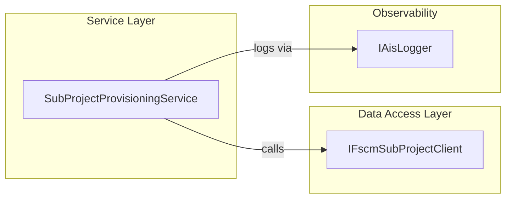

# SubProject Provisioning Service Feature Documentation

## Overview

The **SubProjectProvisioningService** orchestrates creation of FSCM subprojects for individual work orders. It performs:

- **Validation** of incoming requests against mandatory fields.
- **Delegation** to an FSCM client (`IFscmSubProjectClient`) to invoke the external subproject endpoint.
- **Observability** via AIS logging (`IAisLogger`) at each step, including start, validation failures, external call results, cancellations, and unexpected errors.

This service ensures that subproject creation is fail-fast for invalid input and reliably retried for transient failures, fitting into the broader accrual orchestration pipeline by isolating subproject provisioning logic.

## Architecture Overview



## Component Structure

### Business Layer

#### **SubProjectProvisioningService** (`src/Rpc.AIS.Accrual.Orchestrator.Core.Services/SubProjectProvisioningService.cs`)

- **Purpose & Responsibilities**- Validate a `SubProjectCreateRequest`.
- Invoke the FSCM subproject creation client.
- Emit AIS logs for start, validation outcomes, call results, cancellations, and exceptions.

- **Dependencies**- `IFscmSubProjectClient _client`
- `IAisLogger _ais`

- **Methods**

| Method | Description | Returns |
| --- | --- | --- |
| `ProvisionAsync(RunContext context, SubProjectCreateRequest request, CancellationToken ct)` | Orchestrates validation, external call, and logging for subproject creation. | `Task<SubProjectCreateResult>` |
| `Validate(SubProjectCreateRequest request)` | Ensures `DataAreaId`, `ParentProjectId`, and `ProjectName` are present; maps validator errors to `SubProjectError`. | `List<SubProjectError>` |


### Data Access Layer

#### **IFscmSubProjectClient** (`src/Rpc.AIS.Accrual.Orchestrator.Core.Abstractions/IFscmSubProjectClient.cs`)

- **Purpose**

Defines the contract for creating a subproject in FSCM.

- **Method**

```csharp
  Task<SubProjectCreateResult> CreateSubProjectAsync(
      RunContext context,
      SubProjectCreateRequest request,
      CancellationToken ct);
```

### Data Models

#### **SubProjectCreateRequest**

Canonical request model representing the inner `_request` envelope for FSCM.

| Property | Type | Description |
| --- | --- | --- |
| DataAreaId | string | Legal Entity (mandatory) |
| ParentProjectId | string | Parent project identifier (mandatory) |
| ProjectName | string | Subproject name (mandatory) |
| CustomerReference | string? | Optional customer contract reference |
| InvoiceNotes | string? | Optional invoice notes |
| ActualStartDate | string? | Optional actual start date |
| ActualEndDate | string? | Optional actual end date |
| AddressName | string? | Optional billing address name |
| Street | string? | Optional street |
| City | string? | Optional city |
| State | string? | Optional state/province |
| County | string? | Optional county |
| CountryRegionId | string? | Optional country/region ID |
| WellLocale | string? | Optional well locale |
| WellName | string? | Optional well name |
| WellNumber | string? | Optional well number |
| ProjectStatus | int? | FSCM project status (defaulted to 3 if missing) |
| WorkOrderGuid | string? | Optional work order GUID (serialized as `WorkOrderGUID`) |
| IsFsaProject | int? | Optional FSCM flag (serialized as `IsFSAProject`) |
| LegalEntity | object? | Internal: maps to `DataAreaId` |


#### **SubProjectCreateResult**

Result returned by FSCM client, indicating success or detailed errors.

| Property | Type | Description |
| --- | --- | --- |
| IsSuccess | bool | `true` if creation succeeded |
| parmSubProjectId | string? | Created subproject identifier if success |
| Message | string? | Status message |
| Errors | IReadOnlyList<SubProjectError> | List of errors if `IsSuccess == false` |


#### **SubProjectError**

Represents a validation or FSCM error.

| Property | Type | Description |
| --- | --- | --- |
| Code | string | Error code |
| Message | string | Human-readable error message |


## Error Handling

- **Validation Failures**: Returns `SubProjectCreateResult` with `IsSuccess=false` and a list of `SubProjectError`.
- **Cancellation**: Catches `OperationCanceledException` when `ct.IsCancellationRequested`, logs a warning, and rethrows.
- **Unexpected Exceptions**: Catches all other exceptions, logs an error with exception details, and returns a failure result with an `UNHANDLED_EXCEPTION` error.

## Dependencies

- **Core Abstractions**- `IFscmSubProjectClient` (data access contract)
- `IAisLogger` (observability)

- **Domain Models**- `RunContext` (execution metadata)
- `SubProjectCreateRequest`, `SubProjectCreateResult`, `SubProjectError` (request & response)

- **Validation**- `FscmEndpointRequestValidator`, `FscmEndpointType.SubProjectCreate` (centralized field validation)

## Key Classes Reference

| Class | Location | Responsibility |
| --- | --- | --- |
| SubProjectProvisioningService | src/Rpc.AIS.Accrual.Orchestrator.Core.Services/SubProjectProvisioningService.cs | Business orchestration for subproject creation |
| IFscmSubProjectClient | src/Rpc.AIS.Accrual.Orchestrator.Core.Abstractions/IFscmSubProjectClient.cs | Defines FSCM subproject creation contract |
| SubProjectCreateRequest | src/Rpc.AIS.Accrual.Orchestrator.Core.Domain/Domain/SubProjectModels.cs | Input model for subproject creation |
| SubProjectCreateResult | src/Rpc.AIS.Accrual.Orchestrator.Core.Domain/Domain/SubProjectModels.cs | Output model for subproject creation |
| SubProjectError | src/Rpc.AIS.Accrual.Orchestrator.Core.Domain/Domain/SubProjectModels.cs | Error details for failures |
| IAisLogger | Rpc.AIS.Accrual.Orchestrator.Core.Abstractions | Logging interface for AIS observability |
| FscmEndpointRequestValidator | Rpc.AIS.Accrual.Orchestrator.Core.Services.Validation | Validates request fields against contract rules |


## Testing Considerations

- **Validation Tests**: Missing `DataAreaId`, `ParentProjectId`, or `ProjectName` yields appropriate `SubProjectError`.
- **Happy Path**: Valid request leads to a successful call to `IFscmSubProjectClient` and `IsSuccess=true`.
- **Client Error Path**: FSCM returns errors, service logs `ErrorAsync` and returns failure result.
- **Cancellation**: Simulate `CancellationToken` to ensure `OperationCanceledException` is logged and propagated.
- **Unhandled Exceptions**: Force client or validator to throw unexpected exception; verify `SubProjectCreateResult` contains `UNHANDLED_EXCEPTION`.