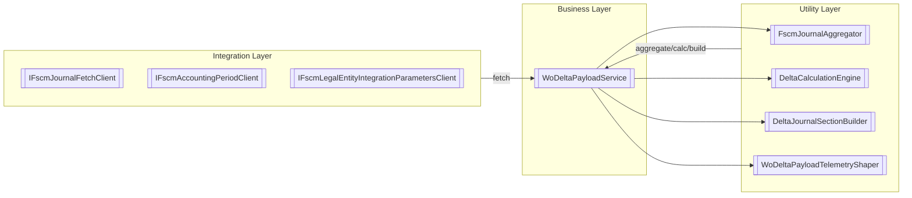
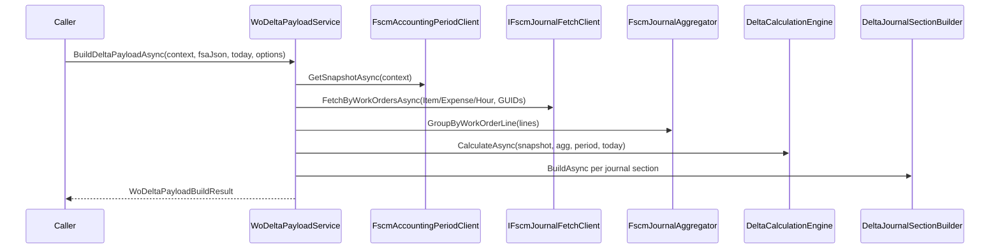

# WoDeltaPayloadService Feature Documentation

## Overview

The **WoDeltaPayloadService** orchestrates the creation of Δ (delta) payloads that reconcile Field Service application snapshots (FSA) with FSCM journal history. Given an incoming FSA JSON payload, it:

- Parses and optionally deactivates all lines (cancel-to-zero scenarios).
- Fetches FSCM Item/Expense/Hour lines in batched OData calls.
- Aggregates and groups lines per work-order line (via **FscmJournalAggregator**).
- Calculates delta changes (additions, reversals, recreations) with **DeltaCalculationEngine**.
- Builds the final JSON payload, injecting headers and journal sections.
- Emits rich telemetry for summary and body snippets.

This service ensures accurate, auditable synchronization between Field Service and FSCM systems in both batch and single-order modes.

## Architecture Overview

## Component Structure

### 1. Business Layer

#### **WoDeltaPayloadService** (`src/Rpc.AIS.Accrual.Orchestrator.Application/Deprecated/Services/WoDeltaPayloadService.cs`)

- **Purpose**: Drives the end-to-end Δ payload pipeline.
- **Responsibilities**:- Input validation and JSON parsing.
- “Cancel to zero” mode to force full reversals.
- Batched fetch of FSCM history lines by journal type.
- Grouping and aggregation of lines per work-order line.
- Delta calculation and JSON assembly.
- Telemetry logging of summaries and optional payload bodies.
- **Key Methods**:- `BuildDeltaPayloadAsync(RunContext context, string fsaWoPayloadJson, DateTime todayUtc, CancellationToken ct)`
- `BuildDeltaPayloadAsync(RunContext context, string fsaWoPayloadJson, DateTime todayUtc, WoDeltaBuildOptions options, CancellationToken ct)`
- `BuildDeltaPayloadInternalAsync(...)` (core orchestration)

### 2. Integration Layer

- **IFscmJournalFetchClient**: Retrieves Item/Expense/Hour journal lines for given work-order GUIDs.
- **IFscmAccountingPeriodClient**: Supplies current FSCM accounting period snapshot.
- **IFscmLegalEntityIntegrationParametersClient**: Provides FSCM journal name identifiers per legal entity.

### 3. Utility Layer

- **FscmJournalAggregator**: Groups raw journal lines into per-line aggregations for delta logic.
- **DeltaCalculationEngine**: Applies business rules to decide delta actions: no change, quantity delta, reverse & recreate, or reverse only.
- **DeltaJournalSectionBuilder**: Builds JSON objects for `WOItemLines`, `WOExpLines`, and `WOHourLines`.
- **WoDeltaPayloadTelemetryShaper**: Logs payload summaries and chunks to AIS telemetry.

## Data Models

#### WoDeltaPayloadBuildResult

Captures Δ build outcome.

| Property | Type | Description |
| --- | --- | --- |
| DeltaPayloadJson | string | Outbound Δ payload JSON. |
| WorkOrdersInInput | int | Count of WOs in incoming FSA payload. |
| WorkOrdersInOutput | int | Count of WOs producing Δ lines in output. |
| TotalDeltaLines | int | Total lines added or changed. |
| TotalReverseLines | int | Lines emitted as reversals. |
| TotalRecreateLines | int | Lines recreated with updated attributes. |

#### WoDeltaBuildOptions

Configures Δ build.

| Property | Type | Description |
| --- | --- | --- |
| BaselineSubProjectId | string? | Optional SubProjectId to scope FSCM history for baseline comparison. |
| TargetMode | WoDeltaTargetMode | Normal Δ semantics or force full reversals (CancelToZero). |

#### WoDeltaTargetMode

| Value | Description |
| --- | --- |
| Normal (0) | Standard Δ logic: additions/reversals based on changes. |
| CancelToZero (1) | Treat all lines inactive to produce full reversal payload. |

#### RunContext

| Property | Type | Description |
| --- | --- | --- |
| RunId | string | Unique run identifier. |
| StartedAtUtc | DateTimeOffset | Run start timestamp. |
| TriggeredBy | string? | Origin trigger (e.g., Timer, HTTP). |
| CorrelationId | string | For distributed tracing. |
| SourceSystem | string? | Optional source system tag. |
| DataAreaId | string? | Optional data-area (legal entity). |

## Feature Flow

## Error Handling

- **ArgumentNullException** for null dependencies or `context`.
- **ArgumentException** if `fsaWoPayloadJson` is empty.
- **InvalidOperationException** if JSON parsing fails.
- Emits AIS warnings for missing GUIDs or empty Δ lines.

## Integration Points

- Calls FSCM OData services for journal history.
- Leverages AIS telemetry via `IAisLogger` and `IAisDiagnosticsOptions`.
- Supports “cancel to zero” reversal scenarios without altering existing aggregator logic.

## Dependencies

- **System.Text.Json** and **JsonNode** APIs.
- Core services: `FscmJournalAggregator`, `DeltaCalculationEngine`.
- Logging: `IAisLogger`, `WoDeltaPayloadTelemetryShaper`.
- Integration clients: `IFscmJournalFetchClient`, `IFscmAccountingPeriodClient`, `IFscmLegalEntityIntegrationParametersClient`.

## Key Classes Reference

| Class | Location | Responsibility |
| --- | --- | --- |
| WoDeltaPayloadService | Deprecated/Services/WoDeltaPayloadService.cs | Main orchestration of Δ payload build. |
| FscmJournalFetchClient | Infrastructure/Clients/FscmJournalFetchHttpClient.cs | Fetches FSCM journal lines via OData. |
| IFscmAccountingPeriodClient | Core/Abstractions/IClients | Retrieves current FSCM period. |
| FscmJournalAggregator | Core/Domain/Delta/FscmJournalAggregator.cs | Aggregates raw lines for Δ evaluation. |
| DeltaCalculationEngine | Core/Domain/Delta/DeltaCalculationEngine.cs | Applies Δ decision logic per line. |
| DeltaJournalSectionBuilder | Core/Services/DeltaJournalSectionBuilder.cs | Builds JSON journal sections. |
| WoDeltaPayloadTelemetryShaper | Core/Services/WoDeltaPayloadTelemetryShaper.cs | Logs payload summaries and chunks. |
| WoDeltaBuildOptions | Core/Abstractions/IWoDeltaPayloadServiceV2.cs | Δ build options record. |
| WoDeltaPayloadBuildResult | Core/Abstractions/IWoDeltaPayloadService.cs | Δ build result record. |
| RunContext | Core/Domain/RunContext.cs | Carries run metadata for telemetry. |
