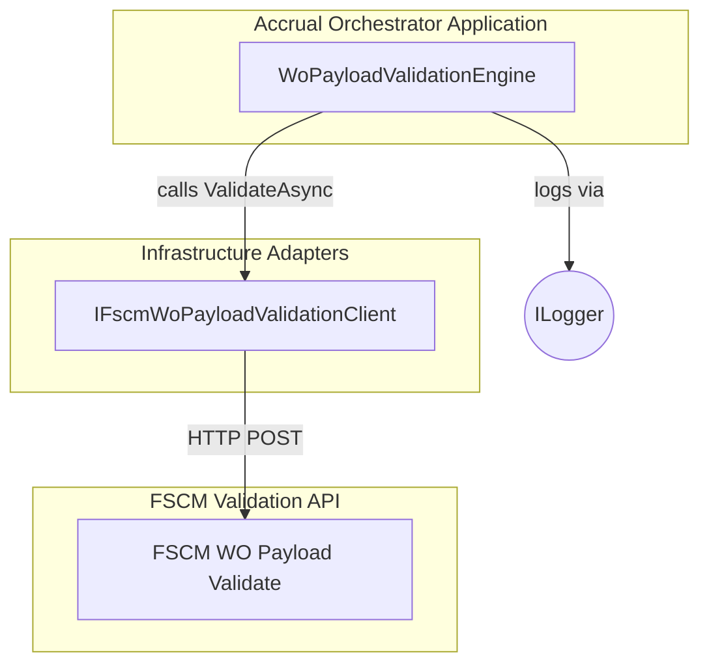

# WO Payload Validation Engine Documentation

## Overview

The **WoPayloadValidationEngine** orchestrates remote validation of normalized Work Order (WO) payloads against an external FSCM validation API. It ensures that invalid payloads never proceed downstream by enforcing a *fail-closed* strategy on transport errors and header-level failures, while filtering valid work orders for posting.

By integrating with the `IFscmWoPayloadValidationClient`, this engine:

- Counts work orders before and after validation
- Logs key events and failures
- Returns a `WoPayloadValidationResult` containing filtered JSON, failure details, and work-order counts

This component lives in the **Business Layer** of the Accrual Orchestrator and depends on domain models (`RunContext`, `JournalType`, `WoPayloadValidationResult`, `WoPayloadValidationFailure`) and the FSCM client interface.

## Architecture Overview



## Component Structure

### **WoPayloadValidationEngine**

**Location:** `src/Rpc.AIS.Accrual.Orchestrator.Application/Deprecated/Services/WoPayloadValidationEngine.cs`

**Purpose & Responsibilities:**

- Invoke FSCM custom validation on a normalized WO JSON payload
- Implement **fail-closed** on transport or header-level invalid failures
- Filter and count work orders before and after validation
- Emit structured logs for tracing and diagnostics

#### Public Methods

| Method | Signature | Description | Returns |
| --- | --- | --- | --- |
| **ValidateAndFilterAsync** | `Task<WoPayloadValidationResult> ValidateAndFilterAsync(RunContext ctx, JournalType journalType, string normalizedWoPayloadJson, CancellationToken ct)` | Execute remote validation, handle failure modes, and produce a filtered payload result. | `WoPayloadValidationResult` |


```csharp
// Example usage
var result = await engine.ValidateAndFilterAsync(
    runContext,
    JournalType.Item,
    normalizedWoPayloadJson,
    cancellationToken);
```

#### Private Helpers

| Method | Signature | Description |
| --- | --- | --- |
| **CountWorkOrders** | `int CountWorkOrders(string? payloadJson)` | Parses JSON, locates `_request.WOList`, and returns the array length or 0 on error. |
| **TryGetProperty** | `bool TryGetProperty(JsonElement root, string name, out JsonElement value)` | Case-insensitive lookup for a JSON property; returns `false` if not found. |


## Dependencies

- **IFscmWoPayloadValidationClient**

Provides `ValidateAsync(...)` to call the FSCM validation endpoint.

- **ILogger<WoPayloadValidationEngine>**

Captures structured logs at **Error** and **Warning** levels.

- **Domain Models**- `RunContext` (run metadata)
- `JournalType` (enum)
- `WoPayloadValidationResult` (outcome container)
- `WoPayloadValidationFailure` (individual failure details)

## Logging & Error Handling

1. **Transport Failures (Fail-Closed)**

```text
   ERR: FSCM custom validation call failed. StatusCode={StatusCode} Url={Url}
```

Returns `workOrdersAfter = 0` and preserves the input payload.

1. **Blocking Header-Level Invalid**

```text
   WARN: FSCM custom validation returned blocking Invalid failures (header-level). WorkOrdersBefore={Before} WorkOrdersAfter=0 FailureCount={FailureCount}
```

Drops entire payload (`filteredPayloadJson = "{}"`).

1. **Line-Level Failures**

Logs each failure:

```text
   WARN: FSCM validation failure. Code={Code} Message={Message} Disposition={Disposition}
```

Does **not** drop entire work orders; only filters invalid lines via the returned JSON.

## Domain Model: WoPayloadValidationResult

| Property | Type | Description |
| --- | --- | --- |
| `FilteredPayloadJson` | `string` | JSON containing only valid work orders (or `"{}"` on failures) |
| `Failures` | `IReadOnlyList<WoPayloadValidationFailure>` | All failures reported by FSCM or an empty list |
| `WorkOrdersBefore` | `int` | Count of WOs in the input JSON |
| `WorkOrdersAfter` | `int` | Count of WOs in `FilteredPayloadJson` |


## Summary

The **WoPayloadValidationEngine** ensures robust, deterministic handling of Work Order payloads by delegating detailed contract checks to FSCM, enforcing strict fail-closed semantics, and providing clear logging and metrics on validation outcomes. 🚀