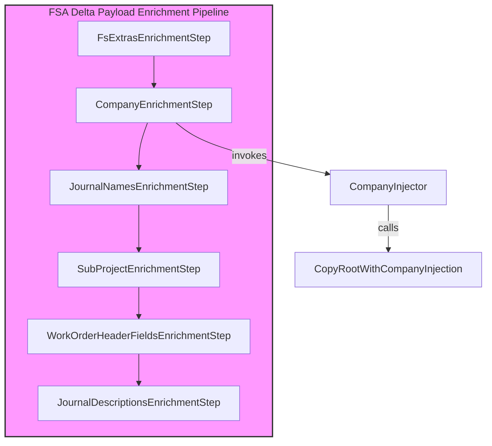
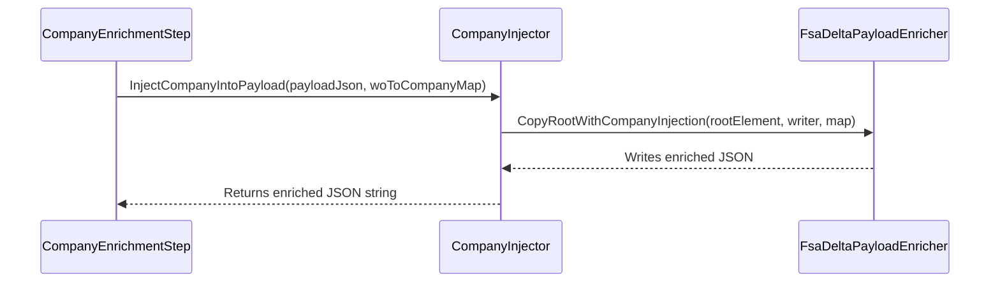

# Company Injector Feature Documentation

## Overview

The **Company Injector** enriches outbound FSA delta payloads by inserting the appropriate company name into each work order entry. 🏢 It reads a JSON payload, locates work orders under the `_request` section, and adds or overrides the `Company` field based on a provided mapping from work order GUID to company name.

This enrichment is part of a larger **FSA Delta Payload Enrichment Pipeline**, sitting immediately after FS line extras injection. It ensures downstream systems (e.g., ERP or reporting services) receive complete work order data with explicit company information.

## Architecture Overview



## Component Structure

### CompanyInjector Class (`…/Enrichment/CompanyInjector.cs`)

**Implements:** `ICompanyInjector`

**Responsibilities:**

- Validate the input mapping dictionary.
- Parse the incoming JSON payload.
- Delegate tree traversal and injection logic to `FsaDeltaPayloadEnricher.CopyRootWithCompanyInjection`.
- Return the enriched JSON as a string.

#### Constructor & Method

| Member | Type | Description |
| --- | --- | --- |
| ⚙️ **CompanyInjector**(ILogger log) | — | Initializes the injector. Throws if `log` is null. |
| **InjectCompanyIntoPayload**(string payloadJson, IReadOnlyDictionary<Guid, string> woIdToCompanyName) | string | Enriches payload JSON with company names; returns updated JSON. |


```csharp
using System;
using System.Collections.Generic;
using System.IO;
using System.Text.Json;
using Microsoft.Extensions.Logging;

internal sealed class CompanyInjector : ICompanyInjector
{
    private readonly ILogger _log;

    public CompanyInjector(ILogger log)
        => _log = log ?? throw new ArgumentNullException(nameof(log));

    public string InjectCompanyIntoPayload(
        string payloadJson,
        IReadOnlyDictionary<Guid, string> woIdToCompanyName)
    {
        if (woIdToCompanyName is null || woIdToCompanyName.Count == 0)
            return payloadJson;

        using var input = JsonDocument.Parse(payloadJson);
        using var ms = new MemoryStream();
        using var w = new Utf8JsonWriter(ms);

        FsaDeltaPayloadEnricher.CopyRootWithCompanyInjection(
            input.RootElement,
            w,
            woIdToCompanyName);

        w.Flush();
        return System.Text.Encoding.UTF8.GetString(ms.ToArray());
    }
}
```

### ICompanyInjector Interface (`…/Enrichment/ICompanyInjector.cs`)

Defines the contract for payload enrichment by company:

| Method | Signature |
| --- | --- |
| InjectCompanyIntoPayload | `string InjectCompanyIntoPayload(string payloadJson, IReadOnlyDictionary<Guid, string> woIdToCompanyName);` |


## Usage Flow



## Dependencies

- **System.Text.Json**: JSON parsing and writing.
- **Microsoft.Extensions.Logging**: Logging abstraction.
- **Rpc.AIS.Accrual.Orchestrator.Core.Services.FsaDeltaPayload**: Houses the static injection helper `CopyRootWithCompanyInjection`.

## Card: Key Note

```card
{
    "title": "Injection Skipped",
    "content": "If the mapping dictionary is null or empty, the original payload is returned unchanged."
}
```

## Class Reference

| Class | Location | Responsibility |
| --- | --- | --- |
| CompanyInjector | src/Rpc.AIS.Accrual.Orchestrator.Application/Features/Delta/FsaDeltaPayload/Services/Enrichment/CompanyInjector.cs | Inserts company names into the FSA delta payload. |
| ICompanyInjector | src/Rpc.AIS.Accrual.Orchestrator.Application/Features/Delta/FsaDeltaPayload/Services/Enrichment/ICompanyInjector.cs | Contract for company injection enrichment. |


## Logging Behavior

- Although `CompanyInjector` accepts an `ILogger`, it does **not** emit logs during normal operation.
- Errors (e.g., malformed JSON) will propagate exceptions; consuming orchestration code may catch and log them as needed.