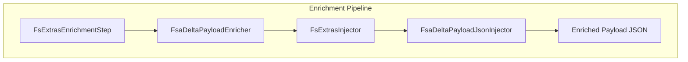
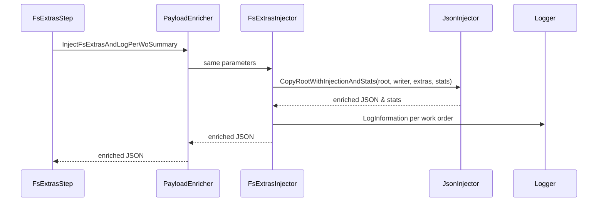

# FsExtras Injection Feature Documentation

## Overview

The FsExtras injection service enriches outbound FSA delta payloads with Field Service (FS) line‐level extras. It parses the existing JSON, fills missing fields such as currency, site, warehouse, worker number, line number, and operations date based on `FsLineExtras`, and then reserializes the payload.

After enrichment, the service logs a per‐work‐order summary containing counts of enriched lines and injected fields. This ensures downstream consumers receive complete data while providing operational visibility via structured log entries.

## Architecture Overview



## Component Structure

### FsExtrasInjector Class (`src/Rpc.AIS.Accrual.Orchestrator.Application/Features/Delta/FsaDeltaPayload/Services/Enrichment/FsExtrasInjector.cs`)

- **Purpose**: Inject Field Service extras into the delta payload JSON and emit enrichment statistics.
- **Responsibilities**:- Parse the incoming JSON payload.
- Populate missing FS fields using the provided `FsLineExtras`.
- Collect per‐work‐order enrichment statistics.
- Log a summary entry for each work order.

#### Properties

- **_log**

Type: `ILogger`

Logger instance for writing information‐level summaries.

#### Methods

##### InjectFsExtrasAndLogPerWoSummary

```csharp
public string InjectFsExtrasAndLogPerWoSummary(
    string payloadJson,
    IReadOnlyDictionary<Guid, FsLineExtras> extrasByLineGuid,
    string runId,
    string corr)
```

- **Parameters**:

| Parameter | Type | Description |
| --- | --- | --- |
| `payloadJson` | `string` | Original FSA delta JSON payload |
| `extrasByLineGuid` | `IReadOnlyDictionary<Guid, FsLineExtras>` | Map of FS line GUIDs to extra enrichment data |
| `runId` | `string` | Unique identifier for this execution run |
| `corr` | `string` | Correlation ID for distributed tracing/logging |


- **Returns**: `string` — The enriched JSON payload.

- **Behavior**:1. Parse `payloadJson` into a `JsonDocument`.
2. Convert `extrasByLineGuid` to a concrete `Dictionary<Guid, FsLineExtras>` if needed.
3. Call `FsaDeltaPayloadJsonInjector.CopyRootWithInjectionAndStats`, passing in the JSON root, writer, extras dictionary, and an initially empty stats list.
4. Serialize the enriched JSON from the `Utf8JsonWriter`.
5. Iterate over collected `WoEnrichmentStats` and log an information‐level summary for each work order.
6. Return the enriched JSON string.

- **Code Snippet**:

```csharp
  public string InjectFsExtrasAndLogPerWoSummary(
      string payloadJson,
      IReadOnlyDictionary<Guid, FsLineExtras> extrasByLineGuid,
      string runId,
      string corr)
  {
      using var input = JsonDocument.Parse(payloadJson);
      var stats = new List<WoEnrichmentStats>();
      var extrasDict = extrasByLineGuid as Dictionary<Guid, FsLineExtras>
                       ?? new Dictionary<Guid, FsLineExtras>(extrasByLineGuid);

      using var ms = new MemoryStream();
      using var w = new Utf8JsonWriter(ms);

      FsaDeltaPayloadJsonInjector.CopyRootWithInjectionAndStats(
          input.RootElement, w, extrasDict, stats);
      w.Flush();

      var updated = System.Text.Encoding.UTF8.GetString(ms.ToArray());

      foreach (var s in stats)
      {
          _log.LogInformation(
              "WO Enrichment Summary " +
              "WorkorderGUID={WorkorderGuid} WorkorderID={WorkorderId} Company={Company} " +
              "EnrichedLinesTotal={Total} Hour={Hour} Expense={Expense} Item={Item} " +
              "Currency={Currency} ResourceId={ResourceId} Warehouse={Warehouse} " +
              "Site={Site} LineNum={LineNum} OperationsDate={OperationsDate}",
              s.WorkorderGuidRaw, s.WorkorderId, s.Company,
              s.EnrichedLinesTotal, s.EnrichedHourLines,
              s.EnrichedExpLines, s.EnrichedItemLines,
              s.FilledCurrency, s.FilledResourceId,
              s.FilledWarehouse, s.FilledSite,
              s.FilledLineNum, s.FilledOperationsDate);
      }

      return updated;
  }
```

## Processing Flow



## Logging Details

Each `WoEnrichmentStats` instance produces a structured log entry with:

| Property | Description |
| --- | --- |
| **WorkorderGuidRaw** | Raw GUID text of the work order line |
| **WorkorderId** | Identifier of the work order |
| **Company** | Company name associated with the work order |
| **EnrichedLinesTotal** | Total number of journal lines processed |
| **EnrichedHourLines** | Number of hour lines enriched |
| **EnrichedExpLines** | Number of expense lines enriched |
| **EnrichedItemLines** | Number of item lines enriched |
| **FilledCurrency** | Count of injected currency fields |
| **FilledResourceId** | Count of injected resource IDs |
| **FilledWarehouse** | Count of injected warehouse fields |
| **FilledSite** | Count of injected site fields |
| **FilledLineNum** | Count of injected line-number fields |
| **FilledOperationsDate** | Count of injected operations date fields |


## Dependencies

- `System.Text.Json` / `System.Text.Json.Nodes`
- `Microsoft.Extensions.Logging`
- `Rpc.AIS.Accrual.Orchestrator.Core.Services.FsaDeltaPayload.FsaDeltaPayloadJsonInjector`
- Domain types:- `FsLineExtras`
- `WoEnrichmentStats`

## Integration Points

- **FsExtrasEnrichmentStep**

Invokes `FsExtrasInjector.InjectFsExtrasAndLogPerWoSummary` as step order = 100 in the enrichment pipeline.

- **FsaDeltaPayloadEnricher**

Exposes the injector via its `InjectFsExtrasAndLogPerWoSummary` method.

- **FsaDeltaPayloadJsonInjector**

Contains the low-level logic for traversing and rewriting the JSON document.

## Testing Considerations

- **No Extras Provided**- Input: empty or null `extrasByLineGuid`.
- Expectation: returns original `payloadJson` unchanged; no logging.

- **Valid Extras Mapping**- Input: `extrasByLineGuid` contains entries matching line GUIDs in the payload.
- Expectation: missing fields are populated; `LogInformation` called once per work order with correct statistics.

- **Partial Enrichment**- Input: some extras have only subset of fields.
- Expectation: only available fields are injected; stats reflect counts accurately.

## Key Classes Reference

| Class | Location | Responsibility |
| --- | --- | --- |
| `FsExtrasInjector` | `.../Features/Delta/FsaDeltaPayload/Services/Enrichment/FsExtrasInjector.cs` | Injects FS line extras into JSON and logs work order stats |
| `FsaDeltaPayloadJsonInjector` | `.../Services/FsaDeltaPayload/Json/FsaDeltaPayloadJsonInjector.cs` | Provides JSON copy & injection routines with enrichment stats |
| `FsExtrasEnrichmentStep` | `.../Services/EnrichmentPipeline/Steps/FsExtrasEnrichmentStep.cs` | Pipeline step that triggers FS extras injection |
| `FsaDeltaPayloadEnricher` | `.../FsaDeltaPayloadEnricher.cs` | Orchestrates all enrichment injectors |
| `WoEnrichmentStats` | Defined within `FsaDeltaPayloadJsonInjector.cs` | Holds per‐work order enrichment metrics |
