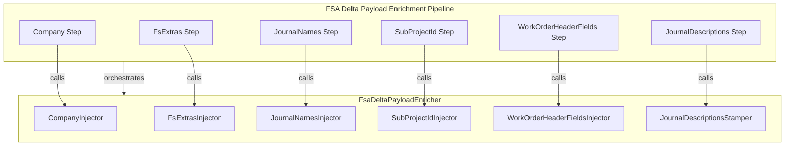
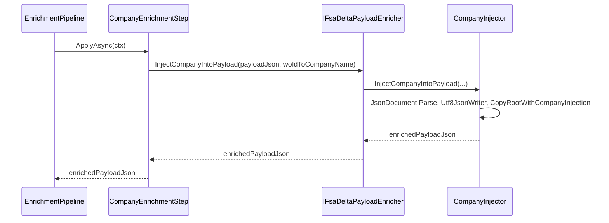

# Company Injector Feature Documentation

## Overview

The Company Injector enriches outbound FSA delta payloads by injecting company names into each work order entry. It uses a mapping of work order GUIDs to company names, ensuring that each work order in the JSON payload carries the correct **Company** field. This enrichment runs as one step in the delta payload pipeline, improving data fidelity before dispatch to downstream systems.

By centralizing company injection in a dedicated service and pipeline step, the application maintains separation of concerns and testability. The original payload is left unchanged when no mapping is provided, avoiding unnecessary overhead.

## Architecture Overview



## Component Structure

### Interfaces

#### **ICompanyInjector** (`src/Rpc.AIS.Accrual.Orchestrator.Application/Features/Delta/FsaDeltaPayload/Services/Enrichment/ICompanyInjector.cs`)

Defines the contract for injecting company names into the outbound payload JSON.

```csharp
internal interface ICompanyInjector
{
    string InjectCompanyIntoPayload(
        string payloadJson,
        IReadOnlyDictionary<Guid, string> woIdToCompanyName);
}
```

- **InjectCompanyIntoPayload**:- **Inputs**:- `payloadJson`: the original JSON payload as a string
- `woIdToCompanyName`: mapping from work order GUID to company name
- **Returns**: enriched JSON string with **Company** values injected where missing

### Implementations

#### **CompanyInjector** (`src/Rpc.AIS.Accrual.Orchestrator.Core.Services.FsaDeltaPayload.Enrichment/CompanyInjector.cs`)

Concrete implementation of `ICompanyInjector` that rewrites the JSON payload using `Utf8JsonWriter`.

- **Constructor**

```csharp
  public CompanyInjector(ILogger log)
      => _log = log ?? throw new ArgumentNullException(nameof(log));
```

Throws if the provided `ILogger` is null.

- **InjectCompanyIntoPayload**

```csharp
  public string InjectCompanyIntoPayload(
      string payloadJson,
      IReadOnlyDictionary<Guid, string> woIdToCompanyName)
  {
      if (woIdToCompanyName is null || woIdToCompanyName.Count == 0)
          return payloadJson;

      using var input = JsonDocument.Parse(payloadJson);
      using var ms = new MemoryStream();
      using var w = new Utf8JsonWriter(ms);

      FsaDeltaPayloadEnricher.CopyRootWithCompanyInjection(
          input.RootElement, w, woIdToCompanyName);

      w.Flush();
      return Encoding.UTF8.GetString(ms.ToArray());
  }
```

- Skips processing when the mapping is null or empty.
- Parses the input JSON, delegates to `FsaDeltaPayloadEnricher.CopyRootWithCompanyInjection` for the transformation, and returns the updated payload.

### Pipeline Step

#### **CompanyEnrichmentStep** (`src/Rpc.AIS.Accrual.Orchestrator.Application.Features.Delta.FsaDeltaPayload.Services.EnrichmentPipeline.Steps/CompanyEnrichmentStep.cs`)

Orchestrates the company injection within the enrichment pipeline.

- **Properties**- `Name`: `"Company"`
- `Order`: `200`

- **ApplyAsync**

```csharp
  public Task<string> ApplyAsync(EnrichmentContext ctx, CancellationToken ct)
  {
      if (ctx.WoIdToCompanyName is null || ctx.WoIdToCompanyName.Count == 0)
          return Task.FromResult(ctx.PayloadJson);

      var updated = _enricher.InjectCompanyIntoPayload(
          ctx.PayloadJson,
          ctx.WoIdToCompanyName);

      return Task.FromResult(updated);
  }
```

- Uses the context’s `WoIdToCompanyName` map to perform injection only when mappings exist.

## Sequence Diagram

### Company Injection Flow



## Integration Points

- Included in `DefaultFsaDeltaPayloadEnrichmentPipeline` via dependency injection as the **Company** step.
- Relies on static JSON-copy helpers in `FsaDeltaPayloadEnricher` for low-level traversal and mutation.

## Key Classes Reference

| Class | Location | Responsibility |
| --- | --- | --- |
| **ICompanyInjector** | `.../Services/Enrichment/ICompanyInjector.cs` | Contract for company-field injection into payload JSON |
| **CompanyInjector** | `.../Services/Enrichment/CompanyInjector.cs` | Implements JSON rewriting logic to set **Company** values |
| **CompanyEnrichmentStep** | `.../EnrichmentPipeline/Steps/CompanyEnrichmentStep.cs` | Pipeline step invoking company injection in the enrichment flow |


## Error Handling

- The **CompanyInjector** constructor throws `ArgumentNullException` if `ILogger` is null, ensuring logging availability.
- `InjectCompanyIntoPayload` returns the original payload unchanged when the mapping dictionary is null or empty.

## Dependencies

- **System.Text.Json**: parsing and writing JSON (`JsonDocument`, `Utf8JsonWriter`).
- **Microsoft.Extensions.Logging**: logging dependencies injected into the service.
- **FsaDeltaPayloadEnricher**: static helpers performing the actual traversal and property injection.

## Testing Considerations

- Validate that an empty or null `woIdToCompanyName` yields the original JSON payload.
- Test injection for payloads with and without existing **Company** fields.
- Cover scenarios with missing `_request` or `WOList` sections to ensure graceful pass-through.