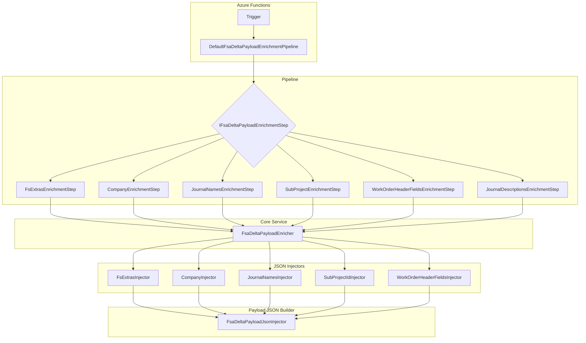

# FSA Delta Payload Enrichment Feature Documentation

## Overview

This feature enriches outbound Field Service Accelerator (FSA) delta payloads with additional contextual data before they’re dispatched to downstream systems. It injects:

- **Line-level extras** (e.g. currency, resource, warehouse, site, line numbers, operations date) and logs per-workorder summaries
- **Company names**, **SubProjectId**, **Journal names**, and **WorkOrder header fields**

By layering discrete enrichment steps into a deterministic pipeline, it ensures payloads carry all required metadata for accurate processing and auditing.

## Architecture Overview



## Component Structure

### 1. Service Layer

This layer defines interfaces and implementations that perform JSON transformations and logging.

#### **IFsExtrasInjector** (`src/Rpc.AIS.Accrual.Orchestrator.Application/Features/Delta/FsaDeltaPayload/Services/Enrichment/IFsExtrasInjector.cs`)

- 🎯 **Purpose:** Contract for enriching a delta payload with file-system line extras and logging a summary per workorder.
- 🛠️ **Method:**

| Method | Description | Parameters | Returns |
| --- | --- | --- | --- |
| `InjectFsExtrasAndLogPerWoSummary` | Injects line-level extras into `payloadJson` and logs per-WO statistics. | `string payloadJson`<br>`IReadOnlyDictionary<Guid, FsLineExtras> extrasByLineGuid`<br>`string runId`<br>`string corr` | `string` |


#### **FsExtrasInjector** (`.../FsExtrasInjector.cs`)

- Implements `IFsExtrasInjector`.
- **Workflow:**1. Parse `payloadJson` into `JsonDocument`.
2. Convert `IReadOnlyDictionary` to `Dictionary<Guid, FsLineExtras>`.
3. Use `FsaDeltaPayloadJsonInjector.CopyRootWithInjectionAndStats` to emit enriched JSON into a `MemoryStream`.
4. Deserialize enriched bytes back to `string`.
5. Iterate collected `WoEnrichmentStats` and write structured logs via `ILogger`.

#### **ICompanyInjector** & **CompanyInjector** (`.../CompanyInjector.cs`)

- 🎯 **Purpose:** Injects **Company** name into each workorder in the payload.
- Returns original JSON if the `woIdToCompanyName` map is null or empty.
- Uses `FsaDeltaPayloadEnricher.CopyRootWithCompanyInjection`.

#### **ISubProjectIdInjector** & **SubProjectIdInjector** (`.../SubProjectIdInjector.cs`)

- 🎯 **Purpose:** Injects **SubProjectId** into workorder headers.
- Preserves existing values; appends the property if missing.
- Leverages `FsaDeltaPayloadEnricher.CopyRootWithSubProjectIdInjection`.

#### **IWorkOrderHeaderFieldsInjector** & **WorkOrderHeaderFieldsInjector** (`.../WorkOrderHeaderFieldsInjector.cs`)

- 🎯 **Purpose:** Injects additional **WorkOrder header fields** (`WoHeaderMappingFields`) fetched from Dataverse.
- Not used in delta calculations; adds metadata for mapping-only fields.

#### **IJournalNamesInjector** & **JournalNamesInjector** (`.../JournalNamesInjector.cs`)

- 🎯 **Purpose:** Adds **JournalName** entries to journal lines based on legal-entity settings (`LegalEntityJournalNames`).
- Uses `FsaDeltaPayloadEnricher.CopyRootWithJournalNamesInjection`.

#### **IFsaDeltaPayloadEnricher** & **FsaDeltaPayloadEnricher** (`.../FsaDeltaPayloadEnricher.cs`)

- 🎯 **Purpose:** Central orchestrator that composes all individual injectors.
- **Injected Components:**- `FsExtrasInjector`
- `SubProjectIdInjector`
- `WorkOrderHeaderFieldsInjector`
- `JournalNamesInjector`
- `JournalDescriptionsStamper`
- `CompanyInjector`
- **Exposed Methods:**- `InjectFsExtrasAndLogPerWoSummary(...)`
- `InjectCompanyIntoPayload(...)`
- `InjectSubProjectIdIntoPayload(...)`
- `InjectWorkOrderHeaderFieldsIntoPayload(...)`
- `InjectJournalNamesIntoPayload(...)`
- `StampJournalDescriptionsIntoPayload(...)`

### 2. Enrichment Pipeline

Defines ordered, injectable steps that apply each enrichment concern.

#### **IFsaDeltaPayloadEnrichmentStep**

- **Responsibility:** Apply exactly one enrichment concern.
- **Signature:**

```csharp
  public interface IFsaDeltaPayloadEnrichmentStep
  {
      string Name { get; }
      int Order { get; }
      Task<string> ApplyAsync(EnrichmentContext ctx, CancellationToken ct);
  }
```

#### **Enrichment Steps**

| Step Class | Name | Order | Action |
| --- | --- | --- | --- |
| `FsExtrasEnrichmentStep` | FsExtras | 100 | Calls `InjectFsExtrasAndLogPerWoSummary` |
| `CompanyEnrichmentStep` | Company | 200 | Calls `InjectCompanyIntoPayload` |
| `JournalNamesEnrichmentStep` | JournalNames | 300 | Calls `InjectJournalNamesIntoPayload` |
| `SubProjectEnrichmentStep` | SubProjectId | 400 | Calls `InjectSubProjectIdIntoPayload` |
| `WorkOrderHeaderFieldsEnrichmentStep` | WorkOrderHeaderFields | 500 | Calls `InjectWorkOrderHeaderFieldsIntoPayload` |
| `JournalDescriptionsEnrichmentStep` | JournalDescriptions | 600 | Calls `StampJournalDescriptionsIntoPayload` |


#### **DefaultFsaDeltaPayloadEnrichmentPipeline** (`.../DefaultFsaDeltaPayloadEnrichmentPipeline.cs`)

- Orders all registered `IFsaDeltaPayloadEnrichmentStep` by `Order`,`Name`.
- Applies them sequentially, logging payload length before/after each step.

#### **EnrichmentContext** (`.../EnrichmentContext.cs`)

- Immutable record bundling:- `PayloadJson`, `RunId`, `CorrelationId`, `Action`
- Dictionaries: `ExtrasByLineGuid`, `WoIdToCompanyName`, `JournalNamesByCompany`, `WoIdToSubProjectId`, `WoIdToHeaderFields`

## Key Classes Reference

| Class | Location | Responsibility |
| --- | --- | --- |
| **IFsExtrasInjector** | `Services/Enrichment/IFsExtrasInjector.cs` | Contract for FS extras injection and logging |
| **FsExtrasInjector** | `Services/Enrichment/FsExtrasInjector.cs` | Implements extras injection, JSON transformation, and per-WO logging |
| **ICompanyInjector** / **CompanyInjector** | `Services/Enrichment/CompanyInjector.cs` | Injects company names into payload |
| **ISubProjectIdInjector** / **SubProjectIdInjector** | `Services/Enrichment/SubProjectIdInjector.cs` | Injects sub-project IDs |
| **IWorkOrderHeaderFieldsInjector** / **WorkOrderHeaderFieldsInjector** | `Services/Enrichment/WorkOrderHeaderFieldsInjector.cs` | Injects workorder header mapping fields |
| **IJournalNamesInjector** / **JournalNamesInjector** | `Services/Enrichment/JournalNamesInjector.cs` | Adds journal names |
| **IFsaDeltaPayloadEnricher** / **FsaDeltaPayloadEnricher** | `Services/FsaDeltaPayloadEnricher.cs` | Orchestrates all injectors and exposes enrichment API |
| **IFsaDeltaPayloadEnrichmentStep** | `Services/EnrichmentPipeline/IFsaDeltaPayloadEnrichmentStep.cs` | Defines one enrichment step |
| **DefaultFsaDeltaPayloadEnrichmentPipeline** | `Services/EnrichmentPipeline/DefaultFsaDeltaPayloadEnrichmentPipeline.cs` | Executes enrichment steps in deterministic order |
| **EnrichmentContext** | `Services/EnrichmentPipeline/EnrichmentContext.cs` | Carries the payload and all auxiliary enrichment data |


## Dependencies

- **System.Text.Json** (`JsonDocument`, `Utf8JsonWriter`)
- **Microsoft.Extensions.Logging** (`ILogger`)
- **Rpc.AIS.Accrual.Orchestrator.Core.Services.FsaDeltaPayload** (domain types: `FsLineExtras`, `WoHeaderMappingFields`, `LegalEntityJournalNames`)
- **.NET Collections** (`Dictionary`, `IReadOnlyDictionary`, `List`)

## Error Handling

- All injectors’ constructors throw `ArgumentNullException` if `ILogger` is null.
- If any mapping dictionary is null or empty, the injector immediately returns the original payload unchanged.
- JSON parsing/writing relies on well-formed input; malformed JSON will surface `JsonException`.

## Testing Considerations

- **Unit tests** should feed minimal valid JSON and mapping dictionaries to each injector.
- Assert that:- No changes occur when mappings are empty.
- Correct fields are injected when mappings contain values.
- Existing values are preserved if already present.
- **Mock ILogger** to verify that `FsExtrasInjector` logs the expected `WoEnrichmentStats` entries.