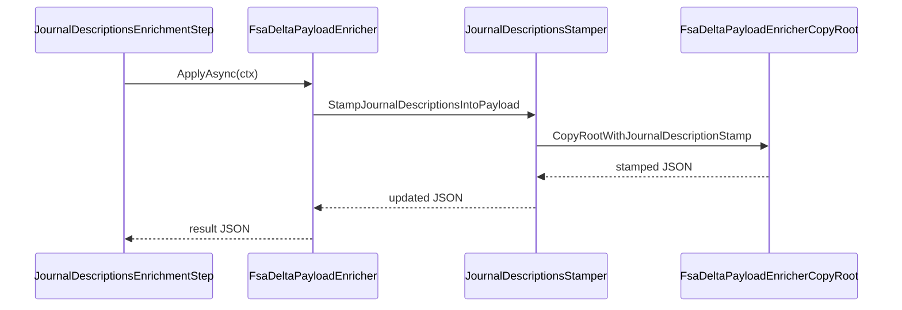

# JournalDescriptionsStamper Interface Documentation

## Overview

The **IJournalDescriptionsStamper** interface defines a contract for recomputing and injecting human-readable descriptions into the JSON payload used by the FSA→FSCM delta orchestrator.

By stamping both the `JournalDescription` at the journal header level and `JournalLineDescription` at each line, it ensures consistency and clarity when posting or reversing journals in downstream FSCM services.

This stamping step executes **after** all other payload enrichments (company, sub-project, journal names, etc.) and **before** journal validation, creation, and posting.

## Interface Definition

### IJournalDescriptionsStamper

**Path:** `src/Rpc.AIS.Accrual.Orchestrator.Application/Features/Delta/FsaDeltaPayload/Services/Enrichment/IJournalDescriptionsStamper.cs`

```csharp
namespace Rpc.AIS.Accrual.Orchestrator.Core.Services.FsaDeltaPayload.Enrichment;

internal interface IJournalDescriptionsStamper
{
    string StampJournalDescriptionsIntoPayload(string payloadJson, string action);
}
```

- **StampJournalDescriptionsIntoPayload**- **Description:** Recomputes and injects `JournalDescription` and `JournalLineDescription` values based on the final WorkOrder header values and the specified action (e.g., Post, Reverse).
- **Parameters:**- `payloadJson` (string): Original delta payload JSON.
- `action` (string): Action name stamped into descriptions.
- **Returns:**- `string`: Updated JSON payload with stamped descriptions.

## Implementation

### JournalDescriptionsStamper

**Path:** `…/Enrichment/JournalDescriptionsStamper.cs`

Implements `IJournalDescriptionsStamper` by:

- Defaulting a blank or whitespace `action` to `"Post"`.
- Parsing the input JSON document.
- Invoking the static copier `FsaDeltaPayloadEnricher.CopyRootWithJournalDescriptionStamp` to traverse `_request`, journals, and lines, stamping descriptions.
- Writing the modified JSON back to a UTF-8 string.

```csharp
internal sealed class JournalDescriptionsStamper : IJournalDescriptionsStamper
{
    private readonly ILogger _log;

    public JournalDescriptionsStamper(ILogger log)
        => _log = log ?? throw new ArgumentNullException(nameof(log));

    public string StampJournalDescriptionsIntoPayload(string payloadJson, string action)
    {
        if (string.IsNullOrWhiteSpace(action))
            action = "Post";

        using var input = JsonDocument.Parse(payloadJson);
        using var ms = new MemoryStream();
        using var w = new Utf8JsonWriter(ms);

        FsaDeltaPayloadEnricher.CopyRootWithJournalDescriptionStamp(input.RootElement, w, action.Trim());
        w.Flush();

        return Encoding.UTF8.GetString(ms.ToArray());
    }
}
```

## Integration

- **Composition in Enricher:**

`FsaDeltaPayloadEnricher` holds an `IJournalDescriptionsStamper` and delegates stamping to it when its own `StampJournalDescriptionsIntoPayload` is called:

```csharp
  _journalDescriptions = new JournalDescriptionsStamper(_log);
```

- **Enrichment Pipeline Step:**

`JournalDescriptionsEnrichmentStep` (Order 600) invokes the stamper as part of the enrichment pipeline:

```csharp
  if (string.IsNullOrWhiteSpace(ctx.Action))
      return Task.FromResult(ctx.PayloadJson);

  var updated = _enricher.StampJournalDescriptionsIntoPayload(ctx.PayloadJson, ctx.Action);
```

## Sequence Flow



## Dependencies

- **System.Text.Json**: JSON parsing (`JsonDocument`) and writing (`Utf8JsonWriter`).
- **Microsoft.Extensions.Logging**: Optional logging within the stamper.
- **FsaDeltaPayloadEnricher.CopyRootWithJournalDescriptionStamp**: Static copier utility for stamping logic.

## Testing Considerations

- Verify defaulting of empty `action` to `"Post"`.
- Ensure existing non-empty `JournalLineDescription` values are preserved.
- Confirm new `JournalDescription` and `JournalLineDescription` appear when missing or blank.
- Edge cases: payload without `_request` object is returned unchanged.
- Unit tests should mock the `ILogger` to focus on JSON transformation outcomes.

```card
{
    "title": "Key Behavior",
    "content": "Empty action defaults to \"Post\" and existing non-blank line descriptions are preserved."
}
```