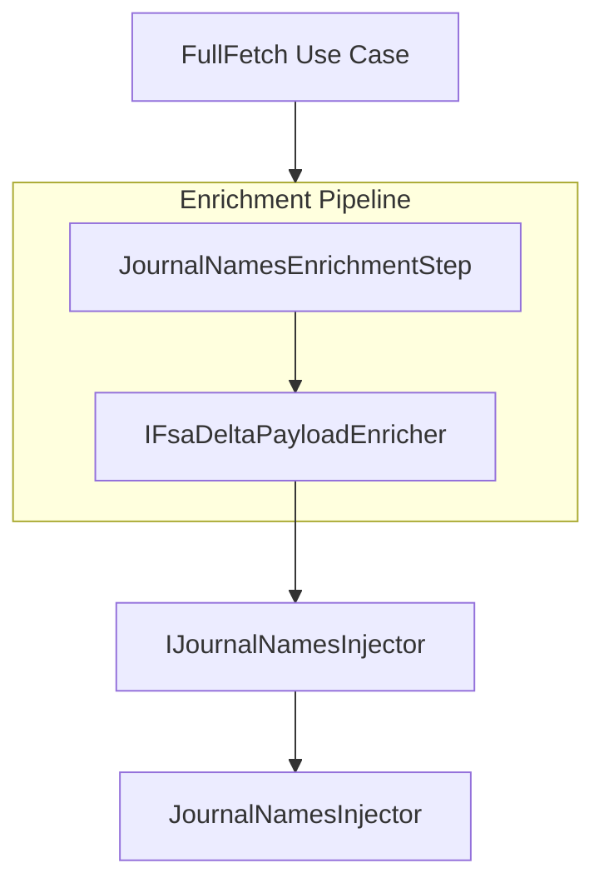

# Journal Names Injector Interface Documentation

## Overview

The **IJournalNamesInjector** interface defines a contract for enriching outbound FSA delta payloads with the correct journal names per legal entity. This ensures each Work Order’s Item, Expense, and Hour journal sections carry the FSCM-configured identifiers when sending data downstream. By abstracting this concern, the interface promotes a clean, testable enrichment pipeline that can evolve independently of JSON parsing details.

## Architecture Overview



## Interface Definition

### IJournalNamesInjector

*src/Rpc.AIS.Accrual.Orchestrator.Application/Features/Delta/FsaDeltaPayload/Services/Enrichment/IJournalNamesInjector.cs*

- **Namespace:** `Rpc.AIS.Accrual.Orchestrator.Core.Services.FsaDeltaPayload.Enrichment`
- **Responsibility:** Add journal names to the JSON payload based on per-company settings.

| Method | Description | Returns |
| --- | --- | --- |
| InjectJournalNamesIntoPayload | Injects FSCM journal name IDs into each journal section of the payload JSON. | `string` |


```csharp
string InjectJournalNamesIntoPayload(
    string payloadJson,
    IReadOnlyDictionary<string, LegalEntityJournalNames> journalNamesByCompany);
```

## Implementation

### JournalNamesInjector ☑️

*src/Rpc.AIS.Accrual.Orchestrator.Core.Services.FsaDeltaPayload.Enrichment/JournalNamesInjector.cs*

- **Implements:** `IJournalNamesInjector`
- **Dependencies:**- `ILogger` for logging enrichment details.
- Static JSON helper `FsaDeltaPayloadEnricher.CopyRootWithJournalNamesInjection`.

**Behavior:**

1. If the provided `journalNamesByCompany` map is `null` or empty, returns the original JSON untouched.
2. Parses the input `payloadJson` into a `JsonDocument`.
3. Creates a new JSON stream via `Utf8JsonWriter`.
4. Calls into the core enricher to copy every node, injecting or overwriting each journal section’s `JournalName` property.
5. Returns the resulting JSON string.

```csharp
public string InjectJournalNamesIntoPayload(
    string payloadJson,
    IReadOnlyDictionary<string, LegalEntityJournalNames> journalNamesByCompany)
{
    if (journalNamesByCompany is null || journalNamesByCompany.Count == 0)
        return payloadJson;

    using var input = JsonDocument.Parse(payloadJson);
    using var ms = new MemoryStream();
    using var w = new Utf8JsonWriter(ms);

    FsaDeltaPayloadEnricher.CopyRootWithJournalNamesInjection(
        input.RootElement,
        w,
        journalNamesByCompany);

    w.Flush();
    return Encoding.UTF8.GetString(ms.ToArray());
}
```

## Enrichment Pipeline Usage

The **JournalNamesEnrichmentStep** is registered as step **300** in the FSA delta payload pipeline. It checks the `EnrichmentContext` for a non-empty journal map and then delegates to the `InjectJournalNamesIntoPayload` method.

```csharp
if (ctx.JournalNamesByCompany is null || ctx.JournalNamesByCompany.Count == 0)
    return Task.FromResult(ctx.PayloadJson);

var updated = _enricher.InjectJournalNamesIntoPayload(
    ctx.PayloadJson,
    ctx.JournalNamesByCompany);

return Task.FromResult(updated);
```

## Related Domain Model

### LegalEntityJournalNames

*src/Rpc.AIS.Accrual.Orchestrator.Core.Domain/LegalEntityJournalNames.cs*

Holds configured journal identifiers per FSCM legal entity.

| Property | Type | Description |
| --- | --- | --- |
| ExpenseJournalNameId | `string?` | Expense journal identifier |
| HourJournalNameId | `string?` | Hour journal identifier |
| InventJournalNameId | `string?` | Item (inventory) journal identifier |


```csharp
public sealed record LegalEntityJournalNames(
    string? ExpenseJournalNameId,
    string? HourJournalNameId,
    string? InventJournalNameId);
```

## Dependencies

- **System.Text.Json** for JSON parsing and writing
- **Microsoft.Extensions.Logging** for structured logging
- **Rpc.AIS.Accrual.Orchestrator.Core.Domain** for `LegalEntityJournalNames`

## Key Classes Reference

| Class | Location | Responsibility |
| --- | --- | --- |
| **IJournalNamesInjector** | `.../Services/Enrichment/IJournalNamesInjector.cs` | Defines the journal-name injection contract |
| **JournalNamesInjector** | `.../Services/Enrichment/JournalNamesInjector.cs` | Concrete JSON injector using core enrichment |
