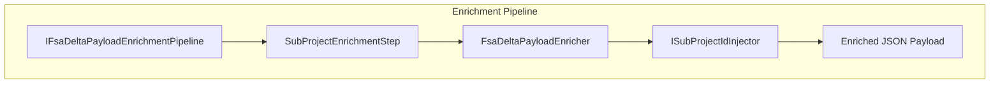
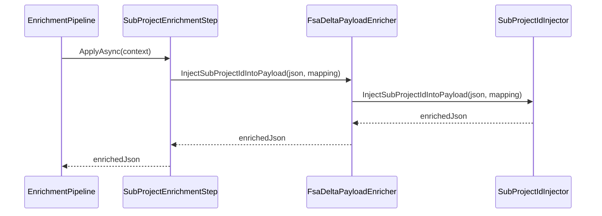

# SubProjectId Injection Feature Documentation

## Overview

The **SubProjectId injection** feature ensures that every work order in the outbound FSA delta payload includes its corresponding subproject identifier. By enriching the JSON payload with this field, downstream systems—such as the FSCM journal posting logic—can correctly associate lines with the right subprojects. This improves data accuracy and traceability across the end-to-end accrual orchestration.

This feature plugs into the existing enrichment pipeline, applying only when a non-empty mapping of work order GUIDs to subproject IDs is supplied. If no mapping is provided, the payload remains unchanged.

## Architecture Overview



## Component Structure

### Enrichment Layer

#### **ISubProjectIdInjector**

`src/Rpc.AIS.Accrual.Orchestrator.Application/Features/Delta/FsaDeltaPayload/Services/Enrichment/ISubProjectIdInjector.cs`

- **Purpose:** Define a contract for injecting subproject IDs into an FSA delta payload JSON.
- **Accessibility:** `internal` within the Core.Services assembly
- **Dependencies:**- `System`
- `System.Collections.Generic`

##### Method

| Method | Description | Returns |
| --- | --- | --- |
| InjectSubProjectIdIntoPayload | Injects or overrides the `SubProjectId` property on each work order element using a GUID→string map. | string |


**Signature:**

```csharp
string InjectSubProjectIdIntoPayload(
    string payloadJson,
    IReadOnlyDictionary<Guid, string> woIdToSubProjectId
);
```

### Implementation and Wiring

- **Implementation:**

The interface is implemented by `SubProjectIdInjector`, which:

- Parses the input JSON via `JsonDocument`.
- Uses `FsaDeltaPayloadEnricher.CopyRootWithSubProjectIdInjection` to traverse and modify the payload.
- Writes the enriched JSON back to a UTF-8 string.

- **Composition:**

`FsaDeltaPayloadEnricher` composes the injector in its constructor and exposes a façade method `InjectSubProjectIdIntoPayload(...)` that delegates to the internal injector.

- **Pipeline Step:**

`SubProjectEnrichmentStep` (Order 400) retrieves the mapping from `EnrichmentContext.WoIdToSubProjectId`. If non-empty, it calls into the enricher to apply the injection.

## Usage Flow



1. **Pipeline** invokes **SubProjectEnrichmentStep**.
2. The step checks for a valid mapping.
3. It calls **FsaDeltaPayloadEnricher.InjectSubProjectIdIntoPayload**.
4. The enricher delegates to **SubProjectIdInjector**.
5. The injector updates each `WOList` entry with its `SubProjectId`.
6. The enriched JSON flows back up to the pipeline.

## Dependencies

- **ILogger**: Logs injection errors or anomalies.
- **System.Text.Json**: For parsing and writing JSON.
- **MemoryStream & Utf8JsonWriter**: For efficient JSON transformations.

## Key Interfaces Reference

| Interface | Location | Responsibility |
| --- | --- | --- |
| **ISubProjectIdInjector** | `.../Enrichment/ISubProjectIdInjector.cs` | Contract for injecting subproject IDs into the delta payload. |


## ⚠️ Important Note

```card
{
    "title": "Injection Skipped",
    "content": "If the GUID\u2192SubProjectId map is null or empty, the original payload is returned unchanged."
}
```