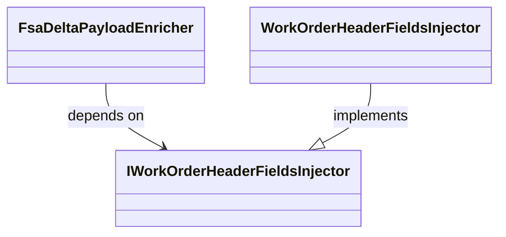

# Work Order Header Fields Injection Feature Documentation

## Overview

The **Work Order Header Fields Injection** feature enables the enrichment of outbound FSA delta payload JSON by injecting mapping-only header fields for each work order. These header fields—such as actual start/end dates, location identifiers, taxability, and custom attributes—are fetched from Dataverse and then merged into the payload. This enrichment does **not** affect delta calculations; it ensures downstream systems receive complete header metadata for each work order.

This functionality is implemented via a small, composable service interface within the core FSA payload enrichment pipeline. By isolating header field injection into its own contract, the system adheres to the Open/Closed Principle, allowing for independent testing and future extensions without modifying existing enrichment steps.

## Architecture Overview



- **FsaDeltaPayloadEnricher** composes multiple injectors, including the work order header injector.
- **IWorkOrderHeaderFieldsInjector** defines the contract for payload enrichment.
- **WorkOrderHeaderFieldsInjector** provides the concrete implementation.

## Component Structure

### Business Layer

#### **IWorkOrderHeaderFieldsInjector**

`src/Rpc.AIS.Accrual.Orchestrator.Core.Services.FsaDeltaPayload.Enrichment/IWorkOrderHeaderFieldsInjector.cs`

- **Purpose**

Defines the contract for injecting work order header mapping fields into an FSA delta payload JSON string.

- **Method**

| Method | Description | Returns |
| --- | --- | --- |
| `string InjectWorkOrderHeaderFieldsIntoPayload(string payloadJson, IReadOnlyDictionary<Guid, WoHeaderMappingFields> woIdToHeaderFields)` | Injects mapping-only header fields (from Dataverse) into each work order entry in the payload. | `string` (updated JSON) |


### Implementation

#### **WorkOrderHeaderFieldsInjector**

`src/Rpc.AIS.Accrual.Orchestrator.Core.Services.FsaDeltaPayload.Enrichment/WorkOrderHeaderFieldsInjector.cs`

- **Implements**

`IWorkOrderHeaderFieldsInjector`

- **Key Responsibilities**- Validates that the mapping dictionary is non-null and non-empty.
- Parses the incoming JSON payload into a `JsonDocument`.
- Invokes the static utility `FsaDeltaPayloadEnricher.CopyRootWithWoHeaderFieldsInjection` to merge header fields under the `_request.WOList` array.
- Serializes the enriched JSON back to a UTF-8 string.

- **Dependencies**- `System.Text.Json` for parsing and writing JSON.
- `Microsoft.Extensions.Logging.ILogger` for logging injection operations.
- `WoHeaderMappingFields` type from `Rpc.AIS.Accrual.Orchestrator.Core.Domain`.

## Integration Points

- **FsaDeltaPayloadEnricher** calls `InjectWorkOrderHeaderFieldsIntoPayload` as part of its enrichment pipeline:

```csharp
  public string InjectWorkOrderHeaderFieldsIntoPayload(
      string payloadJson,
      IReadOnlyDictionary<Guid, WoHeaderMappingFields> woIdToHeaderFields)
  {
      return _woHeader.InjectWorkOrderHeaderFieldsIntoPayload(payloadJson, woIdToHeaderFields);
  }
```

- **Enrichment Pipeline** orders this step (typically `Order = 500`) after company and sub-project injection steps.

## Key Classes Reference

| Class | Location | Responsibility |
| --- | --- | --- |
| IWorkOrderHeaderFieldsInjector | `src/.../IWorkOrderHeaderFieldsInjector.cs` | Contract for injecting header fields into FSA delta payload |
| WorkOrderHeaderFieldsInjector | `src/.../WorkOrderHeaderFieldsInjector.cs` | Concrete implementation handling JSON parsing and writing |
| WoHeaderMappingFields | `src/.../FsaDeltaPayloadWorkOrderHeaderMaps.cs` (Core.Domain) | Data model holding header field values per work order |
| FsaDeltaPayloadEnricher | `src/.../FsaDeltaPayloadEnricher.cs` (Core.Services.FsaDeltaPayload) | Orchestrates all enrichment injectors, including header fields |


## Dependencies

- **Core.Domain**- `WoHeaderMappingFields`: holds actual/projected dates, location, taxability, AFE data, etc.

- **System.Text.Json**- `JsonDocument` and `Utf8JsonWriter` for low-allocation JSON transformations.

- **Microsoft.Extensions.Logging**- Facilitates diagnostic logging within the enrichment process.

## Testing Considerations

- **No-Mapping Scenario**- When `woIdToHeaderFields` is null or empty, the original payload must be returned unchanged.

- **Injection Behavior**- Mapping keys must match work order GUIDs in the payload.
- New header fields should only be emitted when source payload lacks them or when mapped values are non-blank, preventing duplicate keys or noisy blanks.

- **JSON Integrity**- The enriched payload must remain valid JSON, preserving all non-`_request` properties unchanged.

---

By defining a clear interface and a focused implementation, this feature cleanly extends the outbound delta payload with essential work order header metadata while maintaining separation of concerns within the enrichment pipeline.