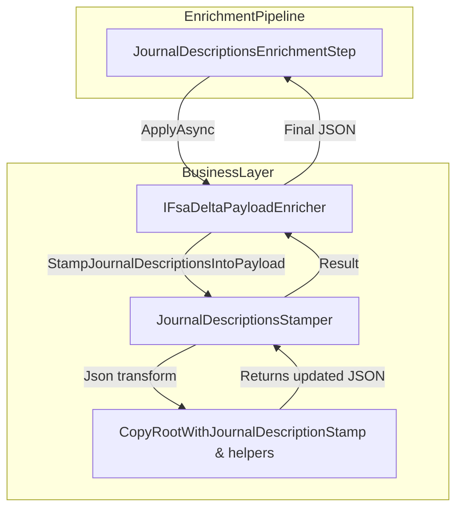
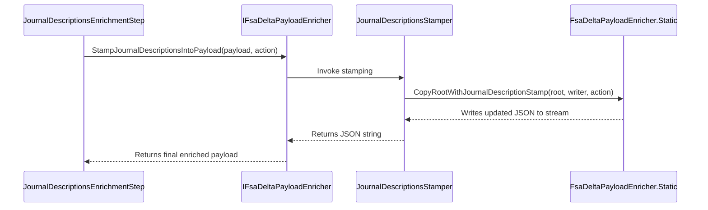

# Journal Descriptions Stamping Feature Documentation

## Overview

The **Journal Descriptions Stamping** feature ensures every journal section and each journal line in a delta payload carries a clear, consistent description. It constructs descriptions using the work order ID, sub-project ID, and the specified action (e.g. Post, Reverse). This stamping runs as the final enrichment step, guaranteeing that downstream systems receive fully annotated payloads.

By embedding human-readable descriptions, the feature improves traceability of posted journals in FSCM, aids in troubleshooting, and enforces a uniform metadata standard across journal entries.

## Architecture Overview



## Component Structure

### Business Layer

#### JournalDescriptionsStamper (`src/Rpc.AIS.Accrual.Orchestrator.Core/Services/FsaDeltaPayload/Enrichment/JournalDescriptionsStamper.cs`)

- **Purpose**: Implements `IJournalDescriptionsStamper` to inject or overwrite journal descriptions in a JSON payload.
- **Constructor**

```csharp
  public JournalDescriptionsStamper(ILogger log)
```

- Throws `ArgumentNullException` if `log` is null.

```csharp
  public string StampJournalDescriptionsIntoPayload(string payloadJson, string action)
```

- Parses `payloadJson` into a DOM.
- Defaults blank `action` to `"Post"`.
- Calls static JSON copier `FsaDeltaPayloadEnricher.CopyRootWithJournalDescriptionStamp`.
- Returns the modified JSON string.

#### IJournalDescriptionsStamper (`src/Rpc.AIS.Accrual.Orchestrator.Core/Services/FsaDeltaPayload/Enrichment/IJournalDescriptionsStamper.cs`)

- **Contract**

```csharp
  string StampJournalDescriptionsIntoPayload(string payloadJson, string action);
```

- Defines stamping behavior used by the enrichment pipeline.

#### JournalDescriptionsEnrichmentStep (`src/Rpc.AIS.Accrual.Orchestrator.Application/Features/Delta/FsaDeltaPayload/Services/EnrichmentPipeline/Steps/JournalDescriptionsEnrichmentStep.cs`)

- **Purpose**: Integrates stamping into the enrichment pipeline.
- **Order**: 600 (executes after names, headers, and other injectors).
- **ApplyAsync**:- If `ctx.Action` is blank, returns original JSON.
- Otherwise calls `_enricher.StampJournalDescriptionsIntoPayload`.

### Static Helpers

The stamping logic resides in `FsaDeltaPayloadEnricher` static methods. These methods traverse and rewrite JSON via `Utf8JsonWriter`, ensuring:

- **CopyRootWithJournalDescriptionStamp**

Processes the root object and delegates to `CopyRequestWithJournalDescriptionStamp` when encountering `"_request"`.

- **CopyRequestWithJournalDescriptionStamp**

Iterates `WOList`, invoking `CopyWoWithJournalDescriptionStamp` per work order.

- **CopyWoWithJournalDescriptionStamp**

Builds a description string:

```plaintext
  "{WorkOrderID} - {SubProjectId} - {action}"
```

Then locates each journal section (`WOItemLines`, `WOExpLines`, `WOHourLines`) and delegates to `CopyJournalWithDescriptionStamp`.

- **CopyJournalWithDescriptionStamp**

For each journal object:

- Overwrites or adds `"JournalDescription"` with the computed descriptor.
- Processes `"JournalLines"` array via `CopyLineWithDescriptionStamp`.

- **CopyLineWithDescriptionStamp**

For each line object:

- If `"JournalLineDescription"` exists and is non-empty, preserves it.
- Otherwise writes or adds `"JournalLineDescription"` with the descriptor.

## Feature Flow

### Journal Description Stamping Flow



## Integration Points

- **Enrichment Pipeline**

`JournalDescriptionsEnrichmentStep` is registered in `Program.cs` and executes as the final enrichment phase.

- **IFsaDeltaPayloadEnricher**

The central orchestrator; calls into `JournalDescriptionsStamper`.

- **FsaDeltaPayloadEnricher**

Constructs `JournalDescriptionsStamper` with the application’s `ILogger`.

## Logging

- The constructor accepts an `ILogger`, enabling future diagnostic logs.
- Currently, no direct log calls occur during stamping; infrastructure allows addition of trace or debug messages.

## Key Classes Reference

| Class | Location | Responsibility |
| --- | --- | --- |
| IJournalDescriptionsStamper | src/.../Enrichment/IJournalDescriptionsStamper.cs | Defines the stamping contract |
| JournalDescriptionsStamper | src/.../Enrichment/JournalDescriptionsStamper.cs | Implements description stamping logic |
| JournalDescriptionsEnrichmentStep | src/.../EnrichmentPipeline/Steps/JournalDescriptionsEnrichmentStep.cs | Pipeline step that triggers stamping |
| FsaDeltaPayloadEnricher | src/.../Services/FsaDeltaPayloadEnricher.cs | Hosts static JSON walkers and orchestrates injectors |


## Error Handling

- **Null Logger**: Constructor throws `ArgumentNullException` if `ILogger` is null.
- **Blank Action**: `StampJournalDescriptionsIntoPayload` treats empty or whitespace `action` as `"Post"` to avoid missing descriptors.

## Dependencies

- System.Text.Json
- Microsoft.Extensions.Logging
- Rpc.AIS.Accrual.Orchestrator.Core.Services.FsaDeltaPayload (interface contracts)

## Testing Considerations

- Validate stamping when:- Original JSON lacks `"JournalDescription"` or `"JournalLineDescription"`.
- Existing descriptions are non-empty and must be preserved.
- `action` is null/empty and defaults to `"Post"`.
- Non-object or null sections appear.
- Test nested JSON arrays and mixed value kinds to ensure resilience.