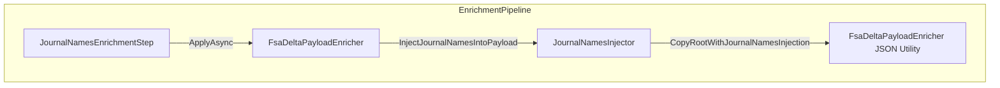

# JournalNamesInjector Service Documentation

## Overview

The **JournalNamesInjector** is responsible for enriching FSA delta payload JSON with company-specific journal names. It parses the existing payload, delegates injection logic to a JSON helper, and returns an updated JSON string. This ensures downstream accounting entries carry the correct **JournalName** based on legal entity settings.

This service plugs into the enrichment pipeline after basic payload construction and before sub-project and header-field enrichment. When no mappings are provided, it leaves the payload unchanged.

## Architecture Overview



## Component Structure

### JournalNamesInjector (src/Rpc.AIS.Accrual.Orchestrator.Application/Features/Delta/FsaDeltaPayload/Services/Enrichment/JournalNamesInjector.cs)

- **Implements:** `IJournalNamesInjector`
- **Purpose:** Injects **JournalName** fields into journal headers of the outbound payload .

#### Constructor

```csharp
public JournalNamesInjector(ILogger log)
    => _log = log ?? throw new ArgumentNullException(nameof(log));
```

- Validates the provided `ILogger` instance.
- Stores the logger for potential future diagnostics.

#### Method: InjectJournalNamesIntoPayload

```csharp
public string InjectJournalNamesIntoPayload(
    string payloadJson,
    IReadOnlyDictionary<string, LegalEntityJournalNames> journalNamesByCompany)
{
    if (journalNamesByCompany is null || journalNamesByCompany.Count == 0)
        return payloadJson;

    using var input = JsonDocument.Parse(payloadJson);
    using var ms = new MemoryStream();
    using var w = new Utf8JsonWriter(ms);

    FsaDeltaPayloadEnricher.CopyRootWithJournalNamesInjection(
        input.RootElement,
        w,
        journalNamesByCompany);

    w.Flush();
    return System.Text.Encoding.UTF8.GetString(ms.ToArray());
}
```

- **Parameters:**- `payloadJson` – The original FSA delta payload as a JSON string.
- `journalNamesByCompany` – A mapping from company code to `LegalEntityJournalNames`.

- **Behavior:**- Returns the original JSON if no mappings are provided.
- Parses the JSON, delegates to `CopyRootWithJournalNamesInjection`, and rewrites the payload.

## Interface Contract

### IJournalNamesInjector

**Location:** src/Rpc.AIS.Accrual.Orchestrator.Core.Services.FsaDeltaPayload.Enrichment/IJournalNamesInjector.cs

| Method | Description |
| --- | --- |
| `InjectJournalNamesIntoPayload(...)` | Adds journal names at the WOItemLines/WOExpLines/WOHourLines level based on legal entity settings. |


## Related Components

| Component | Role |
| --- | --- |
| **JournalNamesEnrichmentStep** | Invokes this injector within the enrichment pipeline. |
| **FsaDeltaPayloadEnricher** | Composes the injector and exposes it via its interface. |
| **CopyRootWithJournalNamesInjection** | Static JSON utility that performs tree traversal and injection. |


## Dependencies

- System.Text.Json
- System.IO
- Microsoft.Extensions.Logging
- `Rpc.AIS.Accrual.Orchestrator.Core.Domain.LegalEntityJournalNames`
- `Rpc.AIS.Accrual.Orchestrator.Core.Services.FsaDeltaPayload.FsaDeltaPayloadEnricher`

## Usage Flow

1. **Pipeline Step**

`JournalNamesEnrichmentStep` checks if `ctx.JournalNamesByCompany` has entries.

1. **Enricher Call**

Calls `_enricher.InjectJournalNamesIntoPayload(...)`.

1. **Injector Execution**

`JournalNamesInjector` parses, delegates JSON copy/injection, and returns updated payload.

## Notes

```card
{
    "title": "No-Op Condition",
    "content": "If `journalNamesByCompany` is null or empty, the payload remains unchanged."
}
```

- The logger is reserved for future diagnostic messages but is not used in the current implementation.

## Key Classes Reference

| Class | Location | Responsibility |
| --- | --- | --- |
| JournalNamesInjector | src/.../Enrichment/JournalNamesInjector.cs | Implements journal-name injection into payload JSON. |
| IJournalNamesInjector | src/.../Enrichment/IJournalNamesInjector.cs | Defines the injection contract. |
| JournalNamesEnrichmentStep | src/.../EnrichmentPipeline/Steps/JournalNamesEnrichmentStep.cs | Pipeline step that triggers journal-name enrichment. |
| FsaDeltaPayloadEnricher | src/.../Services/FsaDeltaPayloadEnricher.cs | Orchestrates all enrichment injectors, including this one. |
