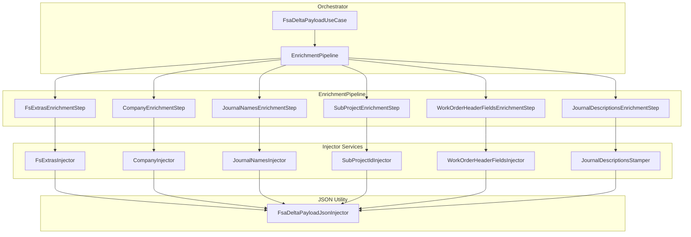

# FSA Delta Payload Enrichment Feature Documentation

## Overview

The **FSA Delta Payload Enrichment** feature augments outbound JSON payloads with business-critical metadata before they are posted to FSCM. It ensures each work order (WO) entry carries:

- **Field Service extras** (currency, worker IDs, warehouse/site info)
- **Company codes**
- **Sub-project identifiers**
- **Custom header fields** (project dates, location coordinates, etc.)
- **Journal names** and **stamped descriptions**

By applying these enhancements in a plug-and-play pipeline, the orchestrator maintains a clean separation of concerns and makes each enrichment step independently testable and extensible.

## Architecture Overview



## Component Structure

### 1. Core Enrichment Services

- **FsExtrasInjector** 🤖

Injects per-line extras (currency, worker number, warehouse, site, line number, operations date) and logs a summary per WO.

Key method:

```csharp
  string InjectFsExtrasAndLogPerWoSummary(
      string payloadJson,
      IReadOnlyDictionary<Guid, FsLineExtras> extrasByLineGuid,
      string runId,
      string corr);
```

- **CompanyInjector**

Populates each WO with its legal-entity company code.

Key method:

```csharp
  string InjectCompanyIntoPayload(
      string payloadJson,
      IReadOnlyDictionary<Guid, string> woIdToCompanyName);
```

- **SubProjectIdInjector**

Adds a `SubProjectId` property to each WO object, preserving any existing value if present.

```csharp
  public string InjectSubProjectIdIntoPayload(
      string payloadJson,
      IReadOnlyDictionary<Guid, string> woIdToSubProjectId)
  { … }
```

- **WorkOrderHeaderFieldsInjector**

Maps custom header fields (dates, location coordinates, PO number, etc.) into each WO entry.

```csharp
  string InjectWorkOrderHeaderFieldsIntoPayload(
      string payloadJson,
      IReadOnlyDictionary<Guid, WoHeaderMappingFields> woIdToHeaderFields);
```

- **JournalNamesInjector**

Inserts journal names at the header level based on legal-entity settings.

```csharp
  string InjectJournalNamesIntoPayload(
      string payloadJson,
      IReadOnlyDictionary<string, LegalEntityJournalNames> journalNamesByCompany);
```

- **JournalDescriptionsStamper**

Recomputes and stamps `JournalDescription` and `JournalLineDescription` after all other enrichments, guided by the action (`Post`, `Reverse`, etc.).

```csharp
  string StampJournalDescriptionsIntoPayload(string payloadJson, string action);
```

### 2. Enrichment Pipeline

- **EnrichmentContext**

Bundles all inputs for enrichment steps:

| Property | Type |
| --- | --- |
| PayloadJson | string |
| RunId | string |
| CorrelationId | string |
| Action | string |
| ExtrasByLineGuid | IReadOnlyDictionary<Guid, FsLineExtras>? |
| WoIdToCompanyName | IReadOnlyDictionary<Guid, string>? |
| JournalNamesByCompany | IReadOnlyDictionary<string, LegalEntityJournalNames>? |
| WoIdToSubProjectId | IReadOnlyDictionary<Guid, string>? |
| WoIdToHeaderFields | IReadOnlyDictionary<Guid, WoHeaderMappingFields>? |


- **IFsaDeltaPayloadEnrichmentStep**

Defines a single enrichment concern:

```csharp
  public interface IFsaDeltaPayloadEnrichmentStep
  {
      string Name { get; }
      int Order { get; }
      Task<string> ApplyAsync(EnrichmentContext ctx, CancellationToken ct);
  }
```

- **DefaultFsaDeltaPayloadEnrichmentPipeline**

Discovers all `IFsaDeltaPayloadEnrichmentStep` implementations via DI, orders them by `Order`, and applies each in turn.

```csharp
  public sealed class DefaultFsaDeltaPayloadEnrichmentPipeline : IFsaDeltaPayloadEnrichmentPipeline
  {
      public Task<string> ApplyAsync(EnrichmentContext ctx, CancellationToken ct) { … }
  }
```

- **Pipeline Steps**

Each step wraps a single injector call, guarding null/empty mappings:

| Class | Name | Order |
| --- | --- | --- |
| FsExtrasEnrichmentStep | FsExtras | 100 |
| CompanyEnrichmentStep | Company | 200 |
| JournalNamesEnrichmentStep | JournalNames | 300 |
| SubProjectEnrichmentStep | SubProjectId | 400 |
| WorkOrderHeaderFieldsStep | WorkOrderHeaderFields | 500 |
| JournalDescriptionsStep | JournalDescriptions | 600 |


### 3. Payload Orchestrator

- **FsaDeltaPayloadEnricher**

High-level facade implementing `IFsaDeltaPayloadEnricher`. It composes all injectors and exposes methods to the use case:

```csharp
  public sealed class FsaDeltaPayloadEnricher : IFsaDeltaPayloadEnricher
  {
      public FsaDeltaPayloadEnricher(ILogger<FsaDeltaPayloadEnricher> log) { … }
      public string InjectFsExtrasAndLogPerWoSummary(...)
      public string InjectCompanyIntoPayload(...)
      public string InjectSubProjectIdIntoPayload(...)
      public string InjectWorkOrderHeaderFieldsIntoPayload(...)
      public string InjectJournalNamesIntoPayload(...)
      public string StampJournalDescriptionsIntoPayload(...)
  }
```

### 4. JSON Injection Utility

- **FsaDeltaPayloadJsonInjector**

Static helpers that traverse the JSON tree, copy all existing properties, and insert or update specific fields within the `_request.WOList` array.

## Error Handling

> Note: All injectors rely on `Utf8JsonWriter` for performance and streaming.

- **Null-Checks**: Constructors and public methods throw `ArgumentNullException` if required dependencies or mappings are missing.
- **Empty Mappings**: Mappings that are null or empty result in the original payload being returned unmodified.

## Dependencies

- `System.Text.Json` / `Utf8JsonWriter` / `JsonDocument`
- `Microsoft.Extensions.Logging` for structured logging
- Domain types: `FsLineExtras`, `WoHeaderMappingFields`, `LegalEntityJournalNames`

## Testing Considerations

Key scenarios to validate:

- No-op behavior when mapping dictionaries are empty
- Preservation of pre-existing fields in payload
- Correct insertion of new fields in nested `_request.WOList` entries
- Order-dependent stamping of journal descriptions

## Key Classes Reference

| Class | Location | Responsibility |
| --- | --- | --- |
| SubProjectIdInjector | Features/Delta/FsaDeltaPayload/Services/Enrichment/SubProjectIdInjector.cs | Injects SubProjectId per work order |
| CompanyInjector | Features/Delta/FsaDeltaPayload/Services/Enrichment/CompanyInjector.cs | Injects Company code per work order |
| FsExtrasInjector | Features/Delta/FsaDeltaPayload/Services/Enrichment/FsExtrasInjector.cs | Injects FS line extras and logs summary |
| WorkOrderHeaderFieldsInjector | Features/Delta/FsaDeltaPayload/Services/Enrichment/WorkOrderHeaderFieldsInjector.cs | Injects header fields per work order |
| JournalNamesInjector | Features/Delta/FsaDeltaPayload/Services/Enrichment/JournalNamesInjector.cs | Injects journal names |
| JournalDescriptionsStamper | Features/Delta/FsaDeltaPayload/Services/Enrichment/JournalDescriptionsStamper.cs | Stamps journal descriptions |
| FsaDeltaPayloadJsonInjector | Features/Delta/FsaDeltaPayload/Services/Json/FsaDeltaPayloadJsonInjector.cs | JSON traversal and injection helpers |
| DefaultFsaDeltaPayloadEnrichmentPipeline | Features/Delta/FsaDeltaPayload/Services/EnrichmentPipeline/DefaultFsaDeltaPayloadEnrichmentPipeline.cs | Orchestrates enrichment steps |
| FsExtrasEnrichmentStep | Features/Delta/FsaDeltaPayload/Services/EnrichmentPipeline/Steps/FsExtrasEnrichmentStep.cs | Pipeline step for FS extras |
| CompanyEnrichmentStep | Features/Delta/FsaDeltaPayload/Services/EnrichmentPipeline/Steps/CompanyEnrichmentStep.cs | Pipeline step for company injection |
| SubProjectEnrichmentStep | Features/Delta/FsaDeltaPayload/Services/EnrichmentPipeline/Steps/SubProjectEnrichmentStep.cs | Pipeline step for sub-project injection |
| WorkOrderHeaderFieldsEnrichmentStep | Features/Delta/FsaDeltaPayload/Services/EnrichmentPipeline/Steps/WorkOrderHeaderFieldsEnrichmentStep.cs | Pipeline step for header fields |
| IFsaDeltaPayloadEnrichmentStep | Features/Delta/FsaDeltaPayload/Services/EnrichmentPipeline/IFsaDeltaPayloadEnrichmentStep.cs | Defines single enrichment concern |
| IFsaDeltaPayloadEnricher | Application/Ports/Common/Abstractions/IFsaDeltaPayloadEnricher.cs | Enricher façade interface |
| EnrichmentContext | Features/Delta/FsaDeltaPayload/Services/EnrichmentPipeline/EnrichmentContext.cs | Immutable context for enrichment steps |


---

*This documentation reflects only the code and patterns present in the provided source files.*