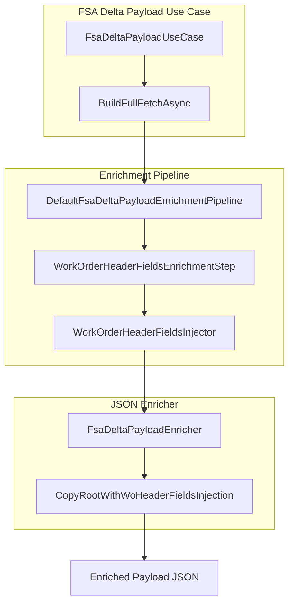
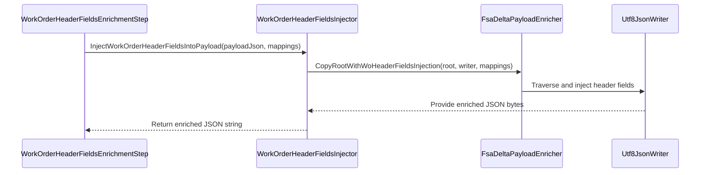

# Work Order Header Fields Injection Feature Documentation

## Overview

The **Work Order Header Fields Injection** feature enriches outbound FSA delta payloads by injecting additional header-level fields into each work order entry. These fields, retrieved from Dataverse via the `WoHeaderMappingFields` model, include actual/projected dates, location data, and custom attributes. This enrichment is mapping-only and does not affect delta calculations; it ensures downstream FSCM processes receive complete header metadata for validations and journal postings.

## Architecture Overview



## Component Structure

### WorkOrderHeaderFieldsInjector (Business Layer)

- **Location:** `src/Rpc.AIS.Accrual.Orchestrator.Application/Features/Delta/FsaDeltaPayload/Services/Enrichment/WorkOrderHeaderFieldsInjector.cs`
- **Implements:** `IWorkOrderHeaderFieldsInjector`
- **Responsibility:** Parses the outbound payload JSON, delegates to the JSON enricher, and returns an enriched JSON string.
- **Dependencies:**- `ILogger` for logging
- `System.Text.Json` (`JsonDocument`, `Utf8JsonWriter`) for JSON parsing/writing
- `FsaDeltaPayloadEnricher.CopyRootWithWoHeaderFieldsInjection` for deep JSON traversal
- `WoHeaderMappingFields` domain model

#### Methods

| Method | Description | Returns |
| --- | --- | --- |
| InjectWorkOrderHeaderFieldsIntoPayload(...) | Injects mapping-only header fields into each `WOList` entry of the payload. | string |


```csharp
public string InjectWorkOrderHeaderFieldsIntoPayload(
    string payloadJson,
    IReadOnlyDictionary<Guid, WoHeaderMappingFields> woIdToHeaderFields)
```

- Returns the original `payloadJson` if `woIdToHeaderFields` is null or empty .
- Otherwise, parses `payloadJson`, writes a new JSON document via `Utf8JsonWriter`, and injects header fields into each work order element.

### Enrichment Pipeline Step

#### WorkOrderHeaderFieldsEnrichmentStep

- **Location:** `.../Services/EnrichmentPipeline/Steps/WorkOrderHeaderFieldsEnrichmentStep.cs`
- **Role:** Component in the enrichment pipeline that invokes the injector when header mappings exist.
- **Key Properties:**- `Name = "WorkOrderHeaderFields"`
- `Order = 500`
- **Behavior:** If the `EnrichmentContext.WoIdToHeaderFields` dictionary is non-empty, calls `InjectWorkOrderHeaderFieldsIntoPayload` .

## Data Models

### WoHeaderMappingFields

Mapping-only work order header fields fetched from Dataverse and injected into the outbound payload. Not used in delta calculations.

| Property | Type | Description |
| --- | --- | --- |
| ActualStartDateUtc | DateTime? | Actual start date/time (UTC) of the work order. |
| ActualEndDateUtc | DateTime? | Actual end date/time (UTC) of the work order. |
| ProjectedStartDateUtc | DateTime? | Promised start date/time (UTC). |
| ProjectedEndDateUtc | DateTime? | Promised end date/time (UTC). |
| WellLatitude | decimal? | Geolocation latitude of the work site. |
| WellLongitude | decimal? | Geolocation longitude of the work site. |
| InvoiceNotesInternal | string? | Internal notes for invoices. |
| PONumber | string? | Purchase order number. |
| DeclinedToSignReason | string? | Reason for declined signature. |
| Department | string? | Formatted department name. |
| ProductLine | string? | Formatted product line name. |
| Warehouse | string? | Formatted warehouse identifier. |
| FSATaxabilityType | string? | Taxability type at header level. |
| FSAWellAge | string? | Well age descriptor. |
| FSAWorkType | string? | Work type descriptor. |
| Coountry | string? | Country region identifier (note spelling). |
| County | string? | County name. |
| State | string? | State name. |


## Sequence Diagram



## Dependencies

- **Logging**: `Microsoft.Extensions.Logging.ILogger` for operational insights.
- **JSON Processing**: `System.Text.Json` for parsing and writing JSON structures.
- **Domain Model**: `WoHeaderMappingFields` encapsulates Dataverse header data.
- **Enricher Helper**: `FsaDeltaPayloadEnricher.CopyRootWithWoHeaderFieldsInjection` for core injection logic .

## Testing Considerations

- Verify that when `woIdToHeaderFields` is null or empty, the output equals the input JSON.
- Validate that existing payload properties are preserved and no duplicate keys occur when header fields overlap.
- Ensure the injected fields appear only when non-empty, honoring `IsBlankNewFieldValue` logic in the enricher.

---

This completes the documentation for the **Work Order Header Fields Injection** component within the FSA delta payload enrichment flow.