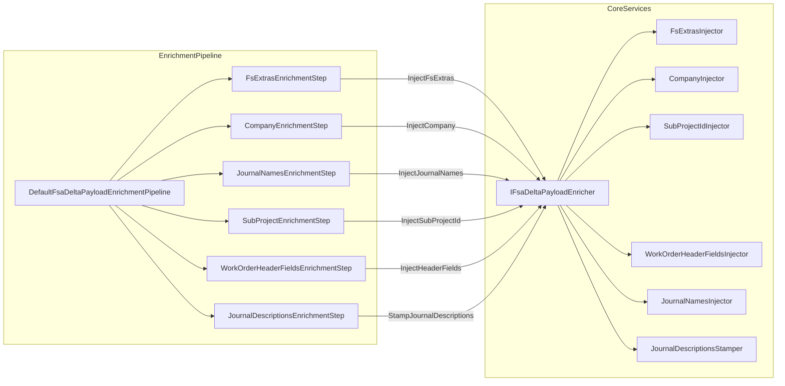

# FSA Delta Payload Enrichment Pipeline Feature Documentation

## 🚀 Overview

The **FSA Delta Payload Enrichment Pipeline** processes outbound delta payload JSON by applying a series of modular enrichment steps. Each step injects specific FS-related data—such as extras, company names, journal names, subproject IDs, header fields, and journal descriptions—into the raw payload. This ensures downstream systems receive a rich, fully annotated JSON structure for further processing or transmission.

By discovering enrichment steps via dependency injection, the pipeline adheres to the **Open/Closed Principle**. New enrichment concerns can be added without modifying existing orchestration logic. This feature sits in the Application layer of the Accrual Orchestrator and is invoked by the FSA delta payload use case to produce a final, enriched payload.

## Architecture Overview



## Component Structure

### 1. Enrichment Pipeline

#### **DefaultFsaDeltaPayloadEnrichmentPipeline**

`src/Rpc.AIS.Accrual.Orchestrator.Application/Features/Delta/FsaDeltaPayload/Services/EnrichmentPipeline/DefaultFsaDeltaPayloadEnrichmentPipeline.cs`

- **Purpose:** Orchestrates and executes all enrichment steps in a deterministic order.
- **Key Properties:**

| Property | Type | Description |
| --- | --- | --- |
| **_steps** | IReadOnlyList\<IFsaDeltaPayloadEnrichmentStep> | Ordered collection of enrichment steps |
| **_log** | ILogger\<DefaultFsaDeltaPayloadEnrichmentPipeline> | Debug logger |


- **Key Methods:**

| Method | Signature | Description |
| --- | --- | --- |
| ApplyAsync | `Task<string> ApplyAsync(EnrichmentContext ctx, CancellationToken ct)` | Applies each step to the payload, logs lengths before/after, and returns the final JSON |


- **Workflow:**1. Validate non-null context.
2. Initialize payload from `ctx.PayloadJson`.
3. For each step in `_steps`:- Throw if cancellation requested.
- Invoke `step.ApplyAsync`, passing an updated context with the latest payload.
- Log debug message with step name, order, and length delta.
4. Return enriched payload.

### 2. Enrichment Context

#### **EnrichmentContext**

`src/Rpc.AIS.Accrual.Orchestrator.Application/Features/Delta/FsaDeltaPayload/Services/EnrichmentPipeline/EnrichmentContext.cs`

- **Purpose:** Immutable data holder carrying the payload JSON and auxiliary enrichment data.
- **Properties:**

| Property | Type | Description |
| --- | --- | --- |
| **PayloadJson** | `string` | Raw or partially enriched JSON payload |
| **RunId** | `string` | Identifier for this enrichment run |
| **CorrelationId** | `string` | Correlation ID for distributed tracing |
| **Action** | `string` | Action name used when stamping journal descriptions |
| **ExtrasByLineGuid** | `IReadOnlyDictionary<Guid, FsLineExtras>?` | FS line-level extras to inject |
| **WoIdToCompanyName** | `IReadOnlyDictionary<Guid, string>?` | Map of work order IDs to company names |
| **JournalNamesByCompany** | `IReadOnlyDictionary<string, LegalEntityJournalNames>?` | Map of company codes to journal naming settings |
| **WoIdToSubProjectId** | `IReadOnlyDictionary<Guid, string>?` | Map of work order IDs to subproject IDs |
| **WoIdToHeaderFields** | `IReadOnlyDictionary<Guid, WoHeaderMappingFields>?` | Map of work order IDs to header-mapping fields |


### 3. Enrichment Steps

All steps implement the **IFsaDeltaPayloadEnrichmentStep** interface:

```csharp
public interface IFsaDeltaPayloadEnrichmentStep
{
    string Name { get; }
    int Order { get; }
    Task<string> ApplyAsync(EnrichmentContext ctx, CancellationToken ct);
}
```

| Step Class | Name | Order | Purpose |
| --- | --- | --- | --- |
| FsExtrasEnrichmentStep | FsExtras | 100 | Injects FS extras and logs per-work-order enrichment statistics |
| CompanyEnrichmentStep | Company | 200 | Injects company names into the payload |
| JournalNamesEnrichmentStep | JournalNames | 300 | Injects legal entity journal names |
| SubProjectEnrichmentStep | SubProjectId | 400 | Injects subproject IDs into the payload |
| WorkOrderHeaderFieldsEnrichmentStep | WorkOrderHeaderFields | 500 | Injects work order header field mappings |
| JournalDescriptionsEnrichmentStep | JournalDescriptions | 600 | Stamps journal descriptions after all other enrichment steps |


### 4. Core Enrichment Service

#### **IFsaDeltaPayloadEnricher**

`src/Rpc.AIS.Accrual.Orchestrator.Core.Abstractions/IFsaDeltaPayloadEnricher.cs`

- **Purpose:** Defines JSON transformation methods for each enrichment concern.
- **Methods:**

| Method | Description |
| --- | --- |
| InjectFsExtrasAndLogPerWoSummary | Adds FS extras, returns updated JSON, and logs enrichment summary per work order |
| InjectCompanyIntoPayload | Injects company mapping into payload JSON |
| InjectSubProjectIdIntoPayload | Injects subproject IDs into payload JSON |
| InjectWorkOrderHeaderFieldsIntoPayload | Injects mapping-only work order header fields |
| InjectJournalNamesIntoPayload | Injects journal names based on legal entity settings |
| StampJournalDescriptionsIntoPayload | Recomputes and stamps journal descriptions using final header values and action |


#### **FsaDeltaPayloadEnricher**

`src/Rpc.AIS.Accrual.Orchestrator.Core.Services.FsaDeltaPayload/FsaDeltaPayloadEnricher.cs`

- **Composition:**- Creates internal injectors for each concern:- `FsExtrasInjector`
- `CompanyInjector`
- `SubProjectIdInjector`
- `WorkOrderHeaderFieldsInjector`
- `JournalNamesInjector`
- `JournalDescriptionsStamper`
- **Delegation:** Each interface method delegates to the corresponding internal injector.

### 5. Injector Implementations

| Injector Class | Implements | Responsibility |
| --- | --- | --- |
| FsExtrasInjector | IFsExtrasInjector | Parses JSON, injects FS extras, logs enrichment statistics |
| CompanyInjector | ICompanyInjector | Injects company names into JSON payload |
| SubProjectIdInjector | ISubProjectIdInjector | Injects subproject IDs into JSON payload |
| WorkOrderHeaderFieldsInjector | IWorkOrderHeaderFieldsInjector | Injects work order header fields |
| JournalNamesInjector | IJournalNamesInjector | Injects journal names according to legal entity settings |
| JournalDescriptionsStamper | IJournalDescriptionsStamper | Stamps or recomputes journal descriptions post-enrichment |


## Dependency Injection Configuration

```csharp
services.AddSingleton<IFsaDeltaPayloadEnrichmentPipeline, DefaultFsaDeltaPayloadEnrichmentPipeline>();

services.AddSingleton<IFsaDeltaPayloadEnrichmentStep, FsExtrasEnrichmentStep>();
services.AddSingleton<IFsaDeltaPayloadEnrichmentStep, CompanyEnrichmentStep>();
services.AddSingleton<IFsaDeltaPayloadEnrichmentStep, JournalNamesEnrichmentStep>();
services.AddSingleton<IFsaDeltaPayloadEnrichmentStep, SubProjectEnrichmentStep>();
services.AddSingleton<IFsaDeltaPayloadEnrichmentStep, WorkOrderHeaderFieldsEnrichmentStep>();
services.AddSingleton<IFsaDeltaPayloadEnrichmentStep, JournalDescriptionsEnrichmentStep>();
```

- **Pipeline** and **steps** are registered as singletons.
- Steps are auto-discovered by injecting `IEnumerable<IFsaDeltaPayloadEnrichmentStep>` into the pipeline.

## Key Classes Reference

| Class | Location | Responsibility |
| --- | --- | --- |
| DefaultFsaDeltaPayloadEnrichmentPipeline | src/Rpc.AIS.Accrual.Orchestrator.Application/Features/Delta/FsaDeltaPayload/Services/EnrichmentPipeline/DefaultFsaDeltaPayloadEnrichmentPipeline.cs | Orchestrates ordered execution of enrichment steps |
| EnrichmentContext | src/Rpc.AIS.Accrual.Orchestrator.Application/Features/Delta/FsaDeltaPayload/Services/EnrichmentPipeline/EnrichmentContext.cs | Carries payload JSON and enrichment data maps |
| IFsaDeltaPayloadEnrichmentStep | src/Rpc.AIS.Accrual.Orchestrator.Application/Features/Delta/FsaDeltaPayload/Services/EnrichmentPipeline/IFsaDeltaPayloadEnrichmentStep.cs | Defines the contract for a single enrichment step |
| IFsaDeltaPayloadEnrichmentPipeline | src/Rpc.AIS.Accrual.Orchestrator.Application/Features/Delta/FsaDeltaPayload/Services/EnrichmentPipeline/IFsaDeltaPayloadEnrichmentPipeline.cs | Defines the contract for the enrichment pipeline |
| FsExtrasEnrichmentStep | src/Rpc.AIS.Accrual.Orchestrator.Application/Features/Delta/FsaDeltaPayload/Services/EnrichmentPipeline/Steps/FsExtrasEnrichmentStep.cs | Implements FS extras injection and logging |
| CompanyEnrichmentStep | src/Rpc.AIS.Accrual.Orchestrator.Application/Features/Delta/FsaDeltaPayload/Services/EnrichmentPipeline/Steps/CompanyEnrichmentStep.cs | Implements company injection |
| JournalNamesEnrichmentStep | src/Rpc.AIS.Accrual.Orchestrator.Application/Features/Delta/FsaDeltaPayload/Services/EnrichmentPipeline/Steps/JournalNamesEnrichmentStep.cs | Implements journal names injection |
| SubProjectEnrichmentStep | src/Rpc.AIS.Accrual.Orchestrator.Application/Features/Delta/FsaDeltaPayload/Services/EnrichmentPipeline/Steps/SubProjectEnrichmentStep.cs | Implements subproject ID injection |
| WorkOrderHeaderFieldsEnrichmentStep | src/Rpc.AIS.Accrual.Orchestrator.Application/Features/Delta/FsaDeltaPayload/Services/EnrichmentPipeline/Steps/WorkOrderHeaderFieldsEnrichmentStep.cs | Implements header fields injection |
| JournalDescriptionsEnrichmentStep | src/Rpc.AIS.Accrual.Orchestrator.Application/Features/Delta/FsaDeltaPayload/Services/EnrichmentPipeline/Steps/JournalDescriptionsEnrichmentStep.cs | Implements journal descriptions stamping |
| FsaDeltaPayloadEnricher | src/Rpc.AIS.Accrual.Orchestrator.Core.Services.FsaDeltaPayload/FsaDeltaPayloadEnricher.cs | Delegates JSON enrichment to internal injectors |


## Error Handling

- **Null Validation:** Constructors and `ApplyAsync` guard against null arguments via `ArgumentNullException`.
- **Cancellation Support:** `ApplyAsync` checks `CancellationToken.ThrowIfCancellationRequested()` before each step.
- **Logging:**- Pipeline logs debug entries after each step showing the step name, order, and JSON length delta.
- `FsExtrasInjector` logs detailed per-work-order enrichment statistics.

## Dependencies

- **Frameworks:**- Microsoft.Extensions.Logging
- System.Text.Json
- **Domain & Core:**- `Rpc.AIS.Accrual.Orchestrator.Core.Domain` types (`FsLineExtras`, `LegalEntityJournalNames`, `WoHeaderMappingFields`)
- JSON injection utilities (`FsaDeltaPayloadJsonInjector`, `FsaDeltaPayloadJsonUtil`)

---

*This documentation reflects the current implementation of the FSA Delta Payload Enrichment Pipeline as provided in the source repository.*