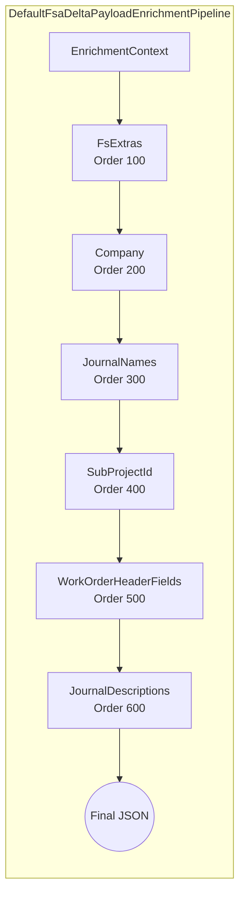

# Delta Payload Enrichment – EnrichmentContext

## Overview

The `EnrichmentContext` record bundles all inputs required to enrich an outbound FSA delta payload. It encapsulates the raw JSON payload, run metadata, enrichment maps, and the journal action, keeping the use-case orchestration thin and focused. By using an immutable record, the design supports thread safety and the Open/Closed Principle—new enrichment steps can be added without modifying existing code .

Once constructed in the use-case layer, this context is passed to the `DefaultFsaDeltaPayloadEnrichmentPipeline`, which applies each registered enrichment step in a deterministic order, updating only the `PayloadJson` property via C#’s `with` expression .

---

## EnrichmentContext Structure

| Property | Type | Description |
| --- | --- | --- |
| **PayloadJson** | `string` | Raw or intermediate delta payload as a JSON string |
| **RunId** | `string` | Unique identifier for this enrichment run |
| **CorrelationId** | `string` | Correlation identifier for logging and tracing |
| **Action** | `string` | Journal action suffix (e.g., Post, Reverse, Recreate) for stamping descriptions |
| **ExtrasByLineGuid** | `IReadOnlyDictionary<Guid, FsLineExtras>?` | Map from line GUID to extra metadata (currency, worker, warehouse, etc.) |
| **WoIdToCompanyName** | `IReadOnlyDictionary<Guid, string>?` | Map from work order GUID to its company name |
| **JournalNamesByCompany** | `IReadOnlyDictionary<string, LegalEntityJournalNames>?` | Map from legal entity (company) to its configured journal names |
| **WoIdToSubProjectId** | `IReadOnlyDictionary<Guid, string>?` | Map from work order GUID to its SubProjectId |
| **WoIdToHeaderFields** | `IReadOnlyDictionary<Guid, WoHeaderMappingFields>?` | Map from work order GUID to header-only mapping fields |


```csharp
public sealed record EnrichmentContext(
    string PayloadJson,
    string RunId,
    string CorrelationId,
    string Action,
    IReadOnlyDictionary<Guid, FsLineExtras>? ExtrasByLineGuid,
    IReadOnlyDictionary<Guid, string>? WoIdToCompanyName,
    IReadOnlyDictionary<string, LegalEntityJournalNames>? JournalNamesByCompany,
    IReadOnlyDictionary<Guid, string>? WoIdToSubProjectId,
    IReadOnlyDictionary<Guid, WoHeaderMappingFields>? WoIdToHeaderFields);
```

---

## Creation & Pipeline Usage

Within the FSA delta payload use case, after building the base JSON and lookup maps, the context is instantiated and passed into the enrichment pipeline:

```csharp
var enrichmentCtx = new EnrichmentContext(
    PayloadJson: payloadJson,
    RunId:      runId,
    CorrelationId: corr,
    Action:     actionSuffix,
    ExtrasByLineGuid: extrasByLineGuid,
    WoIdToCompanyName: woIdToCompanyName,
    JournalNamesByCompany: journalNamesByCompany,
    WoIdToSubProjectId: woIdToSubProjectId,
    WoIdToHeaderFields: woIdToHeaderFields);

payloadJson = await _enrichmentPipeline
    .ApplyAsync(enrichmentCtx, cancellationToken)
    .ConfigureAwait(false);
```

The default pipeline orchestrates each step in ascending `Order`, using the record’s immutability to update only `PayloadJson`:

```csharp
public async Task<string> ApplyAsync(EnrichmentContext ctx, CancellationToken ct)
{
    var payload = ctx.PayloadJson ?? string.Empty;

    foreach (var step in _steps)
    {
        ct.ThrowIfCancellationRequested();
        payload = await step.ApplyAsync(ctx with { PayloadJson = payload }, ct)
                             .ConfigureAwait(false);
    }

    return payload;
}
```

---

## Enrichment Steps Overview

| Step Name | Order | Context Field | Enricher Method |
| --- | --- | --- | --- |
| FsExtras | 100 | `ExtrasByLineGuid` | `InjectFsExtrasAndLogPerWoSummary` |
| Company | 200 | `WoIdToCompanyName` | `InjectCompanyIntoPayload` |
| JournalNames | 300 | `JournalNamesByCompany` | `InjectJournalNamesIntoPayload` |
| SubProjectId | 400 | `WoIdToSubProjectId` | `InjectSubProjectIdIntoPayload` |
| WorkOrderHeaderFields | 500 | `WoIdToHeaderFields` | `InjectWorkOrderHeaderFieldsIntoPayload` |
| JournalDescriptions | 600 | `Action` | `StampJournalDescriptionsIntoPayload` |


### Pipeline Flowchart



---

## Design Highlights

- **Immutable Input Bundle**

Using a C# record ensures all enrichment metadata remains read-only once created.

- **Open/Closed Principle**

Steps implement `IFsaDeltaPayloadEnrichmentStep`; new concerns can be injected via DI without changing pipeline logic.

- **Thin Orchestration**

JSON transformation logic resides in specialized injectors (`IFsaDeltaPayloadEnricher` and its collaborators), keeping pipeline and use case layers simple.

---

## Related Components

| Component | Responsibility |
| --- | --- |
| `EnrichmentContext` | Bundles all inputs for payload enrichment |
| `IFsaDeltaPayloadEnrichmentPipeline` | Defines the contract to execute ordered steps |
| `DefaultFsaDeltaPayloadEnrichmentPipeline` | Implements the pipeline orchestration |
| `IFsaDeltaPayloadEnrichmentStep` | Single enrichment concern with `Name`, `Order`, `ApplyAsync` |
| Step implementations (e.g., `FsExtrasEnrichmentStep`) | Apply JSON injections based on context maps |


All enrichment steps reside under the `Services.EnrichmentPipeline.Steps` namespace and rely on `IFsaDeltaPayloadEnricher` for actual JSON modifications.