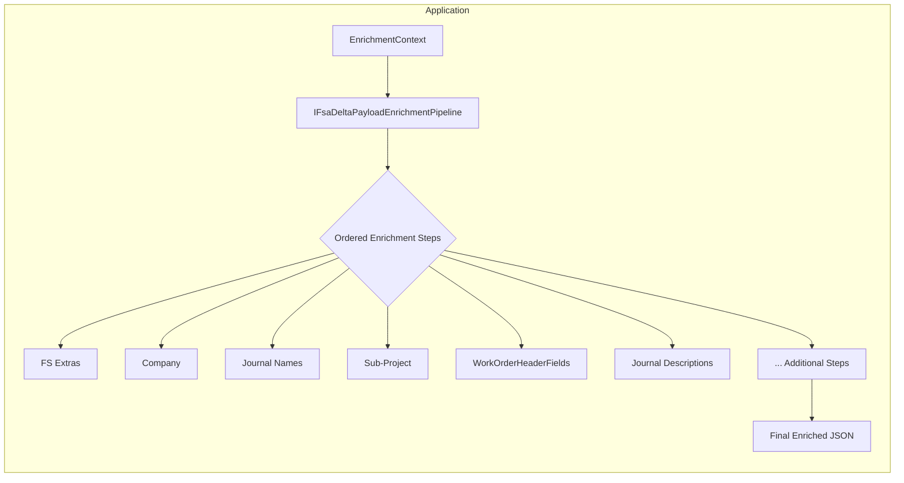

# FSA Delta Payload Enrichment Pipeline Feature Documentation

## Overview

The **FSA Delta Payload Enrichment Pipeline** orchestrates a series of independent enrichment concerns—such as injecting FS-specific extras, company assignments, journal naming, sub-project IDs, work order header fields, and stamping journal descriptions—into an outbound JSON payload. Each concern is encapsulated in its own step, discovered and ordered via dependency injection. This design keeps orchestration logic thin and easily extensible under the Open/Closed Principle.

In the broader application, this pipeline sits at the end of the delta payload generation use case. After raw snapshots of Field Service changes are serialized into JSON, the enrichment pipeline applies additional metadata and formatting before the payload is handed off to downstream consumers (e.g., messaging or integration layers).

## Architecture Overview

## Component Structure

### Business Layer

#### **IFsaDeltaPayloadEnrichmentPipeline**

- **Purpose & Responsibilities**- Defines the contract for executing enrichment steps in a deterministic sequence.
- Keeps orchestration logic minimal; individual concerns live in separate steps.

- **Public Method**

| Method Signature | Description | Returns |
| --- | --- | --- |
| `Task<string> ApplyAsync(EnrichmentContext ctx, CancellationToken ct)` | Applies each registered enrichment step to `ctx.PayloadJson` in ascending `Order`. Logs before/after payload lengths. Honors cancellation. | `Task<string>` enriched JSON payload |

### Supporting Components

#### **IFsaDeltaPayloadEnrichmentStep**

- **Purpose**: Encapsulates a single enrichment concern.
- **Key Members**- `string Name` – Unique identifier for ordering and logging.
- `int Order` – Determines when this step runs relative to others.
- `Task<string> ApplyAsync(EnrichmentContext ctx, CancellationToken ct)` – Executes the enrichment logic on the payload.

#### **EnrichmentContext**

Immutable record that bundles all inputs needed by enrichment steps.

| Property | Type | Description |
| --- | --- | --- |
| `PayloadJson` | `string` | The JSON payload to enrich. |
| `RunId` | `string` | Unique identifier for this pipeline execution. |
| `CorrelationId` | `string` | Correlation ID for end-to-end tracing. |
| `Action` | `string` | Delta action type (e.g., Post, Reverse). |
| `ExtrasByLineGuid` | `IReadOnlyDictionary<Guid, FsLineExtras>?` | Optional FS extras mapped by line GUID. |
| `WoIdToCompanyName` | `IReadOnlyDictionary<Guid, string>?` | Optional mapping of work order IDs to company names. |
| `JournalNamesByCompany` | `IReadOnlyDictionary<string, LegalEntityJournalNames>?` | Optional journal name settings per legal entity. |
| `WoIdToSubProjectId` | `IReadOnlyDictionary<Guid, string>?` | Optional mapping of work order IDs to sub-project IDs. |
| `WoIdToHeaderFields` | `IReadOnlyDictionary<Guid, WoHeaderMappingFields>?` | Optional header-field mappings for work orders. |

## Dependencies

- **Dependency Injection**- The pipeline and its steps are registered with the DI container as `IFsaDeltaPayloadEnrichmentPipeline` and multiple `IFsaDeltaPayloadEnrichmentStep` implementations.
- **Logging**- An `ILogger<DefaultFsaDeltaPayloadEnrichmentPipeline>` logs debug messages indicating each step’s name, order, and payload lengths before/after enrichment.
- **CancellationToken**- Allows caller to abort mid-pipeline before invoking the next step.

## Key Interfaces Reference

| Interface | Location | Responsibility |
| --- | --- | --- |
| `IFsaDeltaPayloadEnrichmentPipeline` | src/.../EnrichmentPipeline/IFsaDeltaPayloadEnrichmentPipeline.cs | Orchestrates execution of all enrichment steps. |
| `IFsaDeltaPayloadEnrichmentStep` | src/.../EnrichmentPipeline/IFsaDeltaPayloadEnrichmentStep.cs | Defines a single enrichment step’s contract. |
| `EnrichmentContext` | src/.../EnrichmentPipeline/EnrichmentContext.cs | Immutable context carrying payload and enrichment metadata. |

## Testing Considerations

- **Step Ordering**- Verify steps execute in ascending `Order` and by `Name` when orders match.
- **Payload Integrity**- Assert that an empty or null input dictionary for any step leaves the payload unchanged.
- **Cancellation**- Confirm that passing a canceled `CancellationToken` halts processing before invoking further steps.
- **Error Propagation**- Ensure exceptions in a step bubble up from `ApplyAsync` and are not swallowed silently.