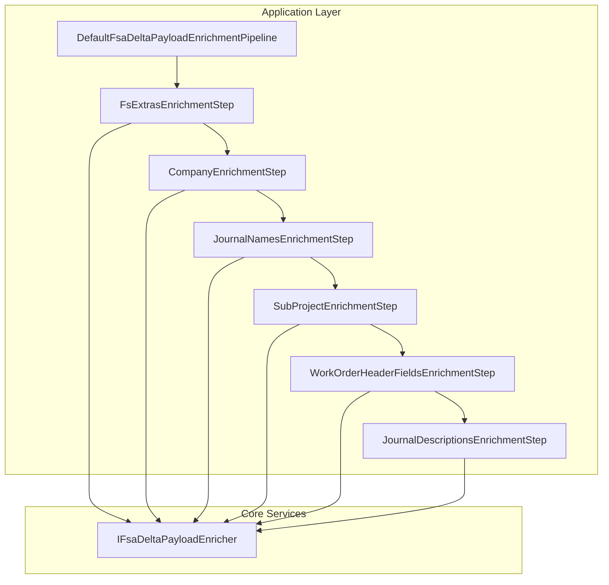

# FSA Delta Payload Enrichment Pipeline Feature Documentation

## Overview

The **FSA Delta Payload Enrichment Pipeline** enriches outbound Field Service delta payloads with additional data concerns—such as FS-specific extras, company codes, journal names, and header fields—before dispatch to downstream systems. By modularizing each enrichment task into isolated steps, the pipeline remains open for extension and closed for modification, supporting business-driven additions without core changes. This design ensures deterministic ordering and streamlined integration via dependency injection.

## Architecture Overview 🚀



## Component Structure

### Enrichment Pipeline Interfaces

#### **IFsaDeltaPayloadEnrichmentStep**

Path: `src/.../EnrichmentPipeline/IFsaDeltaPayloadEnrichmentStep.cs`

Defines a single enrichment concern to apply on the payload.

```csharp
public interface IFsaDeltaPayloadEnrichmentStep
{
    /// <summary>Stable identifier for ordering/logging.</summary>
    string Name { get; }

    /// <summary>Execution order (ascending). Keep gaps for easy insertion.</summary>
    int Order { get; }

    Task<string> ApplyAsync(EnrichmentContext ctx, CancellationToken ct);
}
```

(Source: )

#### **IFsaDeltaPayloadEnrichmentPipeline**

Path: `src/.../EnrichmentPipeline/IFsaDeltaPayloadEnrichmentPipeline.cs`

Orchestrates all registered steps in deterministic order.

```csharp
public interface IFsaDeltaPayloadEnrichmentPipeline
{
    Task<string> ApplyAsync(EnrichmentContext ctx, CancellationToken ct);
}
```

(Source: )

### Default Pipeline Implementation

#### **DefaultFsaDeltaPayloadEnrichmentPipeline**

Path: `src/.../EnrichmentPipeline/DefaultFsaDeltaPayloadEnrichmentPipeline.cs`

- **Responsibilities:**- Sorts injected steps by `Order` then `Name`.
- Invokes each step sequentially, updating the JSON payload.
- Logs debug information on each transformation.

```csharp
public sealed class DefaultFsaDeltaPayloadEnrichmentPipeline : IFsaDeltaPayloadEnrichmentPipeline
{
    private readonly IReadOnlyList<IFsaDeltaPayloadEnrichmentStep> _steps;
    private readonly ILogger<DefaultFsaDeltaPayloadEnrichmentPipeline> _log;

    public DefaultFsaDeltaPayloadEnrichmentPipeline(
        IEnumerable<IFsaDeltaPayloadEnrichmentStep> steps,
        ILogger<DefaultFsaDeltaPayloadEnrichmentPipeline> log)
    {
        _log = log ?? throw new ArgumentNullException(nameof(log));
        _steps = (steps ?? throw new ArgumentNullException(nameof(steps)))
            .OrderBy(s => s.Order)
            .ThenBy(s => s.Name, StringComparer.Ordinal)
            .ToList();
    }

    public async Task<string> ApplyAsync(EnrichmentContext ctx, CancellationToken ct)
    {
        if (ctx is null) throw new ArgumentNullException(nameof(ctx));

        var payload = ctx.PayloadJson ?? string.Empty;
        foreach (var step in _steps)
        {
            ct.ThrowIfCancellationRequested();
            var beforeLen = payload.Length;
            payload = await step.ApplyAsync(ctx with { PayloadJson = payload }, ct).ConfigureAwait(false);
            _log.LogDebug(
                "Delta payload enrichment step executed. Step={Step} Order={Order} LenBefore={Before} LenAfter={After}",
                step.Name, step.Order, beforeLen, payload?.Length ?? 0);
        }
        return payload;
    }
}
```

(Source: )

### Enrichment Context

#### **EnrichmentContext**

Path: `src/.../EnrichmentPipeline/EnrichmentContext.cs`

Immutable record that carries the current payload JSON and supporting lookup dictionaries for enrichment.

| Property | Type | Description |
| --- | --- | --- |
| PayloadJson | string | Raw or partially enriched payload JSON |
| RunId | string | Unique run identifier |
| CorrelationId | string | Correlation identifier for logging/tracing |
| Action | string | Operation type (e.g., Post, Reverse) |
| ExtrasByLineGuid | IReadOnlyDictionary<Guid, FsLineExtras>? | FS extras lookup per line GUID |
| WoIdToCompanyName | IReadOnlyDictionary<Guid, string>? | Company name by Work Order GUID |
| JournalNamesByCompany | IReadOnlyDictionary<string, LegalEntityJournalNames>? | Journal name settings by legal entity code |
| WoIdToSubProjectId | IReadOnlyDictionary<Guid, string>? | Sub-project ID by Work Order GUID |
| WoIdToHeaderFields | IReadOnlyDictionary<Guid, WoHeaderMappingFields>? | Header field mappings by Work Order GUID |


(Source: )

### Enrichment Steps

Each step implements `IFsaDeltaPayloadEnrichmentStep` and applies a focused transformation:

| Step Name | Order | Responsibility | Source |
| --- | --- | --- | --- |
| FsExtras | 100 | Inject FS-specific extras and log per-work order summary |
| Company | 200 | Inject company code from lookup into payload |
| JournalNames | 300 | Add legal-entity journal names at line level |
| SubProjectId | 400 | Inject sub-project IDs into each work order entry |
| WorkOrderHeaderFields | 500 | Inject additional header fields fetched from Dataverse |
| JournalDescriptions | 600 | Stamp or recompute journal descriptions based on final header values |


## Dependency Injection Registration

In the Functions **Program.cs**, the pipeline and each step are registered with DI:

```csharp
services.AddSingleton<IFsaDeltaPayloadEnrichmentPipeline,
    DefaultFsaDeltaPayloadEnrichmentPipeline>();

services.AddSingleton<IFsaDeltaPayloadEnrichmentStep, FsExtrasEnrichmentStep>();
services.AddSingleton<IFsaDeltaPayloadEnrichmentStep, CompanyEnrichmentStep>();
services.AddSingleton<IFsaDeltaPayloadEnrichmentStep, JournalNamesEnrichmentStep>();
services.AddSingleton<IFsaDeltaPayloadEnrichmentStep, SubProjectEnrichmentStep>();
services.AddSingleton<IFsaDeltaPayloadEnrichmentStep, WorkOrderHeaderFieldsEnrichmentStep>();
services.AddSingleton<IFsaDeltaPayloadEnrichmentStep, JournalDescriptionsEnrichmentStep>();
```

## Design Patterns & Considerations

- **Pipeline Pattern**: Each enrichment is an isolated step; steps are composed dynamically.
- **Open/Closed Principle**: Gaps in `Order` allow inserting new steps without touching existing code.
- **Immutability**: `EnrichmentContext` is a record; each step receives a fresh copy with updated payload.
- **Thin Orchestrator**: Core logic remains lean; enrichment responsibilities delegate to `IFsaDeltaPayloadEnricher`.

## Dependencies

- **ILogger<T>**: Structured logging at debug and information levels.
- **IFsaDeltaPayloadEnricher**: Provides actual JSON injection logic.
- **EnrichmentContext**: Carries all required metadata and lookup maps.

## Testing Considerations

- **Unit Test Each Step**: Steps operate on pure functions—given input JSON and lookups, they return new JSON.
- **Order Validation**: Ensure `Order` values yield the intended sequence.
- **Cancellation Support**: Pipeline checks `CancellationToken` between steps.

---

This modular, DI-driven enrichment pipeline ensures that FSA delta payloads are consistently augmented with all required FS-specific fields, supporting maintainability and extensibility for future business needs.