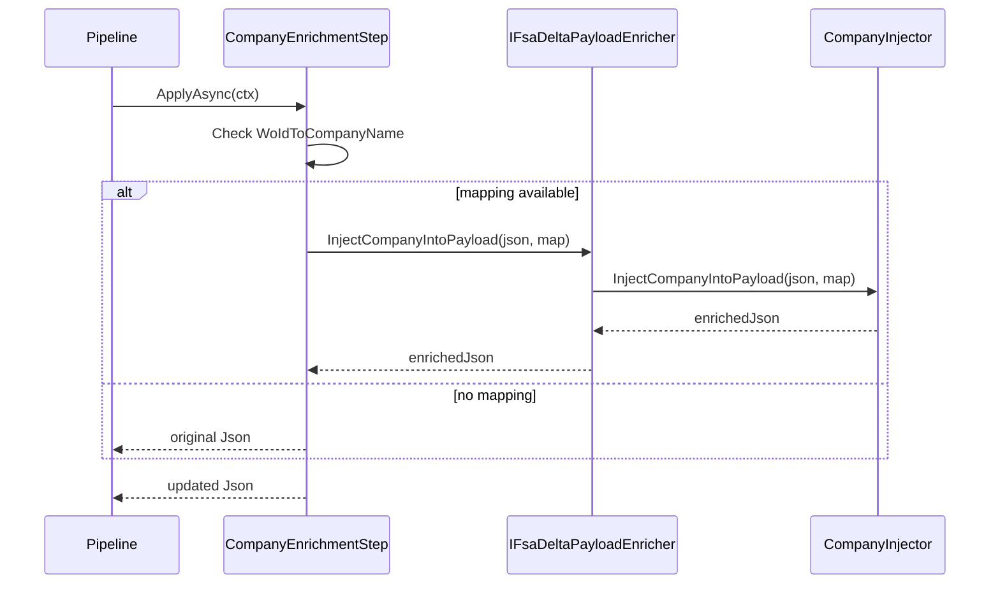

# Company Enrichment Step Feature Documentation

## Overview

The **Company Enrichment Step** ensures every work-order entry in the outbound FSA delta payload carries its associated company identifier. This adds business context to each journal, enabling downstream systems (like FSCM) to process records per company.

As part of an **OCP-friendly enrichment pipeline**, it runs after FS extras (`Order=100`) and before other header enrichments (`Order=300+`), keeping each concern isolated and testable .

## Architecture Overview

```mermaid
flowchart TB
  subgraph Pipeline["Enrichment Pipeline"]
    P[DefaultFsaDeltaPayloadEnrichmentPipeline] --> S100[FsExtras (100)]
    S100 --> S200[Company (200)]
    S200 --> S300[JournalNames (300)]
    S300 --> S400[SubProjectId (400)]
    S400 --> S500[WorkOrderHeaderFields (500)]
    S500 --> S600[JournalDescriptions (600)]
  end

  S200 -->|depends on| E[IFsaDeltaPayloadEnricher]
  E -->|delegates| CI[CompanyInjector]
```

## Component Structure

### CompanyEnrichmentStep (`src/Rpc.AIS.Accrual.Orchestrator.Application/Features/Delta/FsaDeltaPayload/Services/EnrichmentPipeline/Steps/CompanyEnrichmentStep.cs`)

- **Purpose:** Injects company names into each work-order object in the payload.
- **Responsibilities:**- Reads `WoIdToCompanyName` map from `EnrichmentContext`.
- Calls the payload enricher only when mapping exists.
- **Key Properties:**

| Property | Value | Description |
| --- | --- | --- |
| Name | `"Company"` | Stable identifier for logging. |
| Order | `200` | Execution order in pipeline. |


- **Key Method:**

```csharp
  public Task<string> ApplyAsync(EnrichmentContext ctx, CancellationToken ct)
  {
      if (ctx.WoIdToCompanyName is null
          || ctx.WoIdToCompanyName.Count == 0)
          return Task.FromResult(ctx.PayloadJson);

      var updated = _enricher.InjectCompanyIntoPayload(
          ctx.PayloadJson,
          ctx.WoIdToCompanyName);

      return Task.FromResult(updated);
  }
```

(See implementation )

### EnrichmentContext

- **Purpose:** Immutable input bundle for all enrichment steps.
- **Relevant Properties:**

| Property | Type | Description |
| --- | --- | --- |
| `PayloadJson` | `string` | JSON string to enrich. |
| `WoIdToCompanyName` | `IReadOnlyDictionary<Guid, string>?` | Company lookup per work-order ID. |


(Defined in EnrichmentContext )

### IFsaDeltaPayloadEnricher

- **Purpose:** Core orchestrator that applies low-level JSON injections.
- **Relevant Method:**

| Method | Signature |
| --- | --- |
| `InjectCompanyIntoPayload` | `string InjectCompanyIntoPayload(string payloadJson, IReadOnlyDictionary<Guid, string> map)` |


(Interface in Common Abstractions )

### CompanyInjector

- **Purpose:** Performs the actual JSON rewrite to add or overwrite a `"Company"` property in every work-order entry.
- **Method:**

```csharp
  public string InjectCompanyIntoPayload(
      string payloadJson,
      IReadOnlyDictionary<Guid, string> woIdToCompanyName)
```

## Sequence of Operations



## Integration Points

- **Dependency Injection:** Registered as part of the enrichment pipeline in `Program.cs`, alongside other steps .
- **Pipeline Ordering:** Placed at `Order=200` between FS extras and journal-name enrichment.

## Key Classes Reference

| Class | Location | Responsibility |
| --- | --- | --- |
| `CompanyEnrichmentStep` | `.../Services/EnrichmentPipeline/Steps/CompanyEnrichmentStep.cs` | Pipeline step that injects company names into JSON. |
| `EnrichmentContext` | `.../Services/EnrichmentPipeline/EnrichmentContext.cs` | Carries payload and enrichment maps. |
| `IFsaDeltaPayloadEnricher` | `.../Ports/Common/Abstractions/IFsaDeltaPayloadEnricher.cs` | Defines enrichment methods for payload JSON. |
| `CompanyInjector` | `.../Services/Enrichment/CompanyInjector.cs` | Low-level JSON writer for the Company field. |


## Error Handling

- **Constructor:** Throws `ArgumentNullException` if the enricher dependency is `null`.
- **ApplyAsync:** Silently skips injection when `WoIdToCompanyName` is `null` or empty, returning the original payload.

## Testing Considerations

- **No-op behavior:** When `WoIdToCompanyName` is missing or empty, `PayloadJson` must remain unchanged.
- **Successful injection:** Given a valid map, each work-order in the JSON should gain or preserve a non-empty `"Company"` property.
- **Exception path:** Constructor should reject `null` enricher with an `ArgumentNullException`.