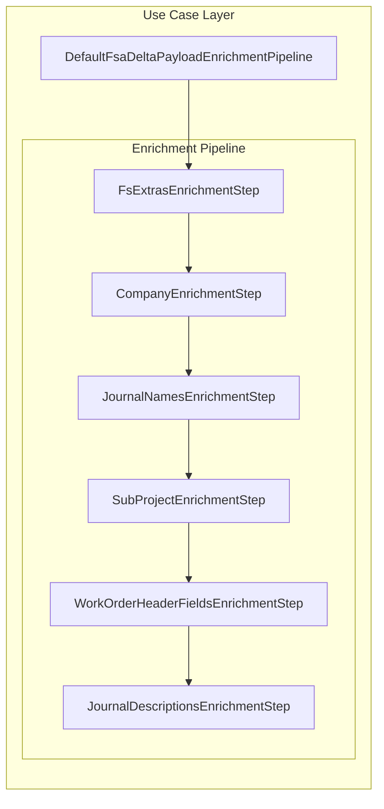
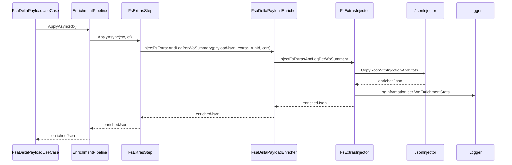

# Fs Extras Enrichment Step Feature Documentation

## Overview

The **FsExtrasEnrichmentStep** enriches the outbound FSA delta payload with Field Service–specific line extras (currency, worker number, warehouse, site, line number, operations date).

It acts as the first step in a concern-based enrichment pipeline, ensuring any available extras are injected and a per-work-order summary is logged.

If no extras exist, it returns the original payload unchanged.

## Architecture Overview



## Component Structure

### 1. Enrichment Pipeline Step

#### **FsExtrasEnrichmentStep**

*Path*: `src/Rpc.AIS.Accrual.Orchestrator.Application/Features/Delta/FsaDeltaPayload/Services/EnrichmentPipeline/Steps/FsExtrasEnrichmentStep.cs`

- **Purpose**

Injects Field Service line extras into the payload JSON and logs summary metrics per work order.

- **Implements**

`IFsaDeltaPayloadEnrichmentStep`

- **Key Properties**

| Property | Type | Value | Description |
| --- | --- | --- | --- |
| **Name** | string | "FsExtras" | Stable identifier used for ordering/logging |
| **Order** | int | 100 | Execution order (first in pipeline) |


- **Key Method**

```csharp
  Task<string> ApplyAsync(EnrichmentContext ctx, CancellationToken ct)
```

- Returns original JSON if no extras exist.
- Wraps `ctx.ExtrasByLineGuid` into a concrete `Dictionary<Guid, FsLineExtras>` to call the enricher.
- Invokes `InjectFsExtrasAndLogPerWoSummary` on the injected enricher.

## Dependencies & Integration

- **EnrichmentContext**

Provides input bundle including `PayloadJson`, `RunId`, `CorrelationId`, and `ExtrasByLineGuid` .

- **IFsaDeltaPayloadEnricher**

Core abstraction for payload enrichment. Used here to perform injection and logging .

- **FsLineExtras**

Record representing per-line extras (currency, worker number, warehouse, site, line number, operations date) .

- **DI Registration**

Registered in `Program.cs` as the enrichment pipeline’s first step:

```csharp
  services.AddSingleton<IFsaDeltaPayloadEnrichmentStep,
      FsExtrasEnrichmentStep>();
```

## Sequence of Operations



## Key Classes Reference

| Class | Location | Responsibility |
| --- | --- | --- |
| FsExtrasEnrichmentStep | `.../EnrichmentPipeline/Steps/FsExtrasEnrichmentStep.cs` | Applies FS line extras enrichment and logs summary per WO line |


## Testing Considerations

- **No Extras Scenario**

Passing a context with `ExtrasByLineGuid` null or empty returns the original payload.

- **With Extras Scenario**

Ensures `InjectFsExtrasAndLogPerWoSummary` is invoked and output JSON includes the extras.

- **Cancellation**

Honors `CancellationToken` by propagating it through pipeline; if cancelled, `ApplyAsync` aborts before injection.

## Dependencies Summary

- `Rpc.AIS.Accrual.Orchestrator.Core.Abstractions.IFsaDeltaPayloadEnricher`
- `Rpc.AIS.Accrual.Orchestrator.Application.Features.Delta.FsaDeltaPayload.Services.EnrichmentPipeline.EnrichmentContext`
- `Rpc.AIS.Accrual.Orchestrator.Core.Services.FsaDeltaPayload.FsLineExtras`
- `Microsoft.Extensions.Logging.ILogger`
- `System.Threading.CancellationToken`
- `System.Threading.Tasks.Task`