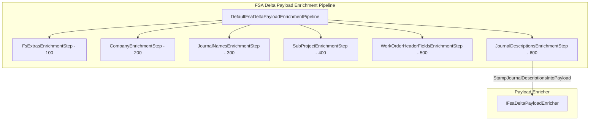
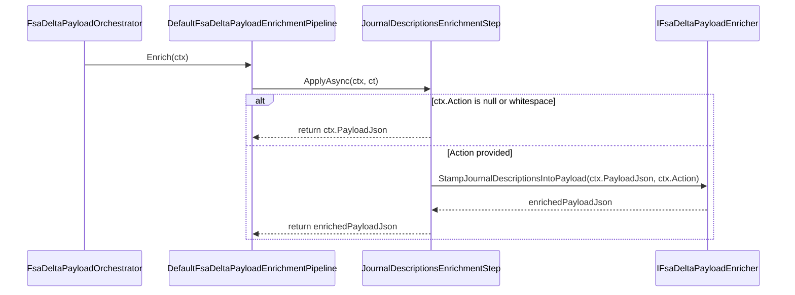

# Journal Descriptions Enrichment Feature Documentation

## Overview

The **Journal Descriptions Enrichment** step injects human-readable descriptions into each journal and journal line within an FSA delta payload. It uses the work order ID, sub-project ID, and action (e.g. “Post” or “Patch”) to form a consistent description like

```plaintext
"{WorkOrderID} - {SubProjectId} - {Action}"
```

This enriches payloads for downstream processing, auditing, and posting to external systems.

This feature fits into the broader **FSA Delta Payload Enrichment Pipeline**, ensuring every journal entry carries context before transmission.

## Architecture Overview 🛠️



## Component Structure

### Business Layer

#### **JournalDescriptionsEnrichmentStep** (`src/Rpc.AIS.Accrual.Orchestrator.Application/Features/Delta/FsaDeltaPayload/Services/EnrichmentPipeline/Steps/JournalDescriptionsEnrichmentStep.cs`)

- **Purpose:**

Applies journal description stamping to the JSON payload when the `Action` is provided.

- **Dependencies:**- `IFsaDeltaPayloadEnricher` – performs the actual JSON transformation.
- `EnrichmentContext` – carries payload data and metadata.

- **Constructor:**

```csharp
  public JournalDescriptionsEnrichmentStep(IFsaDeltaPayloadEnricher enricher)
      => _enricher = enricher ?? throw new ArgumentNullException(nameof(enricher));
```

- **Key Properties:**

| Property | Type | Value |
| --- | --- | --- |
| Name | string | `"JournalDescriptions"` |
| Order | int | `600` (executes after header fields) |


- **Key Method:**

```csharp
  public Task<string> ApplyAsync(EnrichmentContext ctx, CancellationToken ct)
  {
      if (string.IsNullOrWhiteSpace(ctx.Action))
          return Task.FromResult(ctx.PayloadJson);

      var updated = _enricher.StampJournalDescriptionsIntoPayload(ctx.PayloadJson, ctx.Action);
      return Task.FromResult(updated);
  }
```

- Checks for a non-empty `Action`.
- Returns original payload if no action is set.
- Otherwise, delegates to the enricher and returns the enriched JSON.

## Feature Flow

### Journal Description Stamping Sequence



## Integration Points

- **Dependency Injection:**

Registered in `Program.cs` as a singleton for `IFsaDeltaPayloadEnrichmentStep`.

- **Pipeline Ordering:**

Executes after `WorkOrderHeaderFieldsEnrichmentStep` (Order 500) and before any downstream processing.

- **Enricher Collaboration:**

Calls `IFsaDeltaPayloadEnricher.StampJournalDescriptionsIntoPayload` to modify JSON.

## Key Classes Reference

| Class | Location | Responsibility |
| --- | --- | --- |
| JournalDescriptionsEnrichmentStep | `.../EnrichmentPipeline/Steps/JournalDescriptionsEnrichmentStep.cs` | Applies description stamping based on `ctx.Action`. |
| IFsaDeltaPayloadEnrichmentStep | `.../EnrichmentPipeline/IFsaDeltaPayloadEnrichmentStep.cs` | Defines contract for enrichment steps. |
| EnrichmentContext | `.../EnrichmentPipeline/EnrichmentContext.cs` | Carries payload JSON and metadata through pipeline. |
| IFsaDeltaPayloadEnricher | `Rpc.AIS.Accrual.Orchestrator.Core.Abstractions` (in core abstractions project) | Exposes methods to enrich payload JSON. |


## Dependencies

- .NET namespaces: `System`, `System.Threading`, `System.Threading.Tasks`.
- Project abstraction: `Rpc.AIS.Accrual.Orchestrator.Core.Abstractions`.
- Enrichment pipeline contracts and contexts within the application project.

## Error Handling

- **Constructor:** throws `ArgumentNullException` if `enricher` is null.
- **ApplyAsync:** gracefully handles missing `Action` by returning the original payload.

## Testing Considerations

- **Null Dependency:** ensure constructor throws when passed a null `IFsaDeltaPayloadEnricher`.
- **Empty Action:** verify `ApplyAsync` returns unmodified JSON if `ctx.Action` is null or whitespace.
- **Valid Action:** mock `IFsaDeltaPayloadEnricher` to confirm `StampJournalDescriptionsIntoPayload` is invoked with correct arguments and its result is returned.