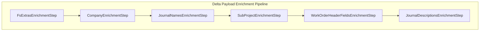
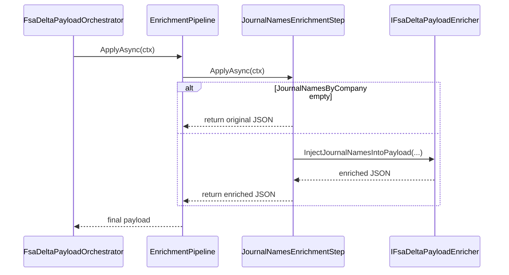

# Journal Names Enrichment Step

## Overview

The **Journal Names Enrichment Step** enriches delta payloads by injecting FSCM journal identifiers into each journal header section of a Work Order JSON. It runs as part of an OCP-friendly enrichment pipeline that applies a sequence of transformations to the raw FSA delta payload. By stamping the appropriate `JournalName` values for item, expense, and hour journals, downstream FSCM posting processes can route entries to the correct journals based on legal-entity configuration.

This step executes after company and extras enrichment and before sub-project, header fields, and description stamping. It ensures that every journal header section in the outbound JSON contains a valid `JournalName`, falling back to existing values if no mapping is configured .

## Architecture Overview



This pipeline is discovered via dependency injection. Each step implements `IFsaDeltaPayloadEnrichmentStep` and runs in ascending `Order` value.

## Component Structure 🚀

### JournalNamesEnrichmentStep (`src/Rpc.AIS.Accrual.Orchestrator.Application/Features/Delta/FsaDeltaPayload/Services/EnrichmentPipeline/Steps/JournalNamesEnrichmentStep.cs`)

- **Purpose:** Injects `JournalName` into each journal header section (`WOItemLines`, `WOExpLines`, `WOHourLines`) using configured mappings per legal entity.
- **Key Properties:- `Name` (string): `"JournalNames"` — stable identifier for logging.
- `Order` (int): `300` — position in pipeline.
- **Constructor:**

```csharp
  public JournalNamesEnrichmentStep(IFsaDeltaPayloadEnricher enricher)
      => _enricher = enricher ?? throw new ArgumentNullException(nameof(enricher));
```

- **ApplyAsync:**1. Checks if `ctx.JournalNamesByCompany` is null or empty; if so, returns original payload.
2. Calls `_enricher.InjectJournalNamesIntoPayload(...)`.

```csharp
  public Task<string> ApplyAsync(EnrichmentContext ctx, CancellationToken ct)
  {
      if (ctx.JournalNamesByCompany is null || ctx.JournalNamesByCompany.Count == 0)
          return Task.FromResult(ctx.PayloadJson);

      var updated = _enricher.InjectJournalNamesIntoPayload(
          ctx.PayloadJson,
          ctx.JournalNamesByCompany);

      return Task.FromResult(updated);
  }
```

### IFsaDeltaPayloadEnrichmentStep (`src/.../Services/EnrichmentPipeline/IFsaDeltaPayloadEnrichmentStep.cs`)

| Member | Description |
| --- | --- |
| `string Name` | Stable identifier for ordering/logging. |
| `int Order` | Execution order (ascending). |
| `Task<string> ApplyAsync(EnrichmentContext, CancellationToken)` | Applies enrichment to payload JSON. |


### IFsaDeltaPayloadEnricher (injected dependency)

Defines methods for all enrichment concerns, including:

- `InjectJournalNamesIntoPayload(string, IReadOnlyDictionary<string, LegalEntityJournalNames>)`
- Other enrichment methods (company, extras, sub-project, header fields, descriptions).

## Registration in DI

In `Program.cs`, the step is registered alongside its peers:

```csharp
services.AddSingleton<IFsaDeltaPayloadEnrichmentStep,
    JournalNamesEnrichmentStep>();
```

This ensures the pipeline discovers and orders it automatically.

## Sequence Diagram



## Dependencies

- **EnrichmentContext**: Carries payload JSON, run metadata, and lookup maps (including `JournalNamesByCompany`).
- **LegalEntityJournalNames**: Holds journal name IDs per entity (item, expense, hour).
- **IFsaDeltaPayloadEnricher**: Core service that performs JSON tree copying and field injection.

## Key Classes Reference

| Class | Location | Responsibility |
| --- | --- | --- |
| JournalNamesEnrichmentStep | `.../EnrichmentPipeline/Steps/JournalNamesEnrichmentStep.cs` | Pipeline step for journal name injection |
| IFsaDeltaPayloadEnrichmentStep | `.../EnrichmentPipeline/IFsaDeltaPayloadEnrichmentStep.cs` | Common interface for enrichment steps |
| IFsaDeltaPayloadEnricher | `.../Ports/Common/Abstractions/IFsaDeltaPayloadEnricher.cs` | Service that implements JSON enrichment operations |
| EnrichmentContext | `.../EnrichmentPipeline/EnrichmentContext.cs` | Carries payload and metadata through the pipeline |


## Testing Considerations

- **Empty Mapping**: Verify that when `JournalNamesByCompany` is null or has no entries, the payload remains unchanged.
- **Injection Logic**: Use a payload with journal sections missing `JournalName` to confirm the enricher adds correct values.
- **Order Enforcement**: Ensure `Order=300` places this step between company injection and sub-project injection.

---

This documentation covers the **Journal Names Enrichment Step**, its role within the FSA delta payload pipeline, and how it integrates with other enrichment concerns to prepare a fully enriched JSON payload for downstream FSCM processes.