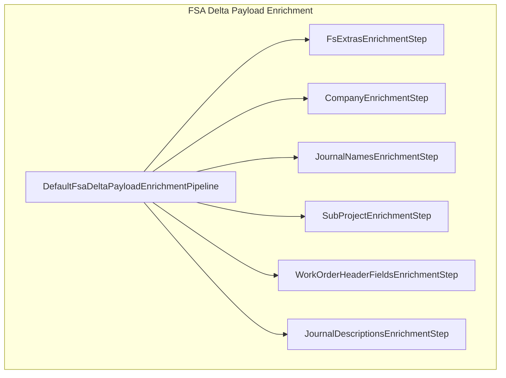
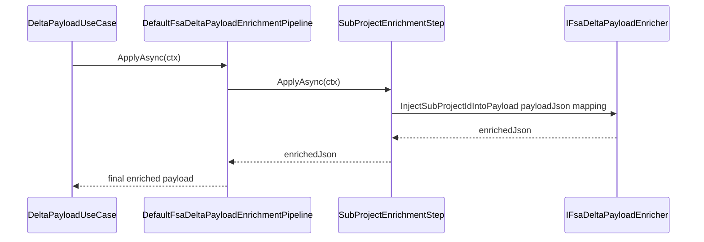

# SubProjectEnrichmentStep Feature Documentation

## Overview

The **SubProjectEnrichmentStep** is an enrichment component in the FSA delta payload pipeline. It injects subproject identifiers into the outbound JSON payload based on a provided mapping of work order IDs to subproject IDs. This ensures downstream systems receive the required `SubProjectId` field for each work order element. It executes as the fourth step in a multi-step pipeline, maintaining a clear separation of concerns.

## Architecture Overview

This step participates in a pipeline that applies multiple enrichment concerns in a defined order. Below is a high-level view of how it fits into the overall enrichment process.



## Component Structure

Below is a breakdown of the main classes and interfaces involved in subproject enrichment.

### Business Layer

This layer contains enrichment step implementations that apply specific concerns to the payload.

#### SubProjectEnrichmentStep (`src/Rpc.AIS.Accrual.Orchestrator.Application/Features/Delta/FsaDeltaPayload/Services/EnrichmentPipeline/Steps/SubProjectEnrichmentStep.cs`)

- **Purpose:** Injects `SubProjectId` into each work order in the JSON payload when mappings exist.
- **Dependencies:**- `IFsaDeltaPayloadEnricher`: Service that performs the actual JSON injection.
- **Key Properties:**- `Name` (`string`): `"SubProjectId"`
- `Order` (`int`): `400`
- **Key Method:**- `ApplyAsync(EnrichmentContext ctx, CancellationToken ct) → Task<string>`: Applies the enrichment if `WoIdToSubProjectId` is non-empty.

```csharp
public sealed class SubProjectEnrichmentStep : IFsaDeltaPayloadEnrichmentStep
{
    private readonly IFsaDeltaPayloadEnricher _enricher;

    public SubProjectEnrichmentStep(IFsaDeltaPayloadEnricher enricher)
        => _enricher = enricher ?? throw new ArgumentNullException(nameof(enricher));

    public string Name => "SubProjectId";
    public int Order => 400;

    public Task<string> ApplyAsync(EnrichmentContext ctx, CancellationToken ct)
    {
        if (ctx.WoIdToSubProjectId is null || ctx.WoIdToSubProjectId.Count == 0)
            return Task.FromResult(ctx.PayloadJson);

        var updated = _enricher.InjectSubProjectIdIntoPayload(ctx.PayloadJson, ctx.WoIdToSubProjectId);
        return Task.FromResult(updated);
    }
}
```

### Enrichment Pipeline Interfaces

This section defines the contracts that pipeline steps and the pipeline implementation follow.

#### IFsaDeltaPayloadEnrichmentStep (`…/EnrichmentPipeline/IFsaDeltaPayloadEnrichmentStep.cs`)

- **Purpose:** Contract for a single enrichment concern applied to the outbound payload.
- **Members:**- `Name` (`string`): Identifier for ordering/logging.
- `Order` (`int`): Execution order (ascending).
- `ApplyAsync(EnrichmentContext ctx, CancellationToken ct)` → `Task<string>`: Applies enrichment.

#### IFsaDeltaPayloadEnricher (`Rpc.AIS.Accrual.Orchestrator.Core.Abstractions`)

- **Purpose:** Defines methods to inject various enrichments into a JSON payload.
- **Relevant Method:**- `string InjectSubProjectIdIntoPayload(string payloadJson, IReadOnlyDictionary<Guid, string> woIdToSubProjectId)`

### Core Services

These classes implement the low-level JSON manipulation logic.

#### SubProjectIdInjector (`Rpc.AIS.Accrual.Orchestrator.Core.Services.FsaDeltaPayload.Enrichment.SubProjectIdInjector`)

- **Purpose:** Traverses and rewrites the JSON payload to insert or override `SubProjectId` fields.
- **Key Method:**- `InjectSubProjectIdIntoPayload(string payloadJson, IReadOnlyDictionary<Guid, string> woIdToSubProjectId)`

### Data Models

Immutable structures carrying enrichment data into each step.

#### EnrichmentContext (`…/EnrichmentPipeline/EnrichmentContext.cs`)

Holds all input needed for enrichment steps.

| Property | Type | Description |
| --- | --- | --- |
| PayloadJson | `string` | Original or previously enriched JSON payload. |
| RunId | `string` | Unique ID for the current run. |
| CorrelationId | `string` | Tracing identifier across services. |
| Action | `string` | Operation name triggering enrichment. |
| ExtrasByLineGuid | `IReadOnlyDictionary<Guid, FsLineExtras>?` | FS extras per line GUID. |
| WoIdToCompanyName | `IReadOnlyDictionary<Guid, string>?` | Work order → company name map. |
| JournalNamesByCompany | `IReadOnlyDictionary<string, LegalEntityJournalNames>?` | Company → journal names map. |
| WoIdToSubProjectId | `IReadOnlyDictionary<Guid, string>?` | Work order → subproject ID map. |
| WoIdToHeaderFields | `IReadOnlyDictionary<Guid, WoHeaderMappingFields>?` | Work order → header fields map. |


## Sequence of Execution

Shows how the enrichment pipeline and this step interact at runtime.



## Integration Points

- Part of the **FSA Delta Payload Enrichment Pipeline**.
- Executes after `JournalNamesEnrichmentStep` (Order 300) and before `WorkOrderHeaderFieldsEnrichmentStep` (Order 500).

## Key Classes Reference

| Class | Location | Responsibility |
| --- | --- | --- |
| SubProjectEnrichmentStep | src/.../Steps/SubProjectEnrichmentStep.cs | Applies SubProjectId enrichment to payload. |
| IFsaDeltaPayloadEnrichmentStep | src/.../EnrichmentPipeline/IFsaDeltaPayloadEnrichmentStep.cs | Defines enrichment step contract. |
| IFsaDeltaPayloadEnricher | Rpc.AIS.Accrual.Orchestrator.Core.Abstractions | Interface for payload enrichment services. |
| SubProjectIdInjector | Rpc.AIS.Accrual.Orchestrator.Core.Services.FsaDeltaPayload.Enrichment/SubProjectIdInjector.cs | Implements JSON injection of SubProjectId. |
| EnrichmentContext | src/.../EnrichmentPipeline/EnrichmentContext.cs | Carries payload and mapping data for enrichment. |


## Dependencies

- **Rpc.AIS.Accrual.Orchestrator.Core.Abstractions.IFsaDeltaPayloadEnricher**
- **Rpc.AIS.Accrual.Orchestrator.Application.Features.Delta.FsaDeltaPayload.Services.EnrichmentPipeline.IFsaDeltaPayloadEnrichmentStep**

## Testing Considerations

- **No Mapping Present:** When `WoIdToSubProjectId` is `null` or empty, `ApplyAsync` returns the original `PayloadJson`.
- **Mapping Present:** Validates that the returned JSON includes a `SubProjectId` property for each work order matching the mapping.

## Error Handling

- The constructor throws an `ArgumentNullException` if the `IFsaDeltaPayloadEnricher` dependency is not supplied.

No additional caching or state management is required by this component.