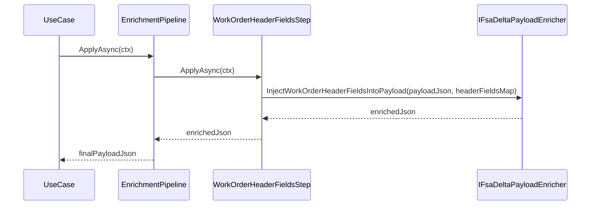
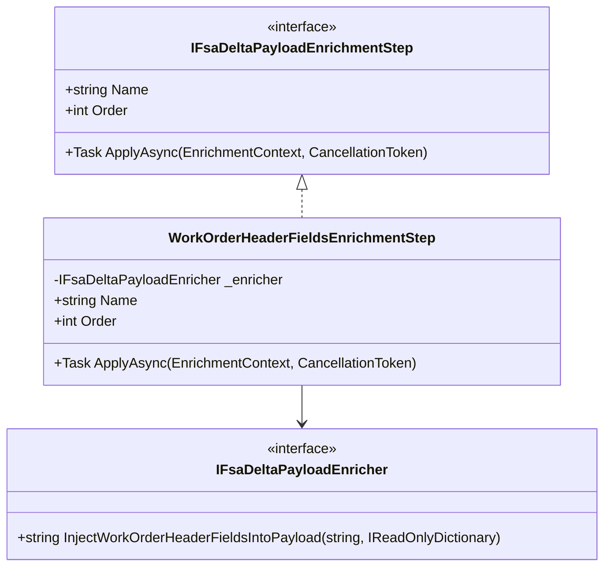

# WorkOrderHeaderFieldsEnrichmentStep Feature Documentation

## Overview

The **WorkOrderHeaderFieldsEnrichmentStep** enriches the outbound delta payload JSON by injecting mapping-only work order header fields into each `WOList` entry. These header fields—such as actual start/end dates, geolocation, invoice notes, customer reference, and taxability—are fetched from Dataverse and attached to the payload to support downstream processing (e.g., validation, delta calculation, posting) without altering core payload construction.

This step implements the **Open/Closed Principle**: it adheres to the `IFsaDeltaPayloadEnrichmentStep` interface so that new enrichment concerns can be added without modifying existing logic. It executes deterministically as part of a pipeline, running **after** company, journal names, and sub-project steps, but **before** journal descriptions stamping.

## Architecture Overview

```mermaid
flowchart TB
    subgraph EnrichmentPipeline
        direction LR
        FS[FsExtras (100)] --> CO[Company (200)]
        CO --> JN[JournalNames (300)]
        JN --> SP[SubProjectId (400)]
        SP --> WH[WorkOrderHeaderFields (500)]
        WH --> JD[JournalDescriptions (600)]
    end

    subgraph EnrichmentStep
        WH -->|delegates to| ENR[IFsaDeltaPayloadEnricher]
    end

    subgraph CoreServices
        ENR -->|invokes| Injector[InjectWorkOrderHeaderFieldsIntoPayload]
    end
```

## Component Structure

### Enrichment Context

- **Type**: `EnrichmentContext`
- **Location**: `…/EnrichmentPipeline/EnrichmentContext.cs`
- **Role**: Immutable bundle containing:- `PayloadJson`
- `RunId`, `CorrelationId`, `Action`
- Lookup maps for FS line extras, company names, journal names, sub project IDs, and header fields .

### IFsaDeltaPayloadEnrichmentStep

- **Interface**: Defines a single enrichment concern.
- **Key Members**:- `string Name { get; }` — stable identifier.
- `int Order { get; }` — execution order.
- `Task<string> ApplyAsync(EnrichmentContext, CancellationToken)` — applies enrichment .

### WorkOrderHeaderFieldsEnrichmentStep

- **Class**: `WorkOrderHeaderFieldsEnrichmentStep`
- **Location**: `…/Services/EnrichmentPipeline/Steps/WorkOrderHeaderFieldsEnrichmentStep.cs`
- **Namespace**: `Rpc.AIS.Accrual.Orchestrator.Application.Features.Delta.FsaDeltaPayload.Services.EnrichmentPipeline.Steps`
- **Purpose**: Injects mapping-only header fields into the outbound payload JSON.
- **Constructor Dependency**:- `IFsaDeltaPayloadEnricher _enricher` — performs actual JSON mutation .
- **Properties**:- `Name => "WorkOrderHeaderFields"`
- `Order => 500`
- **Method**:

```csharp
  public Task<string> ApplyAsync(EnrichmentContext ctx, CancellationToken ct)
  {
      if (ctx.WoIdToHeaderFields is null || ctx.WoIdToHeaderFields.Count == 0)
          return Task.FromResult(ctx.PayloadJson);

      var updated = _enricher.InjectWorkOrderHeaderFieldsIntoPayload(
          ctx.PayloadJson,
          ctx.WoIdToHeaderFields);

      return Task.FromResult(updated);
  }
```

- Checks for presence of header mappings.
- Delegates to the enricher when mappings exist; otherwise returns original JSON .

## Sequence Flow



## Class Diagram



## Dependencies

- **IFsaDeltaPayloadEnricher**- Defined in `Rpc.AIS.Accrual.Orchestrator.Core.Abstractions`
- Provides `InjectWorkOrderHeaderFieldsIntoPayload` .
- **EnrichmentContext.WoIdToHeaderFields**- Dictionary of `Guid` → `WoHeaderMappingFields`, built earlier by `FsaDeltaPayloadWorkOrderHeaderMaps`.

## Testing Considerations

- **No Header Mappings**:- Input: `ctx.WoIdToHeaderFields == null` or empty.
- Expect: returns original `ctx.PayloadJson` unchanged.
- **With Header Mappings**:- Verify `InjectWorkOrderHeaderFieldsIntoPayload` is called once and its return value is propagated.
- **Constructor Null Guard**:- Passing `null` for `enricher` throws `ArgumentNullException(nameof(enricher))`.

## Key Classes Reference

| Class | Location | Responsibility |
| --- | --- | --- |
| WorkOrderHeaderFieldsEnrichmentStep | `…/Services/EnrichmentPipeline/Steps/WorkOrderHeaderFieldsEnrichmentStep.cs` | Enrich payload with work order header fields |
| IFsaDeltaPayloadEnrichmentStep | `…/Services/EnrichmentPipeline/IFsaDeltaPayloadEnrichmentStep.cs` | Interface for single enrichment concern |
| EnrichmentContext | `…/Services/EnrichmentPipeline/EnrichmentContext.cs` | Carries payload JSON and lookup maps to steps |
| IFsaDeltaPayloadEnricher | `…/Core/Abstractions/IFsaDeltaPayloadEnricher.cs` | Defines enrichment operations for delta payload |
| DefaultFsaDeltaPayloadEnrichmentPipeline | `…/Services/EnrichmentPipeline/DefaultFsaDeltaPayloadEnrichmentPipeline.cs` | Orchestrates execution of enrichment steps in order |
