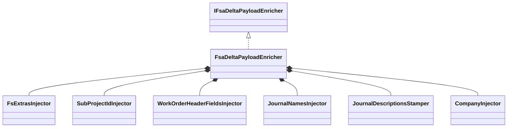
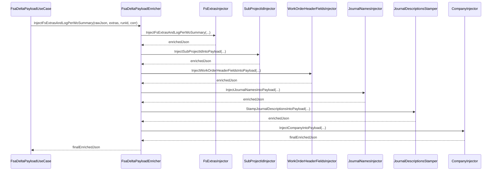

# FSA Delta Payload Enrichment Feature Documentation

## Overview

The **FSA Delta Payload Enricher** centralizes all JSON–based enrichment concerns for outbound delta payloads in the Field Service Accrual orchestrator. After the core use case builds a raw delta payload, this component:

- Injects FS-specific line extras (currency, worker, warehouse, site, line number) and logs a per-workorder summary.
- Adds header-level fields: company, sub-project IDs, and mapping-only work-order header attributes.
- Enriches journal entries with configured journal names and stamps journal descriptions based on the triggering action.

By compositing focused injector classes, the enricher keeps each enrichment concern independently testable and adheres to the Open/Closed Principle (OCP).

## Architecture Overview

- **FsaDeltaPayloadEnricher** implements the **IFsaDeltaPayloadEnricher** interface.
- It delegates each concern to a dedicated injector:- **FsExtrasInjector** for line-level extras and logging
- **SubProjectIdInjector** for sub-project IDs
- **WorkOrderHeaderFieldsInjector** for mapping-only header fields
- **JournalNamesInjector** for journal name assignments
- **JournalDescriptionsStamper** for stamping descriptions
- **CompanyInjector** for company names

## Component Structure

### Service Layer

#### **FsaDeltaPayloadEnricher** (`src/Rpc.AIS.Accrual.Orchestrator.Application/Features/Delta/FsaDeltaPayload/Services/FsaDeltaPayloadEnricher.cs`)

- **Purpose:** Orchestrates all enrichment steps on a raw delta JSON payload by delegating to specialized injectors.
- **Dependencies:**- `ILogger<FsaDeltaPayloadEnricher>`
- Concrete injector implementations:- `FsExtrasInjector`
- `SubProjectIdInjector`
- `WorkOrderHeaderFieldsInjector`
- `JournalNamesInjector`
- `JournalDescriptionsStamper`
- `CompanyInjector`
- **Public Methods:**- `string InjectFsExtrasAndLogPerWoSummary(string payloadJson, Dictionary<Guid, FsLineExtras> extrasByLineGuid, string runId, string corr)`
- `string InjectSubProjectIdIntoPayload(string payloadJson, IReadOnlyDictionary<Guid, string> woIdToSubProjectId)`
- `string InjectWorkOrderHeaderFieldsIntoPayload(string payloadJson, IReadOnlyDictionary<Guid, WoHeaderMappingFields> woIdToHeaderFields)`
- `string InjectJournalNamesIntoPayload(string payloadJson, IReadOnlyDictionary<string, LegalEntityJournalNames> journalNamesByCompany)`
- `string StampJournalDescriptionsIntoPayload(string payloadJson, string action)`
- `string InjectCompanyIntoPayload(string payloadJson, IReadOnlyDictionary<Guid, string> woIdToCompanyName)`

### Injector Components

Each injector implements a single responsibility interface and performs an in-place JSON transformation via **System.Text.Json**.

| Injector | Interface | File | Responsibility |
| --- | --- | --- | --- |
| **FsExtrasInjector** | `IFsExtrasInjector` | `…/Services/Enrichment/FsExtrasInjector.cs` | Injects line-level FS extras and logs per-WO summary |
| **SubProjectIdInjector** | `ISubProjectIdInjector` | *(implied alongside other injectors)* | Injects the `SubProjectId` header field into each WO entry |
| **WorkOrderHeaderFieldsInjector** | `IWorkOrderHeaderFieldsInjector` | *(implied)* | Adds mapping-only header fields (FSAWorkType, CountryRegionId, etc.) |
| **JournalNamesInjector** | `IJournalNamesInjector` | *(implied)* | Inserts configured journal names into WOItemLines, WOExpLines, and WOHourLines |
| **JournalDescriptionsStamper** | `IJournalDescriptionsStamper` | *(implied)* | Stamps `JournalDescription` and `JournalLineDescription` based on WorkOrderID, SubProjectId, action |
| **CompanyInjector** | `ICompanyInjector` | `…/Services/Enrichment/CompanyInjector.cs` | Ensures each WO entry has a non-empty `Company` field |

### JSON Utilities

Within `FsaDeltaPayloadEnricher.cs`, several **private static helpers** drive the JSON copy-and-inject patterns:

- **Build Maps from Dataverse Fragments:**- `BuildWorkOrderCompanyNameMap(JsonDocument woHeaders)`
- `BuildWorkOrderSubProjectIdMap(JsonDocument woHeaders)`
- **Copy-With-Injection Methods:**- `CopyRootWithWoHeaderFieldsInjection(...)`
- `CopyRootWithSubProjectIdInjection(...)`
- `CopyRootWithCompanyInjection(...)`
- `CopyRootWithJournalNamesInjection(...)`
- `CopyRootWithJournalDescriptionStamp(...)`
- **Low-Level Writers:**- `WriteIsoDateIfPresent(Utf8JsonWriter w, string propName, DateTime? dtUtc)`
- `BuildDefaultDimensionDisplayValue(string? department, string? productLine)`

These helpers iterate JSON objects and arrays, selectively skip or overwrite properties, and append new fields according to enrichment rules.

## Feature Flow

1. **Line Extras** are injected first, with logging of summary stats.
2. **Sub-Project IDs**, **Header Fields**, **Journal Names**, **Journal Descriptions**, and **Company** follow in discrete steps.
3. The **Use Case** receives the fully enriched JSON for downstream transmission to FSCM.

## Key Classes Reference

| Class | Location | Responsibility |
| --- | --- | --- |
| `FsaDeltaPayloadEnricher` | `…/FsaDeltaPayloadEnricher.cs` | Entry point for all enrichment concerns; composes injectors. |
| `IFsaDeltaPayloadEnricher` | `…/IFsaDeltaPayloadEnricher.cs` | Abstraction defining all enrichment operations. |
| `FsExtrasInjector` | `…/Enrichment/FsExtrasInjector.cs` | Injects FS line extras and logs per-WO summary. |
| `CompanyInjector` | `…/Enrichment/CompanyInjector.cs` | Ensures the `Company` field is present in each WO entry. |
| `IFsExtrasInjector` | `…/Enrichment/IFsExtrasInjector.cs` | Interface for FS extras injection. |
| `ICompanyInjector` | `…/Enrichment/ICompanyInjector.cs` | Interface for company injection. |

## Error Handling

- **Constructor null-checks:** All injectors and the logger are validated at instantiation.
- **Graceful no-op:** Each public injection method returns the original JSON when its input map is `null` or empty.
- **Loose GUID parsing:** Helper methods tolerate non-GUID strings and skip invalid values silently.

## Dependencies

- `Microsoft.Extensions.Logging` for structured enrichment and summary logs.
- `System.Text.Json` for high-performance streaming JSON read/write.
- `Rpc.AIS.Accrual.Orchestrator.Core.Services.FsaDeltaPayload.FsaDeltaPayloadJsonUtil` for low-level JSON utility routines.