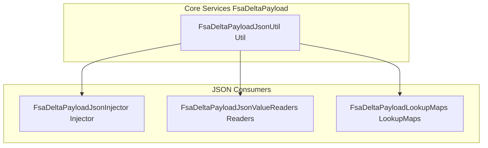

# FSA Delta Payload JSON Utilities Feature Documentation

## Overview 🔍

The **FsaDeltaPayloadJsonUtil** class provides a central set of robust JSON‐parsing helpers used throughout the FSA delta payload full-fetch path. By consolidating common parsing patterns—such as GUID extraction, formatted value lookup, and loose GUID parsing—it prevents duplication of fragile logic and ensures consistency.

These utilities live in the Core Services layer of the **Rpc.AIS.Accrual.Orchestrator** application and support higher-level components like payload injectors and value readers. Consumers rely on them to safely interpret JSON elements returned by Dataverse, avoiding runtime errors from unexpected shapes or nulls.

## Architecture Overview



## Component Structure

### Utility Class

#### **FsaDeltaPayloadJsonUtil**

*Location:* `src/Rpc.AIS.Accrual.Orchestrator.Core.Services.FsaDeltaPayload/FsaDeltaPayloadJsonUtil.cs`

- **Purpose:** Centralize small, reusable JSON‐parsing routines for the FSA delta payload feature.
- **Responsibilities:**- Parsing GUID values from JSON properties.
- Detecting whether a string looks like a GUID.
- Extracting Dataverse OData formatted‐value annotations.
- Loosely parsing GUIDs from possibly wrapped or noisy strings.

### Methods

| Method | Signature | Description |
| --- | --- | --- |
| **TryGuid** | `bool TryGuid(JsonElement row, string propertyName, out Guid id)` | Attempts to read `propertyName` from `row` as a JSON string and parse it as a GUID. |
| **LooksLikeGuid** | `bool LooksLikeGuid(string? s)` | Returns **true** if a non-empty string `s` can be trimmed and parsed as a GUID. |
| **TryFormattedOnly** | `bool TryFormattedOnly(JsonElement row, string logicalFieldName, out string? formatted)` | Looks for the Dataverse annotation `logicalFieldName@OData.Community.Display.V1.FormattedValue` and, if present and non-blank, returns it. |
| **ParseGuidLoose** | `Guid? ParseGuidLoose(string? raw)` | Trims wrappers (`{}`, `()`) from `raw`, tries a strict parse, then scans the content for any 36-char GUID substring. |


#### Example Usage

```csharp
// Safely extract a GUID from a JSON element
if (FsaDeltaPayloadJsonUtil.TryGuid(rowElement, "msdyn_serviceid", out var serviceId))
{
    // serviceId is now a valid Guid
}

// Check arbitrary string for GUID pattern
if (FsaDeltaPayloadJsonUtil.LooksLikeGuid(maybeGuidString))
{
    var loose = FsaDeltaPayloadJsonUtil.ParseGuidLoose(maybeGuidString);
    // loose holds the parsed Guid or null
}

// Read only the formatted display name for a lookup field
if (FsaDeltaPayloadJsonUtil.TryFormattedOnly(rowElement, "ownerid", out var ownerName))
{
    Console.WriteLine($"Owner Display Name: {ownerName}");
}
```

## Dependencies

- **System**
- **System.Text.Json** (`JsonElement`, `JsonValueKind`)

## Integration Points

- **FsaDeltaPayloadJsonInjector** uses `TryFormattedOnly` and `TryGuid` to normalize and inject missing fields into outbound payload JSON.
- **FsaDeltaPayloadJsonValueReaders** delegates its `TryGuid` operations to this utility.
- **FsaDeltaPayloadLookupMaps** leverages `ParseGuidLoose` when assembling line‐extras mappings from raw Dataverse rows.

## Testing Considerations

- Validate **TryGuid** with:- Non-object JSON elements (should return false).
- Missing or null properties.
- Valid and invalid GUID strings.
- Confirm **LooksLikeGuid** rejects whitespace or malformed strings, and accepts properly formatted GUIDs.
- Exercise **TryFormattedOnly** against JSON elements:- Without the formatted annotation.
- With a blank string annotation.
- With a valid formatted-value string.
- Ensure **ParseGuidLoose**:- Trims braces and parentheses.
- Finds a GUID substring amidst noise.
- Returns null when no GUID is present.

```card
{
    "title": "Utility Purpose",
    "content": "Centralizes fragile JSON parsing logic for FSA delta payload."
}
```

## Key Classes Reference

| Class | Location | Responsibility |
| --- | --- | --- |
| FsaDeltaPayloadJsonUtil | `Core/Services/FsaDeltaPayload/FsaDeltaPayloadJsonUtil.cs` | JSON‐parsing helpers for GUIDs and formatted values. |
