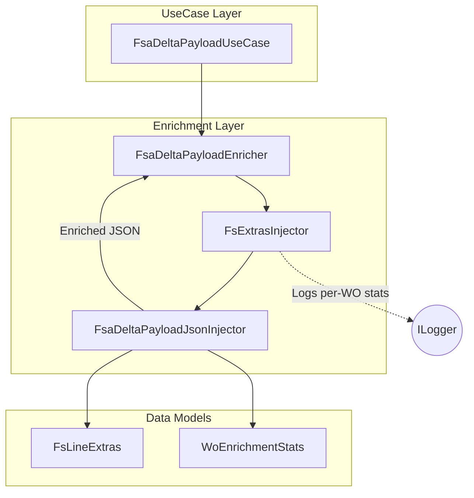
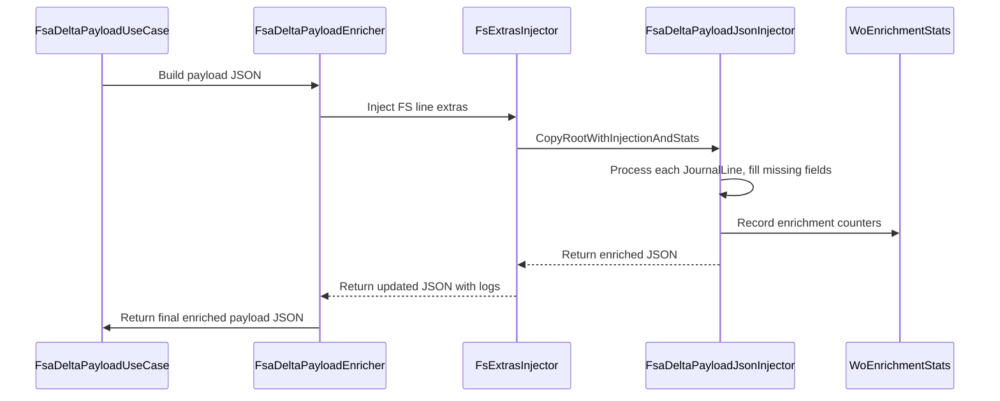

# FSA Delta Payload JSON Injector Feature Documentation

## Overview

The **FsaDeltaPayloadJsonInjector** is a low-level utility that enriches the outbound delta payload JSON with Field Service (FS)–specific details on each journal line and collects per-work-order enrichment statistics. It is invoked by the `FsExtrasInjector` within the delta payload orchestration pipeline to:

- Fill missing FS fields (currency, worker, warehouse, site, line number, dates) on each journal line
- Normalize date formats to FSCM-compatible literals
- Gather metrics on how many fields were injected per work order

This process ensures the final JSON sent to FSCM is complete, consistent, and traceable.

## Architecture Overview



## Component Structure

### FsaDeltaPayloadJsonInjector

**Path:**

`src/Rpc.AIS.Accrual.Orchestrator.Application/Features/Delta/FsaDeltaPayload/Services/Json/FsaDeltaPayloadJsonInjector.cs`

A static helper that walks the JSON document, injects FS line extras, stamps canonical dates, and accumulates enrichment statistics.

Key Methods:

| Method | Description |
| --- | --- |
| CopyRootWithInjectionAndStats(...) | Entry point for any JSON root. Delegates to `CopyRequestWithInjectionAndStats` when encountering the `_request` object; otherwise, passes through properties unmodified. |
| CopyRequestWithInjectionAndStats(...) | Iterates the `WOList` array; for each work order, initializes a `WoEnrichmentStats` and calls `CopyWoWithInjectionAndStats`. |
| CopyWoWithInjectionAndStats(...) | Processes each work order object; delegates line-group handling for `WOExpLines`, `WOItemLines`, and `WOHourLines`. |
| CopyWoLinesBlockWithInjectionAndStats(...) | Within a line group, iterates `JournalLines`, enriching each via `CopyJournalLineWithInjectionAndStats` and updating counters by group. |
| CopyJournalLineWithInjectionAndStats(...) | Core enrichment: parses the line GUID, looks up `FsLineExtras`, fills missing fields (`Currency`, `ResourceId`, `Warehouse`, `Site`, `Line num`), stamps `OperationDate`/`TransactionDate`, and returns whether any injection occurred. Updates stats accordingly. |
| NormalizeToFscmDateLiteralOrNull(raw) | Converts various raw date formats (ISO strings, `/Date(...)` wrappers) into FSCM’s `/Date(ms)/` literal. |
| Helpers (`TryGetString`, `ReadWoIdText`, etc.) | Utility functions to safely extract string properties, read work order IDs/GUIDs, and detect existing JSON properties. |


### WoEnrichmentStats

**Path:**

`src/Rpc.AIS.Accrual.Orchestrator.Application/Features/Delta/FsaDeltaPayload/Services/WoEnrichmentStats.cs`

Aggregates metrics about how many lines and which fields were enriched for each work order.

| Property | Type | Description |
| --- | --- | --- |
| WorkorderId | string? | The “Work order ID” text from the payload. |
| WorkorderGuidRaw | string? | The raw GUID string for the work order. |
| Company | string? | The company name carried in the work order payload. |
| EnrichedLinesTotal | int | Total number of journal lines enriched. |
| EnrichedHourLines | int | Number of hour lines enriched. |
| EnrichedExpLines | int | Number of expense lines enriched. |
| EnrichedItemLines | int | Number of item lines enriched. |
| FilledCurrency | int | Count of currency values added. |
| FilledResourceId | int | Count of resource IDs added. |
| FilledWarehouse | int | Count of warehouse identifiers added. |
| FilledSite | int | Count of site identifiers added. |
| FilledLineNum | int | Count of line numbers added. |
| FilledOperationsDate | int | Count of operation dates injected (via `MarkFilledOperationsDate()`). |


### FsLineExtras

**Path:**

`src/Rpc.AIS.Accrual.Orchestrator.Application/Features/Delta/FsaDeltaPayload/Services/FsLineExtras.cs`

Immutable record representing Field Service–specific attributes fetched from Dataverse for each line.

```csharp
public sealed record FsLineExtras(
    string? Currency,
    string? WorkerNumber,
    string? WarehouseIdentifier,
    string? SiteId,
    int? LineNum,
    string? OperationsDate)
{
    public bool HasAny()
        => !string.IsNullOrWhiteSpace(Currency)
        || !string.IsNullOrWhiteSpace(WorkerNumber)
        || !string.IsNullOrWhiteSpace(WarehouseIdentifier)
        || !string.IsNullOrWhiteSpace(SiteId)
        || LineNum.HasValue
        || !string.IsNullOrWhiteSpace(OperationsDate);
}
```

## Design Patterns

- **Separation of Concerns**: JSON-injection logic is factored into a static class, distinct from orchestrator and logging responsibilities .
- **Streaming JSON API**: Uses `JsonDocument` + `Utf8JsonWriter` to parse and write JSON in a forward-only, low-allocation manner.
- **Composition over Inheritance**: `FsExtrasInjector` composes `FsaDeltaPayloadJsonInjector`, and `FsaDeltaPayloadEnricher` composes all enrichment injectors for OCP-friendly pipelines .

## Sequence Flow



## Dependencies

- **System.Text.Json** — JSON parsing/writing
- **Microsoft.Extensions.Logging** — logging enrichment summaries
- **Rpc.AIS.Accrual.Orchestrator.Core.Domain** — domain types (`FsLineExtras`, `WoEnrichmentStats`)

## Testing Considerations

- Validate that missing fields (`Currency`, `ResourceId`, etc.) are correctly injected when extras are present.
- Confirm existing non-empty fields are preserved.
- Verify date normalization handles ISO strings, `/Date(...)` wrappers, and falls back gracefully.
- Simulate payloads without `_request` or `WOList` to ensure pass-through behavior.

## Key Classes Reference

| Class | Location | Responsibility |
| --- | --- | --- |
| FsaDeltaPayloadJsonInjector | src/Rpc.AIS.Accrual.Orchestrator.Application/Features/Delta/FsaDeltaPayload/Services/Json/FsaDeltaPayloadJsonInjector.cs | Walks the JSON tree to inject FS extras per line and collect stats. |
| FsExtrasInjector | src/Rpc.AIS.Accrual.Orchestrator.Core.Services.FsaDeltaPayload.Enrichment/FsExtrasInjector.cs | Adapter that parses JSON, invokes the injector, logs per-WO summaries. |
| WoEnrichmentStats | src/Rpc.AIS.Accrual.Orchestrator.Application/Features/Delta/FsaDeltaPayload/Services/WoEnrichmentStats.cs | Holds counters of enrichment operations per work order. |
| FsLineExtras | src/Rpc.AIS.Accrual.Orchestrator.Application/Features/Delta/FsaDeltaPayload/Services/FsLineExtras.cs | Encapsulates FS line attributes fetched from Dataverse. |
