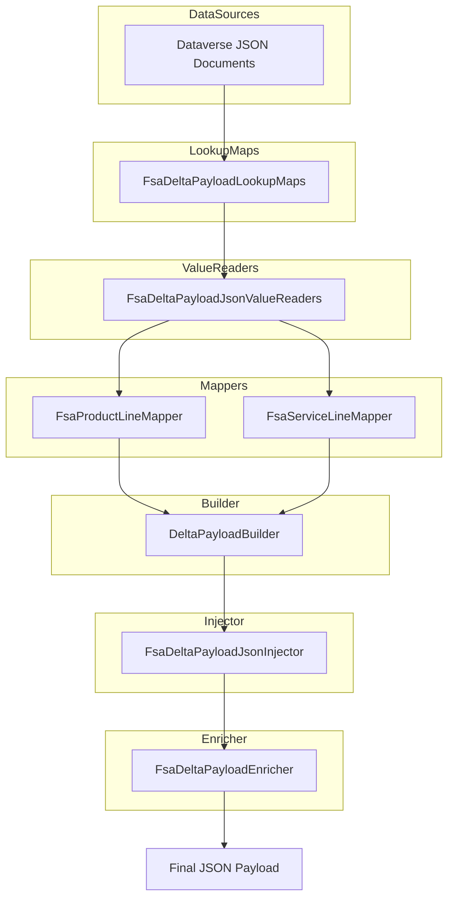

# FSA Delta Payload JSON Services Documentation

## Overview

The **FSA Delta Payload JSON Services** provide a suite of utilities, mappers and enrichers that transform raw JSON responses from Field Service (Dataverse) and FSCM into a final delta payload.

- They parse and normalize JSON properties into .NET types.
- They build lookup maps for work-order lines and headers.
- They inject missing fields (currency, warehouse, dates) into the outbound JSON.
- They orchestrate mapping from Dataverse rows to domain snapshots and enrich journal lines.

These services live in the **Core.Services.FsaDeltaPayload** namespace and power the delta-payload use cases in the Orchestrator application.

---

## Architecture Overview



- **Dataverse JSON Documents** (work-orders, products, services) feed into
- **LookupMaps** which assemble `FsLineExtras` and header maps.
- **ValueReaders** safely extract primitives and formatted values.
- **Mappers** project each row into domain snapshot objects.
- **DeltaPayloadBuilder** constructs the initial JSON shape.
- **Injector** fills in missing FS-only fields per line.
- **Enricher** stamps header fields and journal names into the final payload.

---

## Component Structure

### 1. JSON Value Readers 🧩

File: `Services/Json/FsaDeltaPayloadJsonValueReaders.cs`

**Purpose:** Safely read various JSON properties (string, int, decimal, GUID, lookup labels, flags) from `JsonElement`.

| Method | Return Type | Description |
| --- | --- | --- |
| **TryString**(`row`, `prop`) | `string?` | Returns the string value if the property exists and is a JSON string. |
| **TryInt**(`row`, `prop`) | `int?` | Reads a number or parses a string into an `int`. |
| **TryGuid**(`row`, `prop`, `out id`) | `bool` | Parses a JSON-string property into `Guid`. |
| **TryDecimalAny**(`row`, `props…`) | `decimal?` | Attempts multiple property names, returning the first `decimal`. |
| **TryCurrency**(`row`) | `string?` | Reads `isocurrencycode` or nested `transactioncurrencyid.isocurrencycode`. |
| **TryWarehouse**(`row`) | `string?` | Prefers `msdyn_warehouseidentifier`, falls back to lookup label or raw GUID. |
| **TryFormattedOrRaw**(`row`, `name`) | `string?` | Reads formatted OData value, raw lookup value or raw property. |
| **TryFormattedOrGuidAware**(`row`, `name`) | `string?` | Same as above but treats pure GUIDs as unusable labels. |
| **TryStatecodeActive**(`row`) | `bool?` | Interprets `statecode` number or string into an Active/Inactive flag. |
| **TryJournalDescription**(`row`) | `string?` | Prefers `msdyn_journaldescription`, then `msdyn_description` or `msdyn_name`. |
| **ExtractWoIdsFromPresence**(`doc`) | `HashSet<Guid>` | Extracts work-order GUIDs from a presence JSON array. |


```csharp
internal static int? TryInt(JsonElement row, string prop)
{
    if (!row.TryGetProperty(prop, out var p)) return null;
    if (p.ValueKind == JsonValueKind.Number && p.TryGetInt32(out var i)) return i;
    var s = p.ToString();
    return int.TryParse(s, out var j) ? j : null;
}
```

---

### 2. JSON Utilities 🔧

File: `Services/Json/FsaDeltaPayloadJsonUtil.cs`

**Purpose:** Shared low-level helpers to parse GUIDs and formatted OData annotations.

- **TryGuid** / **LooksLikeGuid**
- **TryFormattedOnly** reads `@OData.Community.Display.V1.FormattedValue`.
- **ParseGuidLoose** strips braces and scans for any GUID-pattern substring.

```csharp
internal static Guid? ParseGuidLoose(string? raw)
{
    if (string.IsNullOrWhiteSpace(raw)) return null;
    var s = raw.Trim('{','}','(',')').Trim();
    if (Guid.TryParse(s, out var g)) return g;
    for (var i = 0; i <= s.Length - 36; i++)
        if (Guid.TryParse(s.Substring(i,36), out g)) return g;
    return null;
}
```

---

### 3. Lookup Maps 🗺️

File: `Services/Json/FsaDeltaPayloadLookupMaps.cs`

**Purpose:** Build dictionaries for FS line-level extras (`FsLineExtras`) and work-order header fields.

- **BuildLineExtrasMapForFinalPayload**- Scans two JSON docs (`woProducts`, `woServices`)
- Reads GUID, currency, worker number, warehouse/site, line number, operations date
- Returns `Dictionary<Guid, FsLineExtras>`

---

### 4. JSON Injector 💉

File: `Services/Json/FsaDeltaPayloadJsonInjector.cs`

**Purpose:** Walk the outbound payload JSON, merging in any missing FS-specific fields and stamping canonical dates.

- **CopyJournalLineWithInjectionAndStats** injects per-line:- Currency, ResourceId, Warehouse, Site, Line num
- RPCWorkingDate / TransactionDate from `rpc_operationsdate`
- Tracks counts in `WoEnrichmentStats`

```csharp
if (p.NameEquals("Warehouse"))
{
    var existing = p.Value.ValueKind == JsonValueKind.String ? p.Value.GetString() : null;
    var shouldFill = hasExtras && !string.IsNullOrWhiteSpace(extras.WarehouseIdentifier)
                     && (string.IsNullOrWhiteSpace(existing)
                         || !string.Equals(existing, extras.WarehouseIdentifier));
    w.WriteString("Warehouse", shouldFill ? extras.WarehouseIdentifier : existing);
    if (shouldFill) { anyFilled = true; s.FilledWarehouse++; }
    continue;
}
```

---

### 5. JSON Helpers for Mappers 🛠️

File: `Services/Mappers/FsaDeltaPayloadJsonHelpers.cs`

**Purpose:** Assist line mappers in reading decimals, lookups, dates, booleans and formatted labels.

| Method | Return Type | Description |
| --- | --- | --- |
| **TryDecimal**(`row`,`prop`) | `decimal?` | Number only |
| **TryDecimalAny**(`row`,`props…`) | `decimal?` | Tries multiple props |
| **TryLookupFormattedPreferred** | `string?` | Prefers OData formatted label then raw lookup id |
| **TryDateTimeUtc**(`row`,`prop`) | `DateTime?` | Parses ISO or `/Date(ms)/` literal to UTC |
| **TryBool**(`row`,`prop`) | `bool?` | Parses number/string boolean |
| **TryStatecodeActive** | `bool` | Active if `statecode == 0` |
| **TryJournalDescription** | `string?` | Same as in JsonValueReaders |


---

### 6. Line Mappers 📦

- **FsaProductLineMapper** (`Services/Mappers/FsaProductLineMapper.cs`)
- **FsaServiceLineMapper** (`Services/Mappers/FsaServiceLineMapper.cs`)

**Purpose:** Map each JSON row into domain snapshot types used by `DeltaPayloadBuilder`.

Key fields include: Currency, Unit, JournalDescription, Discount/Surcharge, CalculatedUnitPrice, OperationsDateUtc, TaxabilityType.

```csharp
var line = new FsaServiceLineDto(
    Currency: FsaDeltaPayloadJsonHelpers.TryCurrency(row),
    Unit: FsaDeltaPayloadJsonHelpers.TryLookupFormattedPreferred(row, "_msdyn_unit_value"),
    JournalDescription: FsaDeltaPayloadJsonHelpers.TryJournalDescription(row),
    DiscountAmount: FsaDeltaPayloadJsonHelpers.TryDecimal(row, "rpc_lineitemdiscountamount"),
    OperationsDateUtc: FsaDeltaPayloadJsonHelpers.TryDateTimeUtc(row, "rpc_operationsdate")
);
```

---

### 7. Work-Order Header Maps 🏷️

File: `Services/Json/FsaDeltaPayloadWorkOrderHeaderMaps.cs`

**Purpose:** Extract header metadata (company, subproject, department, taxability, geolocation, dates) from work-order JSON.

- Loose parsing of strings, decimals, UTC dates
- Returns `Dictionary<Guid, WorkOrderHeaderFields>`

---

### 8. Payload Enricher ✨

File: `Services/FsaDeltaPayloadEnricher.cs`

**Purpose:**

- **InjectCompanyIntoPayload**, **InjectSubProjectIdIntoPayload**, **InjectWorkOrderHeaderFieldsIntoPayload**
- **InjectJournalNamesIntoPayload**
- Stamp header fields at root level, overwriting or skipping blanks
- Build `DimensionDisplayValue`

```csharp
WriteIsoDateIfPresent(w, "ActualStartDate", header.ActualStartDateUtc);
WriteIsoDateIfPresent(w, "ProjectedEndDate", header.ProjectedEndDateUtc);
```

---

### 9. Delta-Payload Use Cases 🚀

Files under `UseCases/FsaDeltaPayloadUseCase.*.cs`

**Purpose:** Orchestrate full-fetch or single-WO delta payload flows:

1. Fetch presence (line GUIDs)
2. Fetch products & services
3. Build lookup maps & header maps
4. Build snapshots via `DeltaPayloadBuilder`
5. Inject FS extras & header fields
6. Stamp journal descriptions
7. Return `GetFsaDeltaPayloadResultDto`

---

### 10. Core Domain DTOs 📑

File: `Domain/FsaDeltaActivityDtos.cs`

- **GetFsaDeltaPayloadResultDto**- `string PayloadJson`
- `string? ProductDeltaLinkAfter`
- `string? ServiceDeltaLinkAfter`
- `IReadOnlyList<string> WorkOrderNumbers`

---

## Data Models

### FsLineExtras

File: `Services/FsLineExtras.cs`

| Property | Type | Description |
| --- | --- | --- |
| `Currency` | `string?` | ISO currency code |
| `WorkerNumber` | `string?` | Field Service worker identifier |
| `WarehouseIdentifier` | `string?` | Warehouse code |
| `SiteId` | `string?` | Site identifier |
| `LineNum` | `int?` | Line order in work-order |
| `OperationsDate` | `string?` | Raw `rpc_operationsdate` string |
| **HasAny()** | `bool` | Indicates if any field is populated |


---

## Dependencies

- **System.Text.Json** for JSON DOM parsing and writing
- **Microsoft.Extensions.Logging** for telemetry in use-cases
- **Rpc.AIS.Accrual.Orchestrator.Core.Services.FsaDeltaPayload** abstractions and utilities
- **DeltaPayloadBuilder** (external)

---

## Integration Points

- **DeltaPayloadBuilder**: constructs base JSON shape from snapshots
- **IFsaDeltaPayloadEnricher**: adapter interface for enrichment steps
- **IJournalNamesParameters**: fetches FSCM journal names by company
- **Telemetry**: logs raw and enriched JSON at key steps

---

## Testing Considerations

- Ensure **ValueReaders** gracefully handle missing or malformed JSON properties
- Validate GUID parsing in `ParseGuidLoose` against various string formats
- Confirm **Injector** does not emit `rpc_operationsdate` but stamps canonical dates instead
- Verify header-field overwrites skip blank or duplicate keys

---

*This documentation covers all JSON-related services in the FSA Delta Payload feature, enabling developers to understand parsing, mapping, and enrichment flows for building outbound delta payloads.*