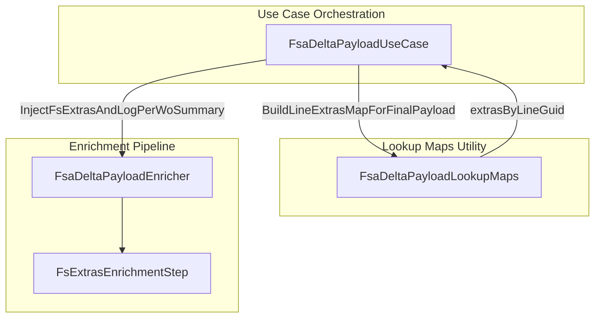
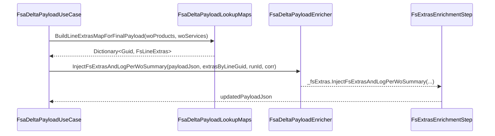

# FSA Delta Payload Lookup Maps Documentation

## Overview

The **FsaDeltaPayloadLookupMaps** class provides utilities to extract Field Service–specific metadata (line extras) from raw JSON payloads of work order products and services. It builds a mapping of line GUIDs to `FsLineExtras` records, capturing fields such as currency, worker number, warehouse, site, line order, and operations date. These lookup maps drive the FS extras enrichment step, ensuring that the final outbound payload includes all necessary FS-only fields for accurate posting to downstream systems.

By centralizing JSON parsing logic, this component improves maintainability and reduces duplication across enrichment steps. It integrates seamlessly into the FSA delta payload orchestration, fitting between data fetching and JSON injection phases of the use case.

## Architecture Overview



## Component Structure

### Utility Service

#### **FsaDeltaPayloadLookupMaps** (`src/Rpc.AIS.Accrual.Orchestrator.Application/Features/Delta/FsaDeltaPayload/Services/Json/FsaDeltaPayloadLookupMaps.cs`)

- **Purpose**

Aggregates FS line extras from product and service JSON documents into a lookup map for final payload injection.

- **Key Methods**

| Method | Description | Returns |
| --- | --- | --- |
| BuildLineExtrasMapForFinalPayload(woProducts, woServices) | Scans `woProducts` and `woServices`, extracts extras per line GUID, and builds a dictionary of `FsLineExtras`. | `Dictionary<Guid, FsLineExtras>` |
| TryReadIsoCurrencyCode(row) | Reads ISO currency code from a JSON element; checks flat and nested fields to support Dataverse expansions. | `string?` |


```csharp
internal static Dictionary<Guid, FsLineExtras> BuildLineExtrasMapForFinalPayload(
    JsonDocument woProducts,
    JsonDocument woServices)
{
    var map = new Dictionary<Guid, FsLineExtras>();
    static void Add(
        JsonDocument doc,
        string idProp,
        bool includeWarehouseAndSite,
        Dictionary<Guid, FsLineExtras> target)
    {
        if (doc is null) return;
        if (!doc.RootElement.TryGetProperty("value", out var arr) ||
            arr.ValueKind != JsonValueKind.Array)
            return;

        foreach (var row in arr.EnumerateArray())
        {
            if (!FsaDeltaPayloadJsonValueReaders.TryGuid(row, idProp, out var id))
                continue;

            var extras = new FsLineExtras(
                Currency: TryReadIsoCurrencyCode(row),
                WorkerNumber: FsaDeltaPayloadJsonValueReaders.TryString(row, "cdm_workernumber"),
                WarehouseIdentifier: includeWarehouseAndSite
                    ? FsaDeltaPayloadJsonValueReaders.TryString(row, "msdyn_warehouseidentifier")
                    : null,
                SiteId: includeWarehouseAndSite
                    ? FsaDeltaPayloadJsonValueReaders.TryString(row, "msdyn_siteid")
                    : null,
                LineNum: FsaDeltaPayloadJsonValueReaders.TryInt(row, "msdyn_lineorder"),
                OperationsDate: FsaDeltaPayloadJsonValueReaders.TryString(row, "rpc_operationsdate")
            );

            if (extras.HasAny())
                target[id] = extras;
        }
    }

    Add(woProducts, "msdyn_workorderproductid", true, map);
    Add(woServices, "msdyn_workorderserviceid", false, map);
    return map;
}
```

```csharp
static string? TryReadIsoCurrencyCode(JsonElement row)
{
    var flat = FsaDeltaPayloadJsonValueReaders.TryString(row, "isocurrencycode");
    if (!string.IsNullOrWhiteSpace(flat)) return flat;

    if (row.TryGetProperty("transactioncurrencyid", out var cur) &&
        cur.ValueKind == JsonValueKind.Object)
    {
        var nested = FsaDeltaPayloadJsonValueReaders.TryString(cur, "isocurrencycode");
        if (!string.IsNullOrWhiteSpace(nested)) return nested;
    }

    return null;
}
```

### Data Models

#### **FsLineExtras** (`src/Rpc.AIS.Accrual.Orchestrator.Application/Features/Delta/FsaDeltaPayload/Services/FsLineExtras.cs`)

- **Purpose**

Represents optional FS-specific metadata for a line item.

- **Property Table**

| Property | Type | Description |
| --- | --- | --- |
| Currency | `string?` | ISO currency code |
| WorkerNumber | `string?` | Field Service worker identifier |
| WarehouseIdentifier | `string?` | Warehouse identifier when applicable |
| SiteId | `string?` | Site identifier when applicable |
| LineNum | `int?` | Line order within the work order |
| OperationsDate | `string?` | Raw operations date string (may require normalization) |


```csharp
public sealed record FsLineExtras(
    string? Currency,
    string? WorkerNumber,
    string? WarehouseIdentifier,
    string? SiteId,
    int? LineNum,
    string? OperationsDate)
{
    public bool HasAny() => 
        !string.IsNullOrWhiteSpace(Currency) ||
        !string.IsNullOrWhiteSpace(WorkerNumber) ||
        !string.IsNullOrWhiteSpace(WarehouseIdentifier) ||
        !string.IsNullOrWhiteSpace(SiteId) ||
        LineNum.HasValue ||
        !string.IsNullOrWhiteSpace(OperationsDate);
}
```

## Integration Points

- **FsaDeltaPayloadUseCase**

Invokes `BuildLineExtrasMapForFinalPayload` immediately before calling `InjectFsExtrasAndLogPerWoSummary` in the FS extras enrichment step .

- **FsExtrasEnrichmentStep**

Receives the resulting map and delegates injection to `FsaDeltaPayloadEnricher`.

## Feature Flow

### FS Extras Enrichment Sequence



## Error Handling

- **Null or malformed JSON**: Returns an empty dictionary if input documents are null or lack a `"value"` array.
- **Missing GUIDs**: Skips rows where the expected GUID property cannot be parsed.
- **Missing extras**: Only lines with at least one non-null extra are included, avoiding empty entries.

## Dependencies

- **FsaDeltaPayloadJsonValueReaders**: Provides low-level JSON readers for GUIDs, strings, and integers.
- **FsLineExtras**: Data model for holding extracted metadata.

## Key Classes Reference

| Class | Location | Responsibility |
| --- | --- | --- |
| FsaDeltaPayloadLookupMaps | `.../Services/Json/FsaDeltaPayloadLookupMaps.cs` | Extracts and maps FS line extras from product/service payloads. |
| FsLineExtras | `.../Services/FsLineExtras.cs` | Holds metadata fields for a line item, with detection of populated fields. |
| FsaDeltaPayloadJsonValueReaders | `.../Services/Json/FsaDeltaPayloadJsonValueReaders.cs` | Low-level JSON parsing helpers (TryGuid, TryString, TryInt). |


## Testing Considerations

- Validate behavior when `woProducts` or `woServices` is `null`, empty, or lacks `"value"`.
- Ensure currency extraction handles both flat and nested shapes.
- Confirm only populated extras are inserted into the map (lines with no extras are omitted).
- Test with mixed product and service inputs to verify both branches of the `Add` helper.