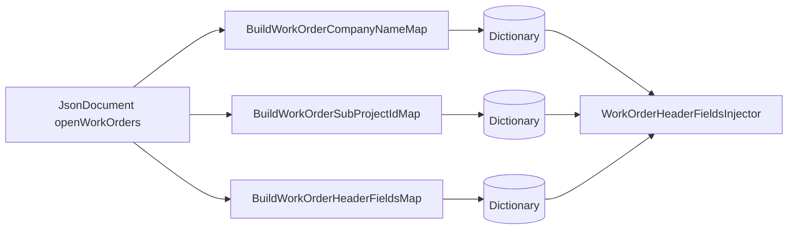
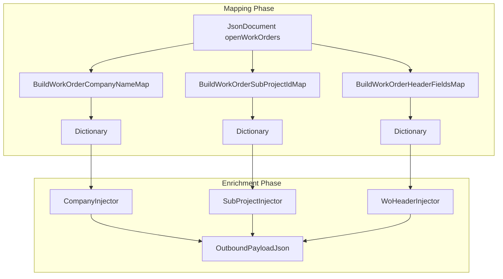

# Fsa Delta Payload Work Order Header Maps

## Overview

This static utility class extracts header‐level lookup data from a Dataverse JSON payload of open Field Service work orders. It builds dictionaries that map each work order’s GUID to:

- **Company Name** (via flattened or expanded lookup fields)
- **Sub‐Project ID** (using formatted or legacy fields)
- **Header Mapping Fields** (`WoHeaderMappingFields` record containing dates, location, taxability, and other header metadata)

These maps enable downstream enrichment and injection of header data into the final delta payload sent to FSCM.

## Architecture Overview



## Component Structure

### Business Layer

#### **FsaDeltaPayloadWorkOrderHeaderMaps**

`src/Rpc.AIS.Accrual.Orchestrator.Core.Services.FsaDeltaPayload/FsaDeltaPayloadWorkOrderHeaderMaps.cs`

A static helper class that builds three distinct lookup maps from a JSON array of open work orders.

| Method | Description | Parameters | Returns |
| --- | --- | --- | --- |
| BuildWorkOrderCompanyNameMap | Extracts each WO’s company code or formatted lookup label | `JsonDocument openWorkOrders` | `Dictionary<Guid,string>` |
| BuildWorkOrderSubProjectIdMap | Reads sub-project IDs via new, Dataverse or legacy formatted fields | `JsonDocument openWorkOrders` | `Dictionary<Guid,string>` |
| BuildWorkOrderHeaderFieldsMap | Gathers diverse header fields into a `WoHeaderMappingFields` record | `JsonDocument openWorkOrders` | `Dictionary<Guid,WoHeaderMappingFields>` |


##### Helper Methods

| Method | Description |
| --- | --- |
| TryGetString | Returns a string property if present and non-empty |
| TryGetDecimalLoose | Parses a decimal from JSON number or numeric string |
| TryGetDateUtcLoose | Parses a UTC DateTime from various string formats |


---

## Data Models

### WoHeaderMappingFields

`Rpc.AIS.Accrual.Orchestrator.Core.Domain.WoHeaderMappingFields`

Holds optional header‐level metadata for a work order.

| Property | Type | Description |
| --- | --- | --- |
| ActualStartDateUtc | `DateTime?` | UTC actual start timestamp |
| ActualEndDateUtc | `DateTime?` | UTC actual end timestamp |
| ProjectedStartDateUtc | `DateTime?` | Promised start time |
| ProjectedEndDateUtc | `DateTime?` | Promised end time |
| WellLatitude | `decimal?` | Field service well latitude |
| WellLongitude | `decimal?` | Field service well longitude |
| InvoiceNotesInternal | `string?` | Internal invoice notes |
| PONumber | `string?` | Customer PO number |
| DeclinedToSignReason | `string?` | Reason customer declined signature |
| Department | `string?` | Formatted department lookup at WO header |
| ProductLine | `string?` | Formatted product line lookup at WO header |
| Warehouse | `string?` | Formatted warehouse lookup |
| FSATaxabilityType | `string?` | FSA taxability label |
| FSAWellAge | `string?` | Field service well age category |
| FSAWorkType | `string?` | Field service work type label |
| Coountry | `string?` | Country/region lookup |
| County | `string?` | County lookup |
| State | `string?` | State lookup |


---

## Integration Points

- **FsaDeltaPayloadUseCase** invokes these maps after fetching `openWoHeaders` to produce:

```csharp
  var woIdToCompanyName   = FsaDeltaPayloadWorkOrderHeaderMaps.BuildWorkOrderCompanyNameMap(openWoHeaders);
  var woIdToSubProjectId  = FsaDeltaPayloadWorkOrderHeaderMaps.BuildWorkOrderSubProjectIdMap(openWoHeaders);
  var woIdToHeaderFields  = FsaDeltaPayloadWorkOrderHeaderMaps.BuildWorkOrderHeaderFieldsMap(openWoHeaders);
```

- **FsaDeltaPayloadEnricher** uses these dictionaries to inject header data into the JSON payload:- `CompanyInjector.InjectCompanyIntoPayload(...)`
- `SubProjectIdInjector.InjectSubProjectIdIntoPayload(...)`
- `WorkOrderHeaderFieldsInjector.InjectWorkOrderHeaderFieldsIntoPayload(...)`

---

## Flow Diagram



---

## Key Classes Reference

| Class | Location | Responsibility |
| --- | --- | --- |
| FsaDeltaPayloadWorkOrderHeaderMaps | `.../Services/Json/FsaDeltaPayloadWorkOrderHeaderMaps.cs` | Builds company, subproject, and header‐fields dictionaries |
| WoHeaderMappingFields | `.../Core/Domain/WoHeaderMappingFields.cs` | Encapsulates multi‐field header metadata |
| WorkOrderHeaderFieldsInjector | `.../Enrichment/WorkOrderHeaderFieldsInjector.cs` | Injects header mapping fields into outbound payload |
| FsaDeltaPayloadEnricher | `.../Services/FsaDeltaPayloadEnricher.cs` | Central enrichment orchestration |


---

## Dependencies

- **System.Text.Json** (`JsonDocument`, `JsonElement`)
- **Rpc.AIS.Accrual.Orchestrator.Core.Services.FsaDeltaPayload.FsaDeltaPayloadJsonUtil** (for generic JSON readers like `TryGuid`, `TryFormattedOnly`)
- **Rpc.AIS.Accrual.Orchestrator.Core.Domain.WoHeaderMappingFields**

---

## Testing Considerations

- Validate behavior with JSON arrays missing some or all fields.
- Ensure formatted and raw variants of each lookup propagate correctly.
- Verify `BuildWorkOrderHeaderFieldsMap` handles null, string, number, and date formats.

---

📋 **Card Block:**

```card
{
    "title": "Field Variants",
    "content": "Mapping methods handle both flattened string fields and OData formatted lookup annotations."
}
```