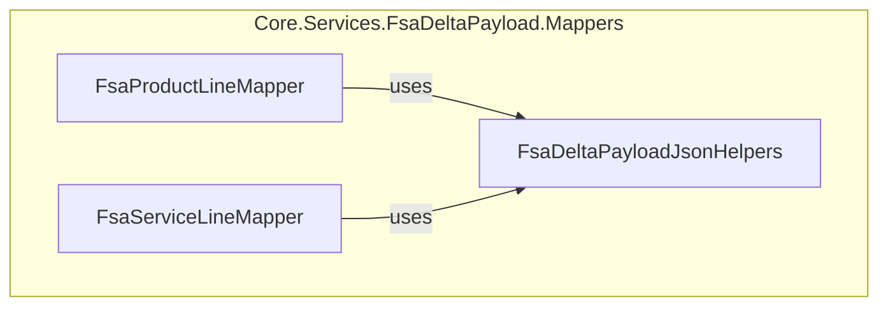
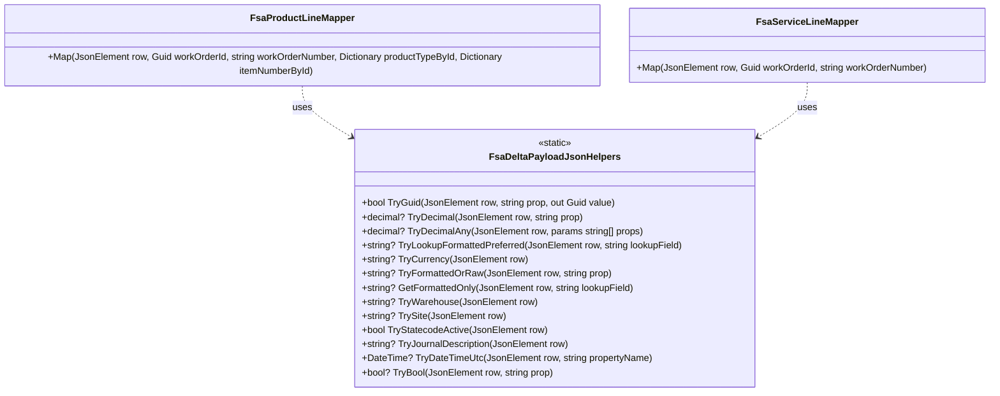

# FSA Delta Payload JSON Helpers

## Overview

The **FsaDeltaPayloadJsonHelpers** class offers a collection of static methods to safely extract and convert JSON properties from `System.Text.Json.JsonElement` instances. These utilities streamline mapping Field Service Analytics (FSA) delta payload fields into .NET types, handling various JSON shapes and Dataverse-specific formatted values.

This helper resides in the Business Layer under the FSA Delta Payload feature. It underpins mappers such as **FsaProductLineMapper** and **FsaServiceLineMapper**, ensuring consistent parsing of GUIDs, numbers, dates, booleans, lookups, and formatted values.

## Architecture Overview



## Component Structure

### Business Layer: JSON Helpers

#### **FsaDeltaPayloadJsonHelpers**

`src/Rpc.AIS.Accrual.Orchestrator.Application/Features/Delta/FsaDeltaPayload/Services/Mappers/FsaDeltaPayloadJsonHelpers.cs`

- **Purpose**

Provide safe, reusable JSON-to-CLR conversion routines for delta payload mapping.

- **Scope**- Parse GUIDs and decimals from string or number tokens
- Read formatted lookup and currency codes
- Normalize date/time properties to UTC
- Handle boolean, statecode, and Dataverse formatted fields

## Key Methods 🔑

| Method | Signature | Description |
| --- | --- | --- |
| TryGuid | `bool TryGuid(JsonElement row, string prop, out Guid value)` | Parse a string property into a `Guid`. Returns `false` on missing or invalid format. |
| TryDecimal | `decimal? TryDecimal(JsonElement row, string prop)` | Read a number or numeric string as `decimal`. Returns `null` if absent or unparsable. |
| TryDecimalAny | `decimal? TryDecimalAny(JsonElement row, params string[] props)` | Attempt multiple property names in order; return first successful `decimal`. |
| TryLookupFormattedPreferred | `string? TryLookupFormattedPreferred(JsonElement row, string lookupField)` | Read formatted (`@OData.Community…FormattedValue`) or raw lookup string. |
| TryCurrency | `string? TryCurrency(JsonElement row)` | Extract ISO currency code from direct, expanded or formatted lookup fields. |
| TryFormattedOrRaw | `string? TryFormattedOrRaw(JsonElement row, string prop)` | Return raw string/number or formatted Dataverse value. |
| GetFormattedOnly | `string? GetFormattedOnly(JsonElement row, string lookupField)` | Read only the Dataverse formatted value for a lookup field. |
| TryWarehouse | `string? TryWarehouse(JsonElement row)` | Shortcut to read warehouse lookup via `TryFormattedOrRaw`. |
| TrySite | `string? TrySite(JsonElement row)` | Shortcut to read site lookup via `TryFormattedOrRaw`. |
| TryStatecodeActive | `bool TryStatecodeActive(JsonElement row)` | Interpret `statecode` numeric as active (`0`) or inactive. Defaults to `true` if missing. |
| TryJournalDescription | `string? TryJournalDescription(JsonElement row)` | Prefer journal description fields; fallback to description or name. |
| TryDateTimeUtc | `DateTime? TryDateTimeUtc(JsonElement row, string propertyName)` | Parse ISO-style string into UTC `DateTime`. |
| TryBool | `bool? TryBool(JsonElement row, string prop)` | Coerce JSON boolean, integer, or string into `bool`. |


### Example Usage

```csharp
using System;
using System.Text.Json;

var doc = JsonDocument.Parse("""
{
  "msdyn_workorderid": "8f14e45f-ea12-4afa-9d5c-2f4e0b7a2e51",
  "msdyn_quantity": "10.5",
  "rpc_operationsdate": "2023-07-15T12:34:00Z",
  "statecode": 0,
  "_msdyn_unit_value@OData.Community.Display.V1.FormattedValue": "Hours"
}
""");

var row = doc.RootElement;
if (FsaDeltaPayloadJsonHelpers.TryGuid(row, "msdyn_workorderid", out var woId))
{
    decimal? qty    = FsaDeltaPayloadJsonHelpers.TryDecimal(row, "msdyn_quantity");
    DateTime? date  = FsaDeltaPayloadJsonHelpers.TryDateTimeUtc(row, "rpc_operationsdate");
    bool   active   = FsaDeltaPayloadJsonHelpers.TryStatecodeActive(row);
    string? unit    = FsaDeltaPayloadJsonHelpers.TryLookupFormattedPreferred(row, "_msdyn_unit_value");
    
    Console.WriteLine($"{woId} | Qty:{qty} | Date:{date:O} | Active:{active} | Unit:{unit}");
}
```

## Class Diagram



## Dependencies

- **System.Text.Json**: JSON traversal and reading.
- **System.Globalization**: Parsing numbers and dates with invariant culture.

## Key Classes Reference

| Class | Location | Responsibility |
| --- | --- | --- |
| FsaDeltaPayloadJsonHelpers | `.../Services/Mappers/FsaDeltaPayloadJsonHelpers.cs` | JSON-to-CLR conversion utilities for FSA delta payload mapping. |
| FsaProductLineMapper | `.../Services/Mappers/FsaProductLineMapper.cs` | Map product-line JSON into `FsaProductLine` domain objects. |
| FsaServiceLineMapper | `.../Services/Mappers/FsaServiceLineMapper.cs` | Map service-line JSON into `FsaServiceLine` domain objects. |
