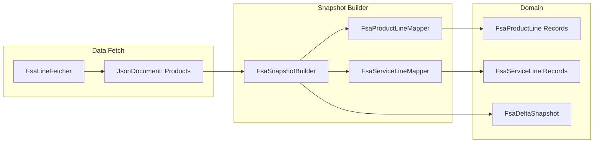
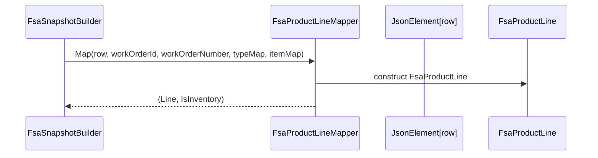

# FsaProductLineMapper Feature Documentation

## Overview

The **FsaProductLineMapper** transforms raw Dataverse JSON rows representing work order products into strongly-typed `FsaProductLine` domain records. It centralizes all field-mapping logic—IDs, quantities, prices, dimensions and enrichment properties—so downstream components consume consistent, validated data. The mapper also flags whether a line is “Inventory” based on a prebuilt lookup, enabling snapshots to separate inventory vs. non-inventory product lines.

This mapping is a core step in the FSA delta payload pipeline. After fetching JSON from Dataverse, the **FsaSnapshotBuilder** invokes this mapper for each product row. The produced `FsaProductLine` instances feed into snapshot generation, delta calculation, and payload assembly, ensuring accounting journals receive correct attributes and dimensions.

## Architecture Overview



## Component Structure

### 1. Service Layer

#### **FsaProductLineMapper** (`src/Rpc.AIS.Accrual.Orchestrator.Application/Features/Delta/FsaDeltaPayload/Services/Mappers/FsaProductLineMapper.cs`)

- **Purpose:** Maps a single Dataverse “work order product” JSON row into an `FsaProductLine` record and determines inventory status.
- **Dependencies:**- `FsaDeltaPayloadJsonHelpers` (field readers/formatters)
- `IFsaProductLineMapper` (interface)
- Domain model `FsaProductLine`

##### Method: Map

```csharp
public (FsaProductLine Line, bool IsInventory) Map(
    JsonElement row,
    Guid workOrderId,
    string workOrderNumber,
    Dictionary<Guid, string> productTypeById,
    Dictionary<Guid, string?> itemNumberById)
```

- **row** `JsonElement`

JSON element for one work order product.

- **workOrderId** `Guid`

The GUID of the parent work order.

- **workOrderNumber** `string`

Human-readable work order number.

- **productTypeById** `Dictionary<Guid, string>`

Maps product IDs to `"Inventory"`, `"Non-Inventory"` or `"Unknown"`.

- **itemNumberById** `Dictionary<Guid, string?>`

Maps product IDs to an optional item number.

- **Returns:**- `FsaProductLine Line`: Populated domain record.
- `bool IsInventory`: True if `ProductType == "Inventory"`.

#### **IFsaProductLineMapper** (`src/Rpc.AIS.Accrual.Orchestrator.Application/Ports/Common/Abstractions/IFsaProductLineMapper.cs`)

- **Purpose:** Abstraction for mapping work order product JSON to `FsaProductLine`.
- **Signature:**

```csharp
  (FsaProductLine Line, bool IsInventory) Map(
      JsonElement row,
      Guid workOrderId,
      string workOrderNumber,
      Dictionary<Guid, string> productTypeById,
      Dictionary<Guid, string?> itemNumberById);
```

### 2. Domain Models

#### **FsaProductLine** (`src/Rpc.AIS.Accrual.Orchestrator.Domain/Domain/FsaDeltaDtos.cs`)

Carries all mapped fields for a product line.

| Property | Type | Description |
| --- | --- | --- |
| **LineId** | `Guid` | Unique work-order-product record ID |
| **WorkOrderId** | `Guid` | Parent work order ID |
| **WorkOrderNumber** | `string` | Human-readable work order number |
| **ProductId** | `Guid?` | Dataverse product lookup GUID |
| **ItemNumber** | `string?` | Product item number (SKU) |
| **ProductType** | `string` | `"Inventory" \ | "Non-Inventory" \ | "Unknown"` |
| **Quantity** | `decimal?` | Quantity on the line |
| **UnitCost** | `decimal?` | Cost per unit |
| **FsaUnitPrice** | `decimal?` | Explicit unit price from Field Service (`msdyn_unitamount`) |
| **UnitAmount** | `decimal?` | Mapped same as `FsaUnitPrice` |
| **Currency** | `string?` | ISO currency code |
| **Unit** | `string?` | Unit of measure |
| **JournalDescription** | `string?` | Description for journal entry |
| **DiscountAmount** | `decimal?` | Line-item discount amount |
| **DiscountPercent** | `decimal?` | Line-item discount percent |
| **SurchargeAmount** | `decimal?` | Surcharge amount |
| **SurchargePercent** | `decimal?` | Surcharge percent |
| **CustomerProductReference** | `string?` | Customer-facing product reference |
| **CalculatedUnitPrice** | `decimal?` | RPC calculated unit price |
| **LineProperty** | `string?` | Dimension: line property |
| **Department** | `string?` | Dimension: department |
| **ProductLine** | `string?` | Dimension: product line |
| **Location** | `string` | Location (currently empty placeholder) |
| **Warehouse** | `string?` | Warehouse identifier |
| **Site** | `string?` | Operational site |
| **IsActive** | `bool?` | Active state flag |
| **DataAreaId** | `string?` | Data area identifier |
| **Printable** | `bool?` | Printable flag |
| **TaxabilityType** | `string?` | Line-level taxability |
| **OperationsDateUtc** | `DateTime?` | Operation date in UTC |
| **ProjectCategory** | `string?` | Enriched from FSCM released-distinct categories |


## Sequence Flow



## Error Handling

- **Missing ID**: Throws `InvalidOperationException("Missing msdyn_workorderproductid.")` if the primary key is absent.

## Important Note

```card
{
    "title": "UnitAmount Mapping",
    "content": "Per design, `UnitAmount` maps to `msdyn_unitamount` (unit price), not extended total amount."
}
```

## Dependencies

- **Json Helpers**: `FsaDeltaPayloadJsonHelpers` for consistently parsing GUIDs, decimals, lookups, booleans, dates.
- **Enrichment Maps**: `productTypeById` and `itemNumberById` built earlier in `FsaDeltaPayloadUseCase` .

## Testing Considerations

- Row missing `msdyn_workorderproductid` should throw.
- Unknown `ProductId` or missing in lookup maps yields `ProductType == "Unknown"`.
- Both `"rpc_surcharge"` and legacy typo `"rpc_surchage"` are handled.
- `TaxabilityType` read from either `FSATaxabilityType` or `"Taxability Type"`, with fallback to formatted lookup.

## Key Classes Reference

| Class | Location | Responsibility |
| --- | --- | --- |
| FsaProductLineMapper | `.../Services/Mappers/FsaProductLineMapper.cs` | Map JSON row → `FsaProductLine` + inventory flag |
| IFsaProductLineMapper | `.../Ports/Common/Abstractions/IFsaProductLineMapper.cs` | Interface for product-line mapping |
| FsaProductLine | `.../Domain/Domain/FsaDeltaDtos.cs` | Domain record for product-line data |
| FsaSnapshotBuilder | `.../Services/Mappers/FsaSnapshotBuilder.cs` | Orchestrates mapping of products & services into shots |
| FsaServiceLineMapper | `.../Services/Mappers/FsaServiceLineMapper.cs` | Map JSON row → `FsaServiceLine` |
| IFsaSnapshotBuilder | `.../Ports/Common/Abstractions/IFsaSnapshotBuilder.cs` | Interface for snapshot builder |
| FsaDeltaPayloadJsonHelpers | (Core JSON utility class) | Provides typed JSON readers & formatted lookups |


---

This documentation reflects only code and relationships present in the provided context and does not assume behavior or classes beyond those in the repository.