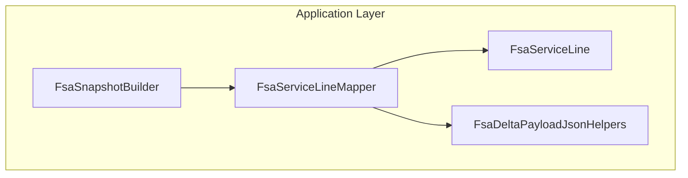

# FSA Service Line Mapping Feature Documentation

## Overview

The **Service Line Mapping** component converts raw Dataverse JSON for work order service rows into strongly-typed domain objects used by the FSA delta payload orchestrator. It ensures that each service line’s identifiers, quantities, pricing, and metadata are correctly extracted, formatted, and enriched for downstream processing. By centralizing this logic, the application maintains consistency, reduces duplication, and isolates parsing concerns from business workflows.

This mapper participates in the payload-build pipeline alongside product-line mapping and snapshot construction. During snapshot assembly, each JSON row representing a service line is passed to this mapper, producing a list of `FsaServiceLine` records ready for final payload injection and delta comparison.

## Architecture Overview



## Component Structure

### Application Layer

#### FsaServiceLineMapper (`src/Rpc.AIS.Accrual.Orchestrator.Application/Features/Delta/FsaDeltaPayload/Services/Mappers/FsaServiceLineMapper.cs`)

- **Purpose**

Maps a Dataverse work order service JSON row into an `FsaServiceLine` domain record, applying field lookups, fallbacks, and formatting rules.

- **Key Dependencies**- `IFsaServiceLineMapper` interface
- `FsaDeltaPayloadJsonHelpers` for JSON extraction utilities
- `FsaServiceLine` domain record

- **Key Method**

```csharp
  public FsaServiceLine Map(
      JsonElement row,
      Guid workOrderId,
      string workOrderNumber)
```

- Validates presence of the service line ID (`msdyn_workorderserviceid`) and throws if missing
- Resolves the service/product GUID from `_msdyn_service_value`, `_msdyn_product_value`, or `_productid_value`
- Reads numeric and lookup fields (duration, cost, unit price, taxability, etc.)
- Constructs and returns an `FsaServiceLine` instance

#### IFsaServiceLineMapper (`src/Rpc.AIS.Accrual.Orchestrator.Application/Ports/Common/Abstractions/IFsaServiceLineMapper.cs`)

- **Purpose**

Abstraction for mapping JSON rows to `FsaServiceLine` records, enabling DI and testability.

- **Signature**

```csharp
  FsaServiceLine Map(
      JsonElement row,
      Guid workOrderId,
      string workOrderNumber);
```

### Snapshot Builder Integration

#### FsaSnapshotBuilder (`src/Rpc.AIS.Accrual.Orchestrator.Application/Features/Delta/FsaDeltaPayload/Services/Mappers/FsaSnapshotBuilder.cs`)

- Invokes `FsaServiceLineMapper.Map(...)` for each service row in the work order services JSON document
- Aggregates mapped lines into `ServiceLines` lists within `FsaDeltaSnapshot` objects

## Data Models

#### FsaServiceLine (`src/Rpc.AIS.Accrual.Orchestrator.Core.Domain/FsaDeltaDtos.cs`)

| Property | Type | Description |
| --- | --- | --- |
| LineId | Guid | Unique service-line identifier (`msdyn_workorderserviceid`). |
| WorkOrderId | Guid | Associated work order GUID. |
| WorkOrderNumber | string | Human-readable work order number. |
| ProductId | Guid? | Service or product lookup GUID (various JSON fields). |
| Duration | decimal? | Service duration (`msdyn_duration`). |
| UnitCost | decimal? | Cost per unit (`msdyn_unitcost`). |
| FsaUnitPrice | decimal? | Unit price provided by FSA (`msdyn_unitamount`). |
| UnitAmount | decimal? | Same as FsaUnitPrice (explicit per mapping rule). |
| Currency | string? | ISO currency code (flat or nested lookup). |
| Unit | string? | Unit-of-measure formatted value (`_msdyn_unit_value`). |
| JournalDescription | string? | Description for the journal entry (checks `msdyn_journaldescription`, `msdyn_description`, or `msdyn_name`). |
| DiscountAmount | decimal? | Discount amount (`rpc_lineitemdiscountamount`). |
| DiscountPercent | decimal? | Discount percentage (`rpc_lineitemdiscount`). |
| SurchargeAmount | decimal? | Surcharge amount (`rpc_surchargeamount`). |
| SurchargePercent | decimal? | Surcharge percentage (`rpc_surcharge` or `rpc_surchage`). |
| CustomerProductReference | string? | Customer’s product reference (`rpc_customerproductid`). |
| CalculatedUnitPrice | decimal? | Derived unit price (`rpc_calculatedunitprice`). |
| LineProperty | string? | Line property lookup (`rpc_lineproperties`). |
| Department | string? | Department lookup (`_rpc_departments_value`). |
| ProductLine | string? | Product-line lookup (`_rpc_productlines_value`). |
| IsActive | bool? | Active state flag (from `statecode`). |
| DataAreaId | string? | Data area identifier (`msdyn_dataareaid`). |
| Printable | bool? | Printable flag (`rpc_printable`). |
| TaxabilityType | string? | Line-level taxability (`FSATaxabilityType` or `Taxability Type` with fallback). |
| OperationsDateUtc | DateTime? | Operation timestamp (`rpc_operationsdate`). |


Described in the domain record definition .

## Integration Points

- **Snapshot Construction**: `FsaSnapshotBuilder` collects service rows and uses this mapper to fill each snapshot’s `ServiceLines` collection.
- **Orchestration Pipeline**: Mapped `FsaServiceLine` objects are serialized into the final payload JSON and passed to enrichment and delta-calculation steps.

## Key Classes Reference

| Class | Location | Responsibility |
| --- | --- | --- |
| FsaServiceLineMapper | `.../Features/Delta/FsaDeltaPayload/Services/Mappers/FsaServiceLineMapper.cs` | Implements mapping from JSON to `FsaServiceLine`. |
| IFsaServiceLineMapper | `.../Ports/Common/Abstractions/IFsaServiceLineMapper.cs` | Interface for service-line mappers. |
| FsaServiceLine | `.../Core/Domain/FsaDeltaDtos.cs` | Domain record for FSA service-line data. |
| FsaSnapshotBuilder | `.../Features/Delta/FsaDeltaPayload/Services/Mappers/FsaSnapshotBuilder.cs` | Builds `FsaDeltaSnapshot` lists, invoking this mapper. |


## Dependencies

- System.Text.Json (JSON parsing)
- `Rpc.AIS.Accrual.Orchestrator.Core.Abstractions.IFsaServiceLineMapper`
- `Rpc.AIS.Accrual.Orchestrator.Core.Domain.FsaServiceLine`
- `Rpc.AIS.Accrual.Orchestrator.Core.Services.FsaDeltaPayload.Mappers.FsaDeltaPayloadJsonHelpers`

## Testing Considerations

- **Missing ID Field**: Verify that absence of `msdyn_workorderserviceid` triggers `InvalidOperationException`.
- **GUID Fallbacks**: Ensure lookup order for `_msdyn_service_value`, `_msdyn_product_value`, then `_productid_value`.
- **Numeric Parsing**: Test non-numeric and null JSON values for decimal fields.
- **Taxability Fallback**: Validate fallback from explicit JSON properties to formatted lookup value.
- **Full Record Mapping**: Compare a sample JSON row through all mapping paths to expected `FsaServiceLine` property values.