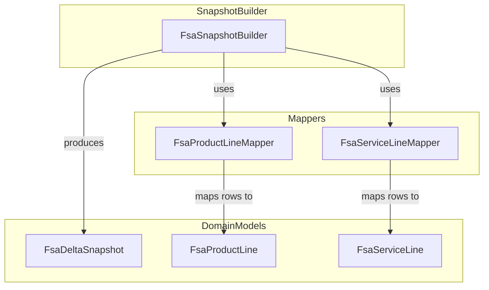
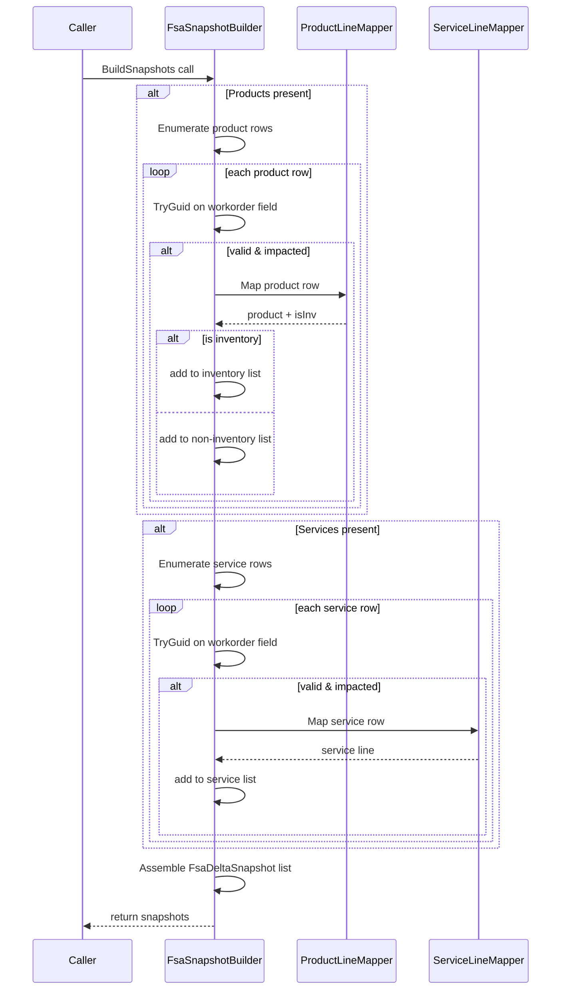

# FSA Delta Payload Snapshot Builder Feature Documentation

## Overview

The **FsaSnapshotBuilder** orchestrates the transformation of raw Dataverse JSON payloads into a structured set of domain snapshots. Given lists of work order products and services, it groups and maps each row into domain models (`FsaProductLine` and `FsaServiceLine`), then assembles them into `FsaDeltaSnapshot` records per work order.

This builder underpins the delta payload pipeline of the Accrual Orchestrator, providing a canonical view of inventory, non-inventory, and service lines for downstream delta evaluation and outbound payload construction.

## Architecture Overview



## Component Structure

### 1. Core Service

#### **FsaSnapshotBuilder** (`src/Rpc.AIS.Accrual.Orchestrator.Application/Features/Delta/FsaDeltaPayload/Services/Mappers/FsaSnapshotBuilder.cs`)

- **Purpose:** Implements `IFsaSnapshotBuilder` to build per-work-order snapshots from JSON payloads of products and services.
- **Dependencies:**- `IFsaProductLineMapper` and `IFsaServiceLineMapper` for row-level mapping
- `FsaDeltaPayloadJsonHelpers` for JSON extraction
- Domain classes `FsaDeltaSnapshot`, `FsaProductLine`, `FsaServiceLine`
- **Fields:**- `_productMapper` : maps product rows
- `_serviceMapper` : maps service rows
- **Constructor:** Validates and assigns mappers, throwing `ArgumentNullException` if dependencies are missing .
- **Method:**

```csharp
  IReadOnlyList<FsaDeltaSnapshot> BuildSnapshots(
      IReadOnlyList<Guid> impactedWoIds,
      Dictionary<Guid,string> woNumberById,
      JsonDocument woProducts,
      JsonDocument woServices,
      Dictionary<Guid,string> productTypeById,
      Dictionary<Guid,string?> itemNumberById)
```

- Initializes empty lists per work order.
- Iterates `woProducts` array: for each row, extracts work order ID, skips if not impacted, maps via `_productMapper`, and adds to inventory or non-inventory lists.
- Iterates `woServices` array similarly, mapping via `_serviceMapper`.
- Projects each work order’s collected lines into a `FsaDeltaSnapshot` .

### 2. Interfaces

| Interface | Location | Responsibility |
| --- | --- | --- |
| IFsaSnapshotBuilder | `.../Ports/Common/Abstractions/IFsaSnapshotBuilder.cs` | Defines `BuildSnapshots` contract |
| IFsaProductLineMapper | `.../Ports/Common/Abstractions/IFsaProductLineMapper.cs` | Maps product JSON rows to `FsaProductLine` |
| IFsaServiceLineMapper | `.../Ports/Common/Abstractions/IFsaServiceLineMapper.cs` | Maps service JSON rows to `FsaServiceLine` |


### 3. Domain Models

#### **FsaDeltaSnapshot**

- **Defined in:** `Rpc.AIS.Accrual.Orchestrator.Core.Domain.FsaDeltaDtos`
- **Properties:**

| Property | Type | Description |
| --- | --- | --- |
| WorkOrderNumber | string | Name or fallback GUID of the work order |
| WorkOrderId | Guid | Unique identifier |
| InventoryProducts | IReadOnlyList\<FsaProductLine\> | Lines flagged as inventory |
| NonInventoryProducts | IReadOnlyList\<FsaProductLine\> | Lines flagged as non-inventory |
| ServiceLines | IReadOnlyList\<FsaServiceLine\> | Service work order lines |
| Header | WoHeaderMappingFields? | Optional header fields enrichment |


## Feature Flows

### 1. Snapshot Building Flow



## Integration Points

- **FsaDeltaPayloadUseCase** invokes `BuildSnapshots(...)` as part of both full-fetch and single-WO pipelines to produce `FsaDeltaSnapshot` collections .

## Error Handling

- **Constructor null-checks:** throws `ArgumentNullException` if mappers are missing.
- **Row filtering:** silently skips JSON rows lacking a valid work order GUID or not in `impactedWoIds`, avoiding runtime exceptions.

## Dependencies

- System.Text.Json
- `Rpc.AIS.Accrual.Orchestrator.Core.Abstractions` (mapper interfaces)
- `Rpc.AIS.Accrual.Orchestrator.Core.Domain` (domain DTOs)
- `FsaDeltaPayloadJsonHelpers` (JSON extraction utilities)

## Key Classes Reference

| Class | Location | Responsibility |
| --- | --- | --- |
| FsaSnapshotBuilder | `.../Services/Mappers/FsaSnapshotBuilder.cs` | Builds per-WO `FsaDeltaSnapshot` collections |
| IFsaSnapshotBuilder | `.../Abstractions/IFsaSnapshotBuilder.cs` | Snapshot builder contract |
| IFsaProductLineMapper | `.../Abstractions/IFsaProductLineMapper.cs` | Product row mapper |
| IFsaServiceLineMapper | `.../Abstractions/IFsaServiceLineMapper.cs` | Service row mapper |
| FsaDeltaSnapshot | `Rpc.AIS.Accrual.Orchestrator.Core.Domain.FsaDeltaDtos.cs` | Canonical per-WO snapshot record |
| FsaProductLine | Domain model created by `FsaProductLineMapper` (namespace `Rpc.AIS.Accrual.Orchestrator.Core.Domain`) | Holds product line details |
| FsaServiceLine | Domain model created by `FsaServiceLineMapper` (namespace `Rpc.AIS.Accrual.Orchestrator.Core.Domain`) | Holds service line details |
