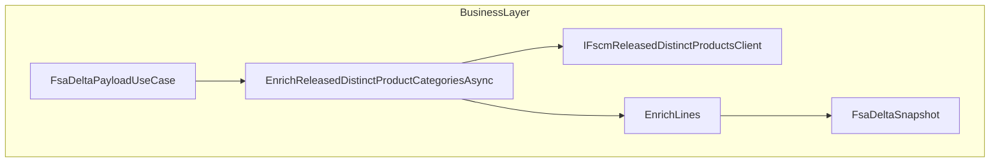

# Project Category Enrichment Feature Documentation

## Overview

This feature enriches outbound FSA delta payloads by assigning **ProjectCategory** values to each product line based on FSCM’s **CDSReleasedDistinctProducts** data. Instead of relying on Dataverse/FieldService project categories, it fetches authoritative `ProjCategoryId` and `RpcProjCategoryId` for each unique **ItemNumber** across snapshots and updates only those lines where the category differs.

Implemented as a partial of the **FsaDeltaPayloadUseCase**, the enrichment step integrates seamlessly into the existing delta payload build pipeline. It ensures downstream journal‐posting logic receives accurate project classifications, improving data consistency and auditability.

## Architecture Overview

## Component Structure

### Business Layer

#### **FsaDeltaPayloadUseCase** (`src/Rpc.AIS.Accrual.Orchestrator.Application/Features/Delta/FsaDeltaPayload/UseCases/FsaDeltaPayloadUseCase.ProjectCategories.cs`)

- **Purpose**: Adds FSCM project categories to each product line in `FsaDeltaSnapshot`.
- **Dependencies**:- `ILogger<FsaDeltaPayloadUseCase>` for structured logging
- `IFscmReleasedDistinctProductsClient` to retrieve category mappings
- **Key Methods**:- `EnrichReleasedDistinctProductCategoriesAsync(RunContext ctx, IReadOnlyList<FsaDeltaSnapshot> snapshots, CancellationToken ct)`- Validates input, extracts distinct `ItemNumber`s, logs start/end, calls the client, and reconstructs snapshots only when enrichment occurred
- `EnrichLines(IReadOnlyList<FsaProductLine> lines, IReadOnlyDictionary<string, ReleasedDistinctProductCategory> map, ref int hit, ref int miss)`- Iterates over product lines; updates `ProjectCategory` when a mapping exists and differs; increments hit/miss counters; returns either the original list or a new enriched list

### Integration Points

#### **IFscmReleasedDistinctProductsClient** (`src/Rpc.AIS.Accrual.Orchestrator.Application/Ports/Common/Abstractions/IFscmReleasedDistinctProductsClient.cs`)

| Method | Description | Returns |
| --- | --- | --- |
| `GetCategoriesByItemNumberAsync(RunContext ctx, IReadOnlyList<string> itemNumbers, CancellationToken ct)` | Fetches a mapping of each `ItemNumber` to its FSCM category IDs. | `IReadOnlyDictionary<string, ReleasedDistinctProductCategory>` |

#### **ReleasedDistinctProductCategory** (`src/Rpc.AIS.Accrual.Orchestrator.Application/Ports/Common/Abstractions/IFscmReleasedDistinctProductsClient.cs`)

| Property | Type | Description |
| --- | --- | --- |
| `ItemNumber` | `string` | Catalog item number |
| `ProjCategoryId` | `string?` | FSCM project category identifier |
| `RpcProjCategoryId` | `string?` | RPC‐specific project category identifier |

### Data Models

#### **FsaDeltaSnapshot**

Models a work order snapshot for delta processing.

- **InventoryProducts**: `IReadOnlyList<FsaProductLine>`
- **NonInventoryProducts**: `IReadOnlyList<FsaProductLine>`

#### **FsaProductLine**

Represents a single product line in a snapshot.

- **ItemNumber**: `string?`
- **ProjectCategory**: `string?` (to be enriched)

## Error Handling

- Throws `ArgumentNullException` if the `snapshots` argument is null.
- Logs an informational message and returns original snapshots when none have valid `ItemNumber`.
- Silently skips missing mappings, tracking them via `miss` counter rather than raising errors.

## Dependencies

- Microsoft.Extensions.Logging
- Rpc.AIS.Accrual.Orchestrator.Core.Domain (`FsaDeltaSnapshot`, `FsaProductLine`, `RunContext`)
- Rpc.AIS.Accrual.Orchestrator.Core.Abstractions (`IFscmReleasedDistinctProductsClient`, `ReleasedDistinctProductCategory`)

## Testing Considerations

Key scenarios to cover:

- **Empty input**: zero snapshots returns immediately without client calls.
- **No item numbers**: logs skip and returns unchanged snapshots.
- **All hits**: every product line’s `ProjectCategory` updates correctly.
- **Mixed hits/misses**: only mapped lines change; counters reflect correct values.
- **Idempotence**: if enriched values match existing, snapshots remain reference‐equal.

## Key Classes Reference

| Class | Location | Responsibility |
| --- | --- | --- |
| `FsaDeltaPayloadUseCase` | `.../UseCases/FsaDeltaPayloadUseCase.ProjectCategories.cs` | Enriches snapshots with FSCM project categories |
| `IFscmReleasedDistinctProductsClient` | `.../Ports/Common/Abstractions/IFscmReleasedDistinctProductsClient.cs` | Fetches `ReleasedDistinctProductCategory` mappings by `ItemNumber` |
| `ReleasedDistinctProductCategory` | Same as above | Data holder for FSCM category IDs |
| `FsaDeltaSnapshot` | `.../Domain/Domain/FsaDeltaDtos.cs` | Model for work order snapshot in delta payload |
| `FsaProductLine` | Same as above | Model for individual product line in snapshot |
