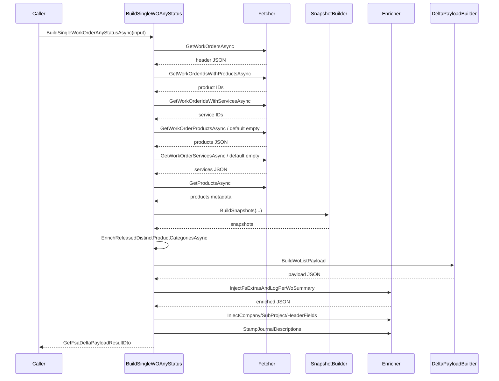

# Single Work Order Any Status Payload Feature Documentation

## Overview

This feature enables building a delta payload for a single work order GUID regardless of its status (open, closed, or canceled). It supports job‐operation flows (for example, Cancel Job) by fetching all Field Service (FSA) job lines, injecting required header fields, and returning the standard work‐order payload JSON. This ensures downstream delta processing and posting always receive the correct snapshot.

Business value:

- Supports synchronous job operations on non‐open work orders.
- Reuses existing orchestration logic without altering full‐fetch behavior.
- Provides consistent payload structure for downstream systems.

## Architecture Overview

```mermaid
flowchart TB
    subgraph BusinessLayer [Business Layer]
        UC[FsaDeltaPayloadUseCase<br/>BuildSingleWorkOrderAnyStatusAsync]
        Fetcher[IFsaLineFetcher]
        SnapshotBuilder[IFsaSnapshotBuilder]
        Enricher[IFsaDeltaPayloadEnricher]
        PayloadBuilder[DeltaPayloadBuilder (static)]
        Telemetry[ITelemetry]
    end

    UC -->|fetch headers & lines| Fetcher
    UC -->|build snapshots| SnapshotBuilder
    UC -->|inject extras| Enricher
    UC -->|build JSON| PayloadBuilder
    UC -->|log JSON| Telemetry
```

## Component Structure

### Business Layer

#### **FsaDeltaPayloadUseCase.SingleAnyStatus** (`src/Rpc.AIS.Accrual.Orchestrator.Application/Features/Delta/FsaDeltaPayload/UseCases/FsaDeltaPayloadUseCase.SingleAnyStatus.cs`)

- **Purpose:**

Orchestrates the creation of a delta payload JSON for one work order GUID, even if it is not in the open set.

- **Dependencies:**- `_fetcher` (IFsaLineFetcher): retrieves work‐order headers, line IDs, product and service lines.
- `_telemetry` (ITelemetry): logs raw JSON for audit and debugging.
- `_snapshotBuilder` (IFsaSnapshotBuilder): constructs business snapshots from raw line data.
- `_enricher` (IFsaDeltaPayloadEnricher): injects FS extras, header fields, and stamps journal descriptions.
- Static `DeltaPayloadBuilder`: builds the outbound JSON payload.

##### Key Method

```csharp
Task<GetFsaDeltaPayloadResultDto> BuildSingleWorkOrderAnyStatusAsync(
    GetFsaDeltaPayloadInputDto input,
    FsaDeltaPayloadRunOptions opt,
    CancellationToken ct)
```

- **Input:**- `input.RunId`, `input.CorrelationId`, `input.TriggeredBy`
- Optional `input.WorkOrderGuid`
- **Output:**- `GetFsaDeltaPayloadResultDto` containing:- `PayloadJson` (string)
- `ProductDeltaLinkAfter` (null)
- `ServiceDeltaLinkAfter` (null)
- `WorkOrderNumbers` (list with the single WO number)

##### Orchestration Steps

1. **Validate Input**

Throws if `input` is null. Parses `WorkOrderGuid`; returns empty payload on invalid or empty GUID.

1. **Fetch Header**

Calls `_fetcher.GetWorkOrdersAsync` for the GUID; builds maps:

- WorkOrderId → Number
- WorkOrderId → CompanyName
- WorkOrderId → SubProjectId
- WorkOrderId → HeaderFields

Returns empty payload if no SubProject mapping exists.

1. **Fetch Line IDs**- Checks presence via `GetWorkOrderIdsWithProductsAsync` and `GetWorkOrderIdsWithServicesAsync`.
- Fetches actual product/service JSON or uses `{"value":[]}` if absent.
2. **Empty Lines Check**

Returns empty payload when no lines exist.

1. **Product Enrichment**- Collects product GUIDs from line docs.
- Fetches product metadata via `_fetcher.GetProductsAsync`.
- Builds `productTypeById` and `itemNumberById` maps.
2. **Build Snapshots**

Calls `_snapshotBuilder.BuildSnapshots` with line data and enrichment maps; injects header fields.

1. **Category Enrichment**

Invokes `EnrichReleasedDistinctProductCategoriesAsync` to tag snapshots with FSCM categories.

1. **Build Outbound Payload**

Uses `DeltaPayloadBuilder.BuildWoListPayload`, passing `system="FieldService"` and `triggeredByOverride`.

1. **Inject FS Extras & Headers**- `InjectFsExtrasAndLogPerWoSummary` adds Currency, WorkerNumber, Warehouse, Site, LineNum.
- `InjectCompanyIntoPayload` and `InjectSubProjectIdIntoPayload`.
- `InjectWorkOrderHeaderFieldsIntoPayload` for additional header fields.
2. **Stamp Journal Descriptions**

Resolves action suffix via `ResolveJournalActionSuffixForTriggeredBy` and injects into payload.

1. **Return Result**

Logs final payload JSON and returns `GetFsaDeltaPayloadResultDto`.

## Domain Models

#### GetFsaDeltaPayloadInputDto

```csharp
public sealed record GetFsaDeltaPayloadInputDto(
    string RunId,
    string CorrelationId,
    string TriggeredBy,
    string? WorkOrderGuid = null,
    string? DurableInstanceId = null);
```

- **RunId**: Unique run identifier
- **CorrelationId**: Tracing identifier
- **TriggeredBy**: Caller name or system
- **WorkOrderGuid**: Optional single WO GUID
- **DurableInstanceId**: Optional orchestration instance ID

#### GetFsaDeltaPayloadResultDto

| Property | Type | Description |
| --- | --- | --- |
| PayloadJson | string | JSON delta payload for downstream posting |
| ProductDeltaLinkAfter | string? | Link for next product delta (always null here) |
| ServiceDeltaLinkAfter | string? | Link for next service delta (always null here) |
| WorkOrderNumbers | IReadOnlyList<string> | List of WO numbers included in the payload |


## Sequence Diagram for Payload Build



## Error Handling

- **ArgumentNullException** when `input` is null.
- Returns empty payload for:- Invalid or empty GUID.
- Missing header in fetched results.
- Missing SubProject mapping.
- No line items (products & services).

## Key Classes Reference

| Class | Location | Responsibility |
| --- | --- | --- |
| FsaDeltaPayloadUseCase | Application/Features/Delta/FsaDeltaPayload/UseCases/FsaDeltaPayloadUseCase.SingleAnyStatus.cs | Orchestrates single WO any‐status payload build |
| GetFsaDeltaPayloadInputDto | Domain/Domain/FsaDeltaActivityDtos.cs | Carries input parameters for payload build |
| GetFsaDeltaPayloadResultDto | Domain/Domain/FsaDeltaActivityDtos.cs | Returns payload JSON and metadata |
| IFsaLineFetcher | Core/Abstractions or Core/Services | Fetches work‐order headers, line IDs, product & service records |
| IFsaSnapshotBuilder | Core/Services/FsaDeltaPayload | Builds business snapshots from raw data |
| IFsaDeltaPayloadEnricher | Core/Services/FsaDeltaPayload | Injects extras, header fields, and journal descriptions |
| DeltaPayloadBuilder | Core/Services/FsaDeltaPayload/FsaDeltaPayloadJsonUtil.cs | Static builder for the outbound JSON payload |
| FsaDeltaPayloadWorkOrderHeaderMaps | Core/Services/FsaDeltaPayload | Maps header JSON to company, subproject, and other header fields |
| FsaDeltaPayloadLookupMaps | Core/Services/FsaDeltaPayload | Builds line‐extra lookup maps (Currency, Worker, Warehouse, Site) |


## Testing Considerations

- **Valid GUID with data**: expect non‐empty payload and correct WO number.
- **Invalid or empty GUID**: expect empty payload, no exceptions.
- **Missing SubProject**: empty payload returned, mimicking 404/business logic.
- **No products or services**: empty payload returned.
- **Partial data**: header present but no lines for one type still builds or skips appropriately.

## Dependencies

- Rpc.AIS.Accrual.Orchestrator.Core.Options.FsaDeltaPayloadRunOptions
- Rpc.AIS.Accrual.Orchestrator.Core.Domain (DTOs, RunContext)
- Microsoft.Extensions.Logging
- System.Text.Json
- Interfaces and services under `Rpc.AIS.Accrual.Orchestrator.Core.Services.FsaDeltaPayload`