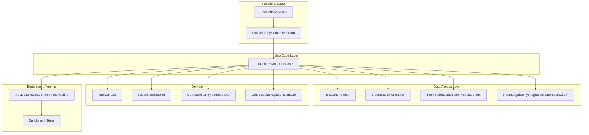
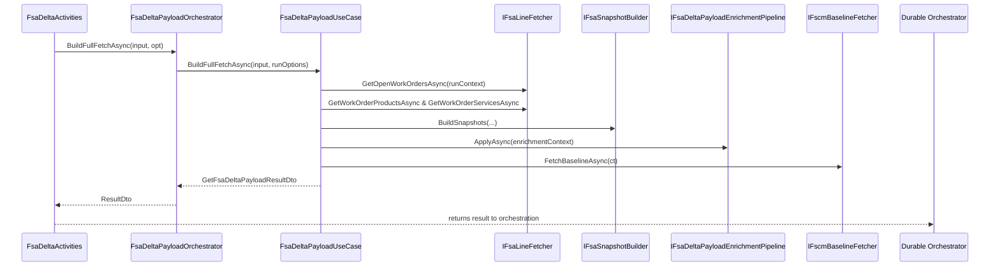

# Fsa Delta Payload Use Case Feature Documentation

## Overview

The FSA Delta Payload Use Case orchestrates building of payloads for Field Service work orders. In **Full Fetch** mode, it retrieves all open work orders, enriches lines with product and service data, and composes a comprehensive JSON payload. In **Job-Operation** scenarios, it supports single work order processing regardless of status.

This feature enables downstream accrual logic to compare FSA snapshots against FSCM journal history. It injects company, subproject, currency, and line‐level details, then returns a `GetFsaDeltaPayloadResultDto` for use by Durable Functions or HTTP endpoints.

## Architecture Overview

## Component Structure

### Use Case Layer

#### **FsaDeltaPayloadUseCase**

`src/Rpc.AIS.Accrual.Orchestrator.Application/Features/Delta/FsaDeltaPayload/UseCases/FsaDeltaPayloadUseCase.cs`

- **Purpose:** Coordinates fetching, enrichment, snapshot building, and payload composition for FSA delta data.
- **Dependencies:**- `ILogger<FsaDeltaPayloadUseCase>`
- `ITelemetry`
- `IFsaLineFetcher`
- `DeltaComparer`
- `IFscmBaselineFetcher`
- `IFsaSnapshotBuilder`
- `IFsaDeltaPayloadEnricher`
- `IFsaDeltaPayloadEnrichmentPipeline`
- `IFscmReleasedDistinctProductsClient`
- `IFscmLegalEntityIntegrationParametersClient`
- `IEmailSender`
- `NotificationOptions`

- **Key Methods:**- `BuildFullFetchAsync(GetFsaDeltaPayloadInputDto input, FsaDeltaPayloadRunOptions opt, CancellationToken ct)`

Entry point for full fetch processing.

- `GetFullFetchPayloadAsync(GetFsaDeltaPayloadInputDto input, FsaDeltaPayloadRunOptions opt, CancellationToken ct)`

Implements fetch→enrich→snapshot→payload flow.

- `FetchJournalNamesByCompanyAsync(RunContext ctx, IReadOnlyDictionary<Guid,string> woIdToCompanyName, CancellationToken ct)`

Retrieves FSCM journal names per legal entity.

- `EmptyValueDocument()`

Returns an empty JSON document (`{"value":[]}`) for skip scenarios.

### Integration Layer

#### **FsaDeltaPayloadOrchestrator**

`src/Rpc.AIS.Accrual.Orchestrator.Functions/Durable/Orchestrators/FsaDeltaPayloadOrchestrator.cs`

Thin adapter mapping Functions options to use-case calls.

#### **FsaDeltaActivities**

`src/Rpc.AIS.Accrual.Orchestrator.Functions/Durable/Activities/FsaDeltaActivities.cs`

Durable Activity that triggers `BuildFullFetchAsync` via the orchestrator.

## Data Models

#### GetFsaDeltaPayloadInputDto

Carries input parameters for payload build .

| Property | Type | Description |
| --- | --- | --- |
| RunId | string | Unique identifier for this run. |
| CorrelationId | string | Correlation identifier for tracing. |
| TriggeredBy | string | Origin of invocation (e.g., FullFetch, CancelJob). |
| WorkOrderGuid | string? | Optional work order GUID (single-WO mode). |
| DurableInstanceId | string? | Optional durable function instance identifier. |

#### GetFsaDeltaPayloadResultDto

Returns built payload and metadata .

| Property | Type | Description |
| --- | --- | --- |
| PayloadJson | string | Outbound JSON payload for FSA work orders. |
| ProductDeltaLinkAfter | string? | Cursor for next product delta   (unused in FullFetch). |
| ServiceDeltaLinkAfter | string? | Cursor for next service delta   (unused in FullFetch). |
| WorkOrderNumbers | IReadOnlyList<string> | List of work order numbers in payload. |

## Feature Flows

### Full Fetch Flow

## Integration Points

- **Durable Functions:** `FsaDeltaActivities.GetFsaDeltaPayload` invokes this use case.
- **HTTP Endpoints:** Job-operation flows call `BuildSingleWorkOrderAnyStatusAsync` via `FsaDeltaPayloadOrchestrator`.

## Analytics & Tracking

- **Dataverse.OpenWorkOrders**: Logs fetched open work orders.
- **Dataverse.WO.Products / Services**: Logs fetched line items.
- **Dataverse.Products**: Logs product enrichment data.
- **Delta.Payload.Outbound**: Logs final payload JSON.
- **Delta.Payload.Outbound.Single**: Logs single-WO payload JSON.

## Key Classes Reference

| Class | Location | Responsibility |
| --- | --- | --- |
| FsaDeltaPayloadUseCase | Features/Delta/FsaDeltaPayload/UseCases/FsaDeltaPayloadUseCase.cs | Orchestrates payload build and enrichment flows. |
| FsaDeltaPayloadOrchestrator | Functions/Durable/Orchestrators/FsaDeltaPayloadOrchestrator.cs | Adapts Functions layer to use-case interface. |
| GetFsaDeltaPayloadInputDto | Core/Domain/FsaDeltaActivityDtos.cs | Input DTO for FSA payload build. |
| GetFsaDeltaPayloadResultDto | Core/Domain/FsaDeltaActivityDtos.cs | Result DTO carrying outbound payload and work order numbers. |
| IFsaLineFetcher | Core/Abstractions/IFsaLineFetcher.cs | Abstraction for fetching work order headers, lines, and products. |
| IFsaSnapshotBuilder | Core/Services/FsaDeltaPayload/Mappers/FsaSnapshotBuilder.cs | Builds intermediate snapshots from raw line data. |
| IFsaDeltaPayloadEnrichmentPipeline | Application/Features/Delta/FsaDeltaPayload/Services/EnrichmentPipeline/DefaultFsaDeltaPayloadEnrichmentPipeline.cs | Applies per-concern enrichment steps to payload JSON. |
| IFscmBaselineFetcher | Core/Abstractions/IFscmBaselineFetcher.cs | Retrieves FSCM baseline history scaffold (delta comparison input). |

## Error Handling

- **Missing WorkOrderFilter**

Throws `InvalidOperationException("FsaIngestion:WorkOrderFilter is required for FullFetch mode.")` when filter is blank .

- **Invalid Single-WO GUID**

Returns empty payload if `input.WorkOrderGuid` fails `Guid.TryParse`.

- **Missing SubProject**

Skips work orders lacking subproject: logs warning, emails distribution list, and removes them from processing.

## Caching Strategy

No internal caching. Each invocation fetches fresh data via `IFsaLineFetcher` and enrichment clients.

## Dependencies

- **Dataverse Fetching:** `IFsaLineFetcher` for headers and line items.
- **Enrichment Services:**- `IFscmReleasedDistinctProductsClient` for project category lookups.
- `IFscmLegalEntityIntegrationParametersClient` for journal names per company.
- **Snapshot & Payload:**- `IFsaSnapshotBuilder` for snapshot creation.
- `IFsaDeltaPayloadEnrichmentPipeline` for modular JSON enrichment.
- **Baseline Comparison:** `IFscmBaselineFetcher` for baseline scaffold.
- **Notifications:** `IEmailSender` and `NotificationOptions` for invalid-subproject alerts.
- **Telemetry & Logging:** `ITelemetry` and `ILogger`.

## Testing Considerations

- **No Open Work Orders:** Verify empty payload and logging.
- **Single-WO Mode:** Test valid, invalid, and closed work order GUIDs.
- **Missing SubProject:** Ensure email is sent and work order is skipped.
- **No Line Items:** Confirm empty payload path.
- **Enrichment Pipeline Steps:** Simulate missing journal names or category lookups.
- **Baseline Fetch Scaffold:** Validate that baselineRecords are fetched and unused by FullFetch logic.