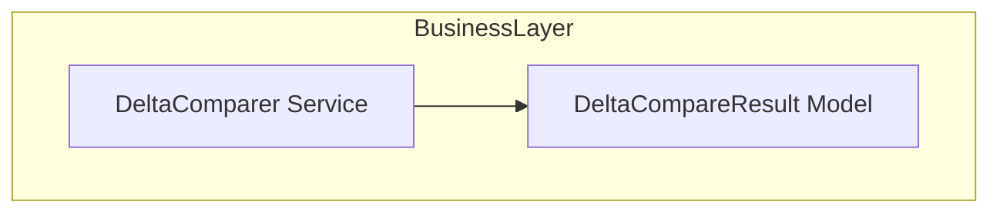

# DeltaComparer Feature Documentation

## Overview

The **DeltaComparer** service identifies changes between two JSON payloads by comparing work order entries. It helps the accrual orchestrator determine how many records were added, changed, or removed for each work order. This comparison aids in logging and telemetry, ensuring downstream processes act only on actual deltas.

When the baseline JSON is missing or empty, **DeltaComparer** treats all records as new and logs this scenario. Otherwise, it parses both payloads, counts the fields per work order, and computes added/changed and removed counts for each key found.

## Architecture Overview



## Component Structure

### 1. Business Layer

#### **DeltaComparer** (`src/Rpc.AIS.Accrual.Orchestrator.Application/Features/Delta/Services/DeltaComparer.cs`)

- **Purpose:** Compares a new payload against a baseline payload to compute per-work-order deltas.
- **Dependencies:**- `ILogger<DeltaComparer>` for logging
- `System.Text.Json` for JSON parsing
- **Key Methods:**- `Compare(string newPayloadJson, string? baselineJson) : IReadOnlyList<DeltaCompareResult>`
- `ExtractWoKeys(JsonDocument doc) : Dictionary<string, int>` (private)

##### Compare

```csharp
public IReadOnlyList<DeltaCompareResult> Compare(
    string newPayloadJson,
    string? baselineJson)
```

- **Behavior:**- Logs and returns an empty result if `baselineJson` is null or whitespace.
- Parses both JSON strings into `JsonDocument` instances.
- Extracts work order keys and field counts from each document.
- For each work order in the new payload, computes:- **AddedOrChanged** = max(0, newCount – oldCount)
- **Removed** = max(0, oldCount – newCount)
- **Logging:**- Logs informational message when baseline is empty.

##### ExtractWoKeys

```csharp
private static Dictionary<string, int> ExtractWoKeys(JsonDocument doc)
```

- **Behavior:**- Navigates to `["_request"]["WOList"]` in the JSON.
- For each work order object, reads `"Work order ID"` property as the key.
- Counts the total number of properties on that work order object.
- Returns a map of work order IDs to their property counts.
- **Resilience:**- Skips entries missing the expected properties.

### 2. Data Models

#### **DeltaCompareResult**

Carries the comparison outcome for a single work order.

| Property | Type | Description |
| --- | --- | --- |
| WorkOrderNumber | string | Identifier of the work order compared |
| JournalType | string | Journal category (currently always `"Mixed"`) |
| AddedOrChanged | int | Number of newly added or modified fields |
| Removed | int | Number of fields removed since the baseline |


```csharp
public sealed record DeltaCompareResult(
    string WorkOrderNumber,
    string JournalType,
    int AddedOrChanged,
    int Removed);
```

## Method Details

### Compare

- **Input:**- `newPayloadJson`: JSON string of the latest work order payload
- `baselineJson`: JSON string of the previous payload (nullable)
- **Output:** List of `DeltaCompareResult` instances, one per work order in the new payload.
- **Failure Modes:**- If `baselineJson` is null or empty, returns an empty list after logging.
- If JSON parsing fails, exceptions propagate to the caller.

### ExtractWoKeys

- **Input:** `JsonDocument` representing a payload with shape:

```json
  {
    "_request": {
      "WOList": [ { "Work order ID": "...", /* other props */ }, … ]
    }
  }
```

- **Output:** Dictionary mapping each `"Work order ID"` to its number of JSON properties.
- **Edge Cases:**- Returns an empty dictionary if `_request` or `WOList` is missing.
- Skips array elements missing a `"Work order ID"`.

## Dependencies

- **Logging:** `Microsoft.Extensions.Logging.ILogger<DeltaComparer>`
- **JSON Processing:** `System.Text.Json.JsonDocument`

## Key Classes Reference

| Class | Location | Responsibility |
| --- | --- | --- |
| DeltaComparer | `.../Features/Delta/Services/DeltaComparer.cs` | Compares two payloads and computes per-WO deltas |
| DeltaCompareResult | Same file (`DeltaComparer.cs`) | Data carrier for comparison results |


## Error Handling

- Proactively handles missing baseline by logging an information-level message.
- Relies on `JsonDocument.Parse` to throw `JsonException` for invalid JSON.

## Testing Considerations

- **Baseline Missing:** Verify that an empty baseline yields an empty result and logs appropriately.
- **Identical Payloads:** Both newer and older payloads with identical work orders should result in zero `AddedOrChanged` and `Removed`.
- **Field Count Variations:** Payloads where a work order’s property count increases or decreases should reflect correct delta values.
- **Malformed JSON:** Ensure consumers handle exceptions when input strings cannot be parsed.