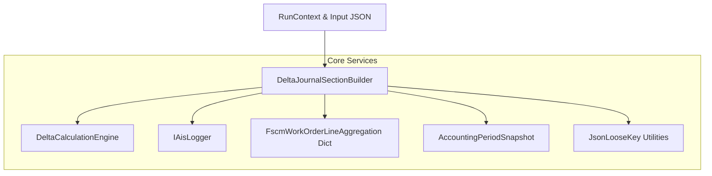
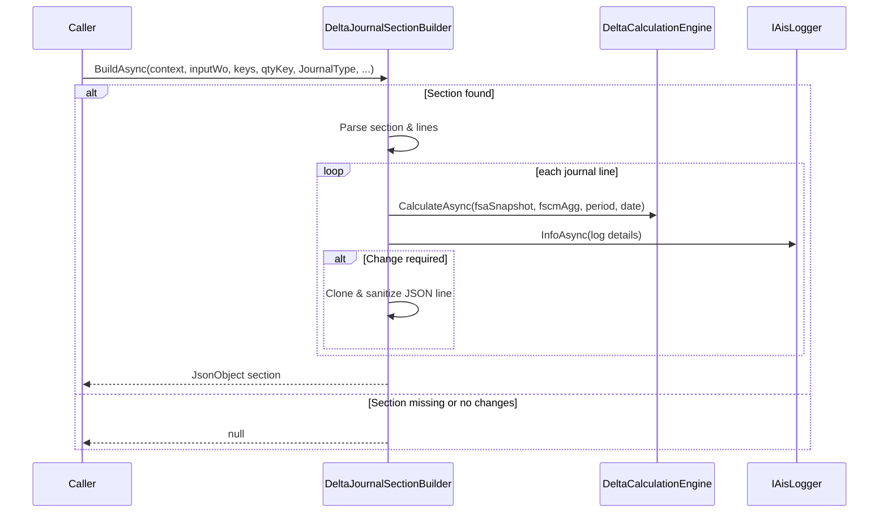

# ⚙️ Delta Journal Section Builder Feature Documentation

## Overview

The **DeltaJournalSectionBuilder** constructs delta payload sections for specific journal types by comparing incoming FSA snapshots with existing FSCM aggregations.

It identifies lines that require reversal, recreation, or no action, and assembles a trimmed JSON section for posting.

This builder ensures precise updates and reversals in closed or open accounting periods.

## Architecture Overview



## Component Structure

### Business Layer

#### **DeltaJournalSectionBuilder** (`src/Rpc.AIS.Accrual.Orchestrator.Core.Services/DeltaJournalSectionBuilder.cs`)

- **Purpose:** Build a delta **JsonObject** section for a journal type (Item, Expense, Hour).
- **Constructor:**- `DeltaJournalSectionBuilder(DeltaCalculationEngine deltaEngine, IAisLogger aisLogger)`
- Throws `ArgumentNullException` if dependencies are null.
- **Main Method:**

```csharp
  Task<JsonObject?> BuildAsync(
      RunContext context,
      JsonObject inputWo,
      string[] journalKeyCandidates,
      string qtyKey,
      JournalType jt,
      Guid woGuid,
      string? woNumber,
      IReadOnlyDictionary<Guid, FscmWorkOrderLineAggregation> aggDict,
      AccountingPeriodSnapshot period,
      DateTime todayUtc,
      Func<int> totalDeltaLines,
      Action incDelta,
      Action incReverse,
      Action incRecreate,
      CancellationToken ct
  )
```

- **Behavior:**- Locates the journal section by loose key matching.
- Iterates each line to build an **FsaWorkOrderLineSnapshot**.
- Calls `_deltaEngine.CalculateAsync(...)` to get a **DeltaDecision** and planned lines.
- Logs each decision via `_aisLogger.InfoAsync(...)`.
- Clones and sanitizes lines that require reversal or recreation.
- Stamps dates and dimension values according to period and journal type.
- Returns `null` if no lines require changes.

- **Key Responsibilities:**- **Section Discovery:** `FindFirstObjectLoose`, `FindJournalLinesArrayLoose`
- **Snapshot Assembly:** reading quantity, price, dimensions, dates
- **Delta Evaluation:** calling `DeltaCalculationEngine`
- **Line Transformation:** cloning, stripping unwanted fields, stamping reversals
- **Date Handling:** `ResolveOperationsDateUtc`, `ResolveWorkingDateUtcFromLineOrFallback`
- **Reversal Mapping:** `BuildReversalLineFromFscmSnapshot`

### Helper Methods

- **JSON Loose Parsing**- `HasAnyNodeLoose`, `GetDecimalLooseAny`, `GetStringLooseAny`
- **GUID & Decimal Parsing**- `GetWorkOrderLineGuid`, `TryParseDecimal`
- **Date Literal Handling**- `TryParseFscmDateLiteral`, `ToFscmDateLiteral`, `TryParseIsoUtc`
- **Dimension Display Value**- `TryParseDeptProdFromDimensionDisplayValue`, `BuildDefaultDimensionDisplayValue`
- **Payload Hygiene**- `RemoveLoose`, `CopyIfPresentLoose`, `SetOrAddLoose`

## Sequence Flow



## Error Handling

- **Constructor:** throws `ArgumentNullException` for null `deltaEngine` or `aisLogger`.
- **Line Parsing:** skips any line with invalid or missing **WorkOrderLineGuid**.
- **Date Parsing:** fallbacks to `todayUtc.Date` if all parsing attempts fail.

## Dependencies

- **DeltaCalculationEngine**: computes delta decisions.
- **IAisLogger**: logs detailed decisions for diagnostics.
- **FscmWorkOrderLineAggregation**: aggregated FSCM history per line.
- **FsaWorkOrderLineSnapshot**: incoming snapshot of FSA line state.
- **AccountingPeriodSnapshot**: identifies closed/open periods.
- **JsonLooseKey Utilities**: flexible JSON node access.

## Testing Considerations

- Scenario: **No journal section** → returns `null`.
- Scenario: **Empty journal lines** → returns `null`.
- Scenario: **Partial FSA update** (missing dims) → fallback to FSCM attributes.
- Scenario: **Item journal reversal** when period closed → reversed line dated to open period.
- Scenario: **Expense/Hour journal** ignores warehouse dimension.
- Scenario: **Zero FSAUnitPrice** treated as “unsupplied”.

## Key Classes Reference

| Class | Location | Responsibility |
| --- | --- | --- |
| DeltaJournalSectionBuilder | `.../Core/Services/DeltaJournalSectionBuilder.cs` | Builds delta JSON sections per journal type. |
| DeltaCalculationEngine | `.../Core/Domain/Delta` (injected) | Determines **DeltaDecision** and planned lines. |
| IAisLogger | `.../Core/Abstractions/IAisLogger.cs` | Logs informational events with context. |
| FscmWorkOrderLineAggregation | `.../Domain/Domain/Delta/FscmJournalAggregator.cs` | Aggregated FSCM journal line history and snapshots. |
| AccountingPeriodSnapshot | `.../Core/Domain` (injected) | Evaluates if a date falls in closed/open accounting periods. |
| JsonLooseKey | `.../Core/Utilities` | Provides loose JSON key access and parsing methods. |


---

💡 **Card Block: Key Dimension Rule**

```card
{
    "title": "Warehouse Dimension",
    "content": "Only Item journals trigger reversals based on Warehouse. Expense and Hour ignore this dimension."
}
```