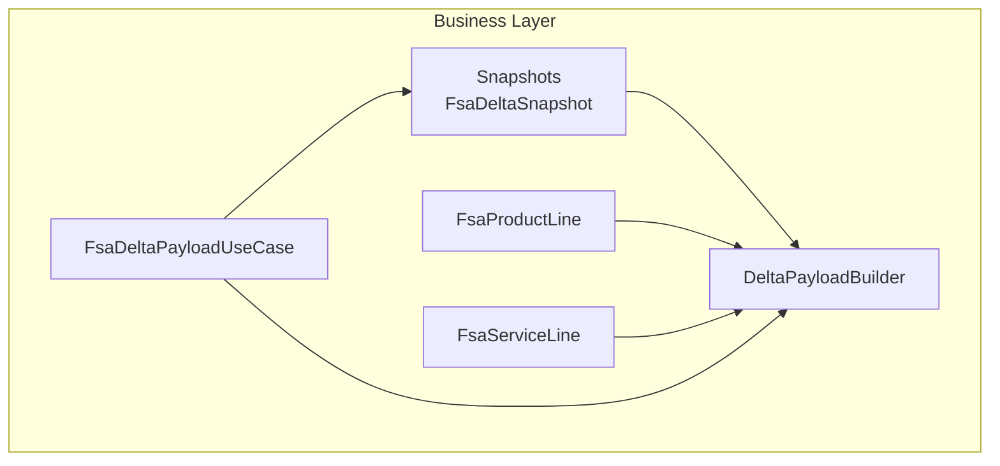

# DeltaPayloadBuilder Service Documentation

## 🎯 Overview

The **DeltaPayloadBuilder** transforms in-memory snapshots of Field Service (FSA) work order data into the JSON payload expected by the downstream Financials (FSCM) journal API. It aggregates product and service lines into distinct journal sections—Item, Expense, and Hour—applying business rules such as warehouse inclusion only on item lines. This builder supports both typed `FsaDeltaSnapshot` inputs and arbitrary snapshot types via reflection.

By centralizing payload composition, it enforces consistency across use cases (full fetch, single‐WO) and eliminates duplication. Business value comes from reliably generating valid delta payloads that drive accrual journal postings in FSCM.

## Architecture Overview



## Component Structure

### **DeltaPayloadBuilder** (`src/Rpc.AIS.Accrual.Orchestrator.Core.Services/DeltaPayloadBuilder.cs`)

- **Purpose:**- Compose the outbound JSON payload for FSCM journals from FSA snapshots.
- Support both `FsaDeltaSnapshot` and arbitrary snapshot types via reflection.
- Enforce warehouse‐and‐section rules (warehouse only in item journals).

- **Dependencies:**- Domain DTOs: `FsaDeltaSnapshot`, `FsaProductLine`, `FsaServiceLine` .
- System.Text.Json.Nodes for mutable JSON composition.
- Reflection for generic snapshot extraction.

#### Public Methods

| Method | Description | Returns |
| --- | --- | --- |
| BuildWoListPayload(snapshots, corr, runId, system?, triggeredBy?) | Build full JSON string payload from typed snapshots . | string |
| Build<TWorkOrder>(system, runId, corr, workOrders, triggeredBy?) | Compose a `JsonObject` payload without serialization, accepting any snapshot class via reflection . | JsonObject |
| ResolveJournalActionSuffixForTriggeredBy(triggeredBy) | Determine journal action suffix (Create | Post | Cancel | Billing Location Change) based on trigger source. | string |


#### Private Helpers

- **BuildWorkOrder**: Extracts header fields and assembles per‐WO `JsonObject`.
- **BuildItemJournal**, **BuildExpenseJournal**, **BuildHourJournal**: Create section nodes with `LineType` and ordered `JournalLines`.
- **BuildProductJournalLine**, **BuildServiceJournalLine**: Map domain line DTOs into JSON properties, handling:- Price fallbacks (`CalculatedUnitPrice` vs `UnitCost`)
- Date formatting to FSCM literal (`/Date(ms)/`)
- Conditional warehouse inclusion (only item lines)
- Removal of unwanted fields (e.g., `Site`, `ResourceId`).
- **GetLines**, **GetStringProp**, **GetGuidProp**, **GetDecimalProp**, **GetDateTimeProp**: Reflection utilities to retrieve properties by multiple candidate names.
- **BuildJournalDescription**, **ToBracedUpperGuidString**, **BuildDefaultDimensionDisplayValue**, **ToFscmDateLiteral**, **S**: Formatting utilities.

## 📦 Payload Structure

### Root Object

```jsonc
{
  "_request": {
    "System": "FieldService",
    "RunId": "...",
    "CorrelationId": "...",
    "WOList": [ /* WorkOrder objects */ ]
  }
}
```

### WorkOrder Object Properties

| Property | Type | Description |
| --- | --- | --- |
| WorkOrderGUID | string | Braced, uppercase GUID of the work order. |
| WorkOrderID | string | Work order number or identifier. |
| Company | string | Data area/legal entity ID. |
| SubProjectId | string | Subproject identifier. |
| CountryRegionId | string | Country or region code. |
| County | string | County name or code. |
| State | string | State or province. |
| DimensionDisplayValue | string | Combined department–product default dimension. |
| FSATaxabilityType | string | Taxability classification from FSA. |
| FSAWellAge | string | Well age attribute. |
| FSAWorkType | string | Work type attribute. |
| WOItemLines | object | Item journal section (if any). |
| WOExpLines | object | Expense journal section (if any). |
| WOHourLines | object | Hour journal section (if any). |


### Journal Section (`WOItemLines`, `WOExpLines`, `WOHourLines`)

Each section has:

| Property | Type | Description |
| --- | --- | --- |
| JournalDescription | string | Combined `<WorkOrderID> - <SubProjectId> - <Action>`. |
| LineType | string | `"Item"`, `"Expense"`, or `"Hour"`. |
| JournalLines | array | List of line JSON objects. |


#### JournalLine Fields (Item / Expense)

| Field | Type | Note |
| --- | --- | --- |
| WorkOrderLineGuid | string | Braced GUID of the line. |
| Currency | string | ISO currency code. |
| DimensionDisplayValue | string | Dept–Product dimension. |
| FSAUnitPrice | number | Unit price from FSA. |
| ItemId | string | Product/item number. |
| ProjectCategory | string | Category code. |
| JournalDescription | string | Inherited from section. |
| JournalLineDescription | string | Specific line description. |
| LineProperty | string | Non‐billable/billable property. |
| Quantity | number | Quantity or duration. |
| RPCCustomerProductReference | string | Customer reference. |
| RPCDiscountAmount/Percent | number | Discount values. |
| RPCMarkupPercent | number | Markup percent. |
| RPCOverallDiscountAmount/Percent | number | Overall discount. |
| RPCSurchargeAmount/Percent | number | Surcharge values. |
| RPMarkUpAmount | number | Markup amount. |
| TransactionDate / OperationDate | string | FSCM‐formatted date literal. |
| UnitAmount | number | Extended amount or unit amount. |
| UnitCost | number | Cost basis. |
| IsPrintable | string | `"Yes"` or `"No"`. |
| UnitId | string | Unit identifier. |
| Warehouse | string | **Item only** (removed for Expense/Hour). |


#### JournalLine Fields (Hour)

Same as above, replacing `Quantity` with `Duration` and no warehouse.

## 🛠️ Dependencies

- Rpc.AIS.Accrual.Orchestrator.Core.Domain:- `FsaDeltaSnapshot`, `FsaProductLine`, `FsaServiceLine` .
- System.Text.Json & System.Text.Json.Nodes
- System.Reflection for generic property access

## 🔍 Design Decisions

- **Reflection‐based typing**: `Build<TWorkOrder>` avoids compile-time coupling to `FsaDeltaSnapshot`.
- **Ordering**: Lines are sorted by `WorkOrderNumber`, then `LineId` to stabilize payloads.
- **Warehouse Rule**: Included only in Item journal; explicitly stripped from Expense & Hour payloads .
- **JournalAction Suffix**: Tolerant matching of trigger sources (Timer, AdHocBulk, Cancel, etc.) .

```card
{
    "title": "Warehouse Rules",
    "content": "Warehouse appears only in item journals; removed from expense and hour sections."
}
```

## 🧪 Testing Considerations

- **Empty Snapshots**: `BuildWoListPayload(Array.Empty<FsaDeltaSnapshot>(), corr, runId)` produces

```json
  {"_request":{"System":"FieldService","RunId":"...","CorrelationId":"...","WOList":[]}}
```

- **Section Absence**: Snapshots with only services should omit `WOItemLines` and `WOExpLines`.
- **Reflection Fallbacks**: Ensure property name variants (e.g., `WorkOrderNo` vs `msdyn_name`) are correctly recognized.

---

By encapsulating all journal JSON logic, **DeltaPayloadBuilder** centralizes outbound payload creation, ensuring that the orchestrator’s use cases generate consistent, valid, and maintainable payloads for FSCM journal posting.