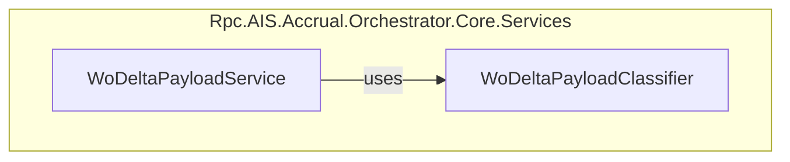

# WoDeltaPayloadClassifier Feature Documentation

## Overview

The **WoDeltaPayloadClassifier** is a core utility responsible for extracting and normalizing Work Order (WO) entries from a generic JSON payload. It provides tolerant reads and key-name normalization to handle variations in casing, spacing, and key formats. This ensures robust upstream processing in the Delta payload build pipeline, preventing failures due to inconsistent JSON structures.

By centralizing loose JSON parsing logic, this classifier promotes the Single Responsibility Principle (SRP) and decouples classification from payload transformation and output composition. It underpins the **WoDeltaPayloadService** by supplying a cleaned list of WO nodes and extracting key properties like GUIDs and string values.

## Architecture Overview

## Component Structure

### Business Layer

#### WoDeltaPayloadClassifier

**Path:** `src/Rpc.AIS.Accrual.Orchestrator.Core.Services/WoDeltaPayload/WoDeltaPayloadClassifier.cs`

- **Purpose:**- Locate and return the array of WO entries from a JSON root node.
- Extract GUIDs and arbitrary string fields with loose key matching.
- Normalize key names by stripping underscores, spaces, and casing differences.

- **Dependencies:**- `System.Text.Json.Nodes` for JSON DOM navigation.
- `System`, `System.Collections.Generic`, `System.Globalization`, `System.Text` for core utilities.

#### Methods

| Method | Signature | Description |
| --- | --- | --- |
| GetWoList | `List<JsonNode> GetWoList(JsonNode root)` | Returns all non-null WO nodes under `_request.WOList`, tolerating variant key names. |
| GetWorkOrderGuid | `Guid GetWorkOrderGuid(JsonObject woObj)` | Reads a `WorkOrderGUID` string loosely, normalizes braces, and parses it into a `Guid`. |
| GetStringLoose | `string? GetStringLoose(JsonObject obj, string key)` | Retrieves a JSON node by key loosely and returns its non-empty string value or `null`. |
| FindFirstObjectLoose | `JsonObject? FindFirstObjectLoose(JsonObject obj, params string[] candidates)` | Returns the first matching child object for any candidate key. |
| FindFirstNodeLoose | `JsonNode? FindFirstNodeLoose(JsonObject obj, params string[] candidates)` | Returns the first non-null node for any candidate key. |
| TryGetNodeLoose | `bool TryGetNodeLoose(JsonObject obj, string key, out JsonNode? node)` | Attempts exact then normalized key lookup; returns `true` if found. |
| TryGetStringLoose | `bool TryGetStringLoose(JsonObject obj, string key, out string? value)` | Wraps `TryGetNodeLoose` and ensures non-whitespace string content. |
| NormalizeKey | `string NormalizeKey(string s)` | Strips `_`, spaces, trims, and converts to lower-case. |
| NormalizeGuidString | `string? NormalizeGuidString(string? s)` | Trims whitespace and braces `{}` from GUID strings. |

All methods are `internal static`, indicating intended usage within the assembly.

## Loose JSON Helpers

This group of private methods underpins the tolerant parsing strategy:

- **Key Normalization:** Removes underscores/spaces and lowercases keys (`NormalizeKey`).
- **GUID Normalization:** Strips braces before parsing (`NormalizeGuidString`).
- **First-match Lookup:** Searches multiple candidate keys for objects or nodes.

By delegating to these helpers, `GetWoList`, `GetWorkOrderGuid`, and `GetStringLoose` achieve resilience against inconsistent payload formats.

## Integration Points

- **WoDeltaPayloadService** invokes:- `GetWoList` to enumerate work orders.
- `GetWorkOrderGuid` for each WO object.
- `GetStringLoose` to retrieve identifiers like `WorkOrderID`.

- **DeltaActivities** indirectly rely on classification when orchestrating payload rebuilds in job operations.

## Error Handling

- Invalid or missing root/_request/WOList nodes yield an empty list rather than throwing exceptions.
- Unparsable GUIDs return `Guid.Empty`.
- Whitespace or null JSON node values return `null`.

This fail-safe behavior prevents downstream errors in the delta build pipeline.

## Key Classes Reference

| Class | Location | Responsibility |
| --- | --- | --- |
| WoDeltaPayloadClassifier | `Core/Services/WoDeltaPayload/WoDeltaPayloadClassifier.cs` | Classifies and extracts WO nodes and properties with tolerant JSON reads. |

## Dependencies

- `System.Text.Json.Nodes` for DOM-based JSON parsing.
- Core .NET libraries (`System`, `System.Collections.Generic`, `System.Globalization`, `System.Text`).

## Testing Considerations

- Verify `GetWoList` handles missing or malformed `_request` and `WOList` keys.
- Test `GetWorkOrderGuid` with varied GUID formats (with/without braces, casing differences).
- Confirm `GetStringLoose` returns correct string or `null` for different whitespace scenarios.
- Simulate JSON with renamed or cased keys (e.g., `"Request"`, `"wolist"`) to ensure candidate matching.