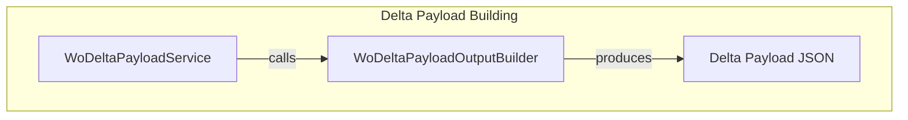

# WoDeltaPayloadOutputBuilder Feature Documentation

## Overview

The **WoDeltaPayloadOutputBuilder** provides static helpers to compose and manipulate the JSON output for Work Order delta payloads.

It encapsulates common operations to build an empty payload and to copy header fields loosely from one JSON object to another.

This improves single-responsibility adherence by extracting output-composition logic from the main delta service .

## Architecture Overview



## Component Structure

### Business Layer

#### **WoDeltaPayloadOutputBuilder** (`src/Rpc.AIS.Accrual.Orchestrator.Application/Features/Delta/WoDeltaPayload/WoDeltaPayload/WoDeltaPayloadOutputBuilder.cs`)

- **Purpose**- Extracts JSON output-composition logic from the delta payload service for improved maintainability and SRP.
- Supplies a canonical empty payload and loose key-based copy functionality.

- **Dependencies**- `System.Text.Json.Nodes.JsonObject` for JSON DOM manipulation
- `Rpc.AIS.Accrual.Orchestrator.Core.Utilities.JsonLooseKey` for case-insensitive, underscore-insensitive key lookup

- **Methods**

| Method | Signature | Description | Returns |
| --- | --- | --- | --- |
| BuildEmptyPayload | `internal static string BuildEmptyPayload()` | Returns the minimal JSON envelope for an empty WOList payload. | string |
| CopyIfPresentLoose | `internal static void CopyIfPresentLoose(JsonObject src, JsonObject dst, string key)` | If `src` contains a value for `key` (loose match), deep-clone it into `dst` under `key`. | void |


```csharp
internal static string BuildEmptyPayload() =>
    "{\"_request\":{\"WOList\":[]}}";

internal static void CopyIfPresentLoose(JsonObject src, JsonObject dst, string key)
{
    if (JsonLooseKey.TryGetNodeLoose(src, key, out var v) && v is not null)
        dst[key] = v.DeepClone();
}
```

## Data Models

#### Empty Delta Payload JSON Structure

The payload produced by `BuildEmptyPayload()` conforms to:

```json
{
  "_request": {
    "WOList": []
  }
}
```

- **_request**: Envelope for the payload
- **WOList**: An array of work order objects (empty in this case)

## Key Classes Reference

| Class | Location | Responsibility |
| --- | --- | --- |
| WoDeltaPayloadOutputBuilder | `.../Features/Delta/WoDeltaPayload/WoDeltaPayload/WoDeltaPayloadOutputBuilder.cs` | JSON output-composition helpers for delta payloads |


## Error Handling

- **Loose Key Lookup**

`CopyIfPresentLoose` uses `JsonLooseKey.TryGetNodeLoose` to avoid exceptions when the source JSON lacks the specified key or when casing/formatting differs.

## Dependencies

- **Rpc.AIS.Accrual.Orchestrator.Core.Utilities.JsonLooseKey**

Provides methods to perform case- and formatting-insensitive key lookups on `JsonObject`.

- **System.Text.Json.Nodes**

Enables dynamic JSON creation and manipulation via the DOM API.

```card
{
    "title": "Implementation Note",
    "content": "This builder is invoked by WoDeltaPayloadService to standardize empty-payload creation and header-field copying."
}
```

## Testing Considerations

- Verify `BuildEmptyPayload` returns syntactically valid JSON matching the empty-WOList contract.
- Test `CopyIfPresentLoose`:- Copies and deep-clones present properties under various casing and underscore variations.
- Does nothing (and throws no exception) when the key is absent or value is null.