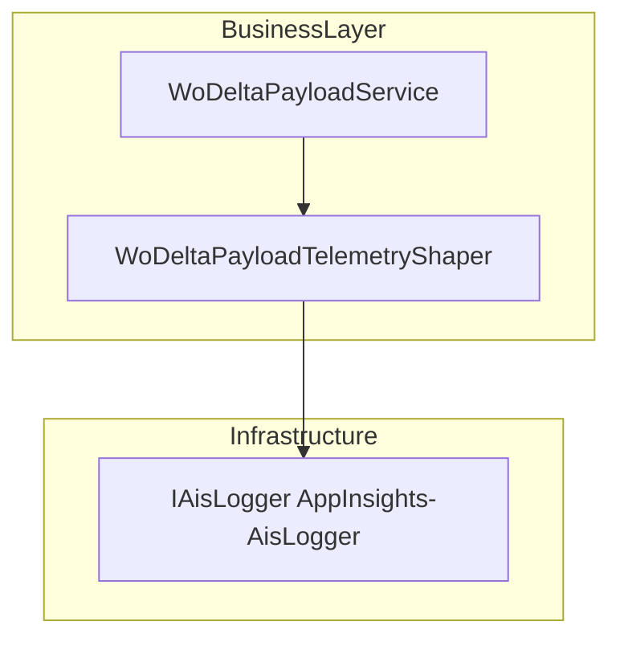
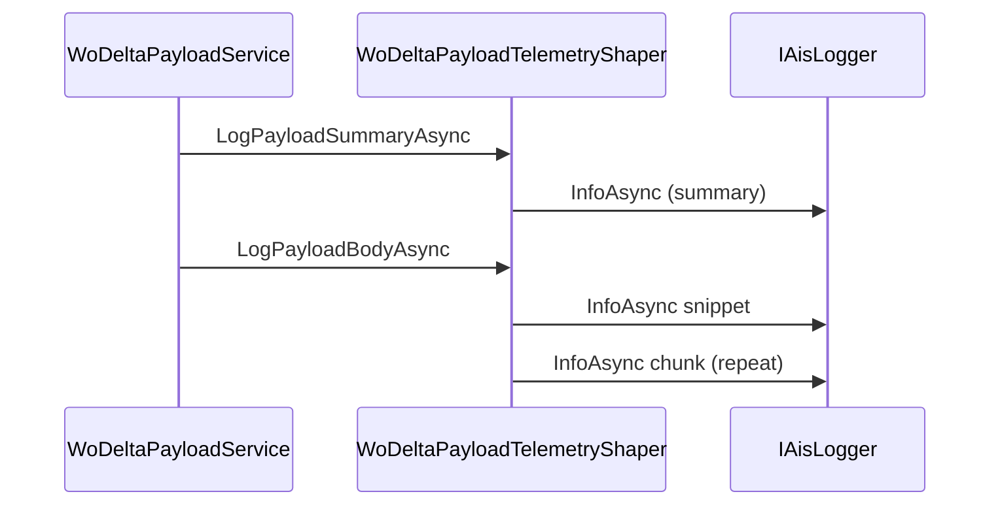

# WO Delta Payload Telemetry Shaper Feature Documentation

## Overview 📖

The **WoDeltaPayloadTelemetryShaper** class centralizes telemetry logging for work-order delta payloads. It encapsulates logic to record both a concise summary (length and SHA-256 hash) and the full or partial payload body in configurable chunks. By offloading logging details from the payload service, it improves single-responsibility compliance and makes telemetry behavior consistent across delta-building scenarios .

This component is used by the `WoDeltaPayloadService` to report:

- **Payload summaries** after inbound FSA payload reception and after delta construction.
- **Payload bodies** selectively, based on diagnostic settings, to avoid overwhelming the telemetry sink with large JSON .

## Architecture Overview 📊

## Component Structure

### Business Layer

#### **WoDeltaPayloadTelemetryShaper** (`src/Rpc.AIS.Accrual.Orchestrator.Application/Features/Delta/WoDeltaPayload/WoDeltaPayload/WoDeltaPayloadTelemetryShaper.cs`)

- **Purpose**: Shape and emit telemetry for delta payloads without polluting payload-building logic.
- **Constructor**- Ensures non-null `IAisLogger` and `IAisDiagnosticsOptions`.
- Throws `ArgumentNullException` if dependencies are missing .

- **Key Methods**

| Method | Description | Returns |
| --- | --- | --- |
| `LogPayloadSummaryAsync` | Logs payload metadata: type, work-order identifiers, length, and SHA-256 hex digest | `Task` |
| `LogPayloadBodyAsync` | Logs a snippet and optional chunks of the full JSON payload, based on diagnostics | `Task` |
| `Sha256Hex` | Computes the SHA-256 hash of a string and returns uppercase hex representation | `string` |

## Usage Flow

## Dependencies 🔗

- **IAisLogger** (from `Rpc.AIS.Accrual.Orchestrator.Core.Abstractions`): abstracts telemetry sink.
- **IAisDiagnosticsOptions** (from same namespace): provides `PayloadSnippetChars` and `PayloadChunkChars` limits.
- **RunContext** (`Rpc.AIS.Accrual.Orchestrator.Core.Domain`): carries `RunId` and `CorrelationId`.
- **CancellationToken**: supports cooperative cancellation.
- **System.Security.Cryptography.SHA256** & **System.Text.Encoding.UTF8**: for computing payload hash.

## Error Handling

- **Constructor** validates injections and fails fast with `ArgumentNullException`.
- `LogPayloadBodyAsync` returns immediately if `json` is null or empty to avoid unnecessary logging.
- Diagnostic clamp operations ensure snippet and chunk sizes remain within safe bounds.

## Key Classes Reference

| Class | Location | Responsibility |
| --- | --- | --- |
| WoDeltaPayloadTelemetryShaper | `.../WoDeltaPayload/WoDeltaPayloadTelemetryShaper.cs` | Shaping and emitting telemetry for delta payload JSON |

## Testing Considerations

- Validate constructor throws on null `IAisLogger` or `IAisDiagnosticsOptions`.
- Verify `LogPayloadSummaryAsync` calls `InfoAsync` with correct `PayloadLength` and uppercase SHA-256.
- Test snippet extraction honors `_diag.PayloadSnippetChars` limits.
- Test chunking loop honors `_diag.PayloadChunkChars` and emits correct number of chunks.
- Confirm `LogPayloadBodyAsync` skips body logging when `PayloadChunkChars` ≤ 0.