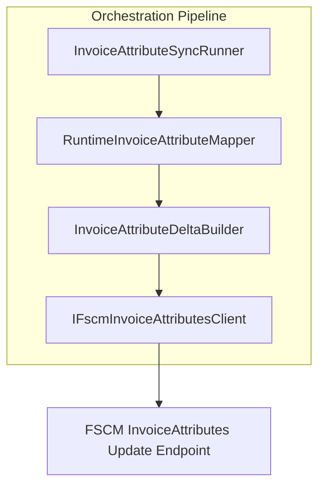

# Invoice Attribute Delta Builder Feature Documentation

## Overview

The **Invoice Attribute Delta Builder** computes differences between invoice attributes supplied by Field Service (FS) and the current values stored in FSCM. By comparing FS-provided values against an in-memory FSCM snapshot, it generates a minimal set of updates—only attributes that have changed. This reduces unnecessary calls to the FSCM update endpoint and ensures data consistency.

Key business value:

- **Efficiency**: Sends only changed attributes to FSCM.
- **Reliability**: Handles case-insensitive schema matching, avoiding missed updates due to casing differences.
- **Auditability**: Reports counts of mapped, changed, unchanged, and missing attributes.

This component fits into the **Invoice Attributes** synchronization pipeline. It is invoked by the orchestration runner after mapping FS keys to FSCM schema names and before calling the FSCM update client.

## Architecture Overview



- **InvoiceAttributeSyncRunner**: Reads FS payload, extracts raw attributes, and triggers the pipeline.
- **RuntimeInvoiceAttributeMapper**: Builds a mapping from FS keys to FSCM schema names.
- **InvoiceAttributeDeltaBuilder**: Compares FS values against FSCM snapshot, producing a delta.
- **IFscmInvoiceAttributesClient**: Applies updates to FSCM via HTTP.

## Component Structure

### **InvoiceAttributeDeltaBuilder** (`src/Rpc.AIS.Accrual.Orchestrator.Application/Features/InvoiceAttributes/Services/InvoiceAttributes/InvoiceAttributeDeltaBuilder.cs`)

- **Purpose**- Compare FS attribute dictionary against FSCM current values.
- Normalize keys and values in a case-insensitive manner.
- Produce a list of `InvoiceAttributePair` updates for attributes that differ.

- **Public Types**- **DeltaResult**: Encapsulates the update pairs and counts .

- **Public Method**

| Method | Description | Returns |
| --- | --- | --- |
| BuildDelta(fsAttributes, fsKeyToFscmName, fscmCurrentByName) | Generates a delta by comparing FS values to FSCM snapshot values, counting mapped, changed, unchanged, and missing entries. | `DeltaResult` |


#### BuildDelta Signature

```csharp
public static DeltaResult BuildDelta(
    IReadOnlyDictionary<string, string?> fsAttributes,
    IReadOnlyDictionary<string, string> fsKeyToFscmName,
    IReadOnlyDictionary<string, string?> fscmCurrentByName)
```

- **fsAttributes**: Raw FS-provided key/value pairs.
- **fsKeyToFscmName**: Mapping from FS keys to FSCM schema names.
- **fscmCurrentByName**: FSCM snapshot values by schema name.

### Helper Methods

| Method | Responsibility |
| --- | --- |
| **BuildCaseInsensitiveValueMap** | Creates a case-insensitive map of FS keys to values, preferring the first non-empty value on duplicates. |
| **BuildCaseInsensitiveSnapshotMap** | Builds a CI map of FSCM schema names to a `SnapshotEntry` (canonical name + value), preferring non-empty values. |
| **NormKey** | Trims and upper-cases a key for normalization. |
| **NormalizeValue** | Trims whitespace and converts empty/null to `null`. |
| **StringEquals** | Compares two strings ignoring case. |


## Data Models

### DeltaResult

Encapsulates the outcome of a delta comparison.

| Property | Type | Description |
| --- | --- | --- |
| **Updates** | `IReadOnlyList<InvoiceAttributePair>` | List of attribute updates to send to FSCM. |
| **MappedCount** | `int` | Total FS keys mapped to FSCM names. |
| **ChangedCount** | `int` | Number of attributes whose values differ. |
| **UnchangedCount** | `int` | Number of attributes with identical values. |
| **MissingInFscmSnapshotCount** | `int` | FS keys with no matching FSCM snapshot entry. |


### SnapshotEntry (internal)

A helper struct pairing a canonical schema name with its value.

```csharp
private readonly record struct SnapshotEntry(string CanonicalName, string? Value);
```

### InvoiceAttributePair (domain model)

Represents a name/value pair for FSCM attribute updates.

```csharp
public sealed record InvoiceAttributePair(string AttributeName, string? AttributeValue);
```

## Integration Points

- **RuntimeInvoiceAttributeMapper**: Supplies `fsKeyToFscmName` mappings.
- **IFscmInvoiceAttributesClient.GetCurrentValuesAsync**: Provides `fscmCurrentByName`.
- **InvoiceAttributeDeltaBuilder.BuildDelta**: Produces `DeltaResult`.
- **IFscmInvoiceAttributesClient.UpdateAsync**: Consumes `DeltaResult.Updates` to post changes.

## Error Handling

- Null or empty input dictionaries are defaulted to empty maps; no exceptions are thrown.
- Missing snapshot entries are counted in `MissingInFscmSnapshotCount` rather than erroring.
- All comparisons use safe normalization to avoid null reference errors.

## Dependencies

- **Namespaces**- `System`
- `System.Collections.Generic`
- `System.Linq`
- `Rpc.AIS.Accrual.Orchestrator.Core.Domain.InvoiceAttributes`

- **Domain Services**- `RuntimeInvoiceAttributeMapper`
- `IFscmInvoiceAttributesClient`

## Key Classes Reference

| Class | Location | Responsibility |
| --- | --- | --- |
| InvoiceAttributeDeltaBuilder | `.../InvoiceAttributeDeltaBuilder.cs` | Computes deltas between FS and FSCM attribute values. |
| DeltaResult | Nested in `InvoiceAttributeDeltaBuilder`. | Holds update pairs and counts. |
| SnapshotEntry | Nested record struct in `InvoiceAttributeDeltaBuilder`. | Stores canonical schema name + value. |
| InvoiceAttributePair | `Core.Domain.InvoiceAttributes/InvoiceAttributePair.cs` | Domain contract for attribute name/value. |
| RuntimeInvoiceAttributeMapper | `.../RuntimeInvoiceAttributeMapper.cs` | Builds FS-to-FSCM key mappings at runtime. |
| IFscmInvoiceAttributesClient | `Core.Abstractions/IFscmInvoiceAttributesClient.cs` | Interface for FSCM invoice attribute operations. |


## Testing Considerations

Key scenarios to validate:

- **Case-insensitive matching**: FS keys with varied casing still map correctly.
- **Empty or missing values**: Blank FS values vs. missing snapshot entries.
- **Canonical naming**: Updates use FSCM’s original schema names when available.
- **Count accuracy**: `MappedCount`, `ChangedCount`, `UnchangedCount`, and `MissingInFscmSnapshotCount` reflect actual comparisons.

---

🎯 This documentation covers the **Invoice Attribute Delta Builder**, explaining its role, API, data models, dependencies, and how it integrates into the invoice attribute synchronization workflow.