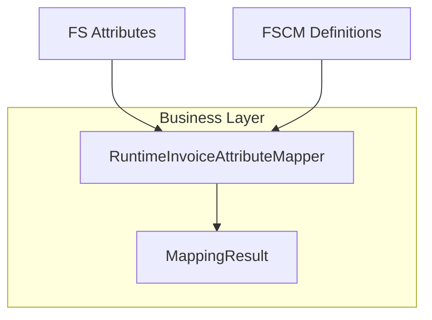

# Runtime Invoice Attribute Mapper Feature Documentation

## Overview

The **RuntimeInvoiceAttributeMapper** service dynamically aligns Finance System (FS) attribute keys with Financial Supply Chain Management (FSCM) attribute names at runtime. It processes raw FS attribute keys against in-memory FSCM definitions and produces:

- A mapping of FS keys to valid FSCM schema names
- A list of FS keys that couldn’t be mapped

This capability ensures that only active, recognized attributes are passed downstream for delta computation and eventual updates. It decouples mapping logic from static configuration, adapting to changes in FSCM’s “attribute table” without redeployment.

## Architecture Overview 🚀



- **FS Attributes**: Raw key/value pairs extracted from Dataverse work order headers.
- **FSCM Definitions**: List of `InvoiceAttributeDefinition` (active FSCM attributes).
- **RuntimeInvoiceAttributeMapper**: Service that builds `MappingResult`.
- **MappingResult**: Output containing the FS→FSCM map and unmapped keys.

## Component Structure

### 1. Business Layer

#### **RuntimeInvoiceAttributeMapper**

`src/Rpc.AIS.Accrual.Orchestrator.Application/Features/InvoiceAttributes/Services/InvoiceAttributes/RuntimeInvoiceAttributeMapper.cs`

- **Purpose & Responsibilities**- Generate a runtime mapping between FS attribute keys and FSCM attribute names.
- Filter out inactive or undefined FSCM attributes.
- Identify FS keys with no matching FSCM definition.

- **Key Methods**

| Method | Signature | Description |
| --- | --- | --- |
| BuildMapping | `static MappingResult BuildMapping(IReadOnlyDictionary<string,string?> fsAttributes, IReadOnlyList<InvoiceAttributeDefinition> fscmDefinitions)` | Processes inputs and returns both the mapping and list of unmapped FS keys. |
| NormalizeKey | `internal static string NormalizeKey(string s)` | Strips non-alphanumeric characters and lowercases input for fuzzy matching of attribute names. |


- **Nested Types**

```csharp
  public sealed record MappingResult(
      IReadOnlyDictionary<string, string> FsKeyToFscmName,
      IReadOnlyList<string> UnmappedFsKeys
  );
```

- **FsKeyToFscmName**: Map of original FS keys to canonical FSCM names.
- **UnmappedFsKeys**: FS keys that lacked any direct or normalized match.

## Data Models

### MappingResult

| Property | Type | Description |
| --- | --- | --- |
| FsKeyToFscmName | `IReadOnlyDictionary<string,string>` | Dictionary mapping FS keys to FSCM schema names. |
| UnmappedFsKeys | `IReadOnlyList<string>` | List of FS keys without a corresponding FSCM attribute name. |


## Integration Points

- **InvoiceAttributeSyncRunner**:

Uses `BuildMapping` to align raw FS attributes before computing deltas.

- **InvoiceAttributeDeltaBuilder**:

Consumes the FS→FSCM map to compare FS values against current FSCM snapshot.

- **InvoiceAttributeDefinition** (Domain):

Provides the list of active attribute names and types used for mapping.

## Example Usage

```csharp
var fsAttributes = new Dictionary<string,string?> {
    ["rpc_WellName"] = "Alpha-1",
    ["rpc_unknown"] = "Value"
};

var fscmDefinitions = new List<InvoiceAttributeDefinition> {
    new("rpc_wellname", type: "String", active: true),
    new("SomeOtherAttr", type: "Number", active: true)
};

var result = RuntimeInvoiceAttributeMapper.BuildMapping(fsAttributes, fscmDefinitions);

// result.FsKeyToFscmName:
//   "rpc_WellName" -> "rpc_wellname"
// result.UnmappedFsKeys:
//   [ "rpc_unknown" ]
```

## Key Classes Reference

| Class | Location | Responsibility |
| --- | --- | --- |
| RuntimeInvoiceAttributeMapper | `.../Services/InvoiceAttributes/RuntimeInvoiceAttributeMapper.cs` | Builds runtime mapping of FS keys to FSCM names using active definitions. |
| MappingResult | Nested in `RuntimeInvoiceAttributeMapper` | Holds the mapping dictionary and list of unmapped FS keys. |
| InvoiceAttributeDefinition | `Rpc.AIS.Accrual.Orchestrator.Core.Domain.InvoiceAttributes/InvoiceAttributeDefinition.cs` | Defines FSCM attribute metadata (name, type, active flag). |


## Testing Considerations

- **Direct Match**: FS key exactly matches an active FSCM name (case-insensitive).
- **Normalized Match**: Match after stripping non-alphanumeric characters and lowercasing.
- **Unmapped Keys**: Keys with no match should appear in `UnmappedFsKeys`.
- **Empty Inputs**: Passing `null` or empty collections should yield empty mappings and unmapped lists without exceptions.