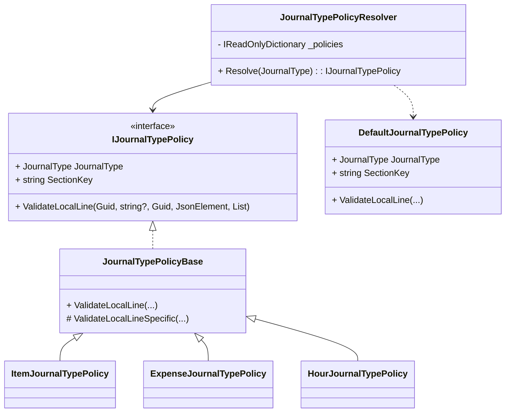

# Journal Policies Feature Documentation

## Overview

The **Journal Policies** feature encapsulates journal-type specific validations for work order payloads in the Orchestrator application. It ensures each journal line meets required business rules before processing. By abstracting common and type-specific rules, this design promotes maintainability and extensibility as new journal types emerge.

## Architecture Overview

```mermaid
flowchart TB
    subgraph Business Layer
        IPolicy[IJournalTypePolicy Interface]
        BasePolicy[JournalTypePolicyBase]
        ItemPolicy[ItemJournalTypePolicy]
        ExpPolicy[ExpenseJournalTypePolicy]
        HourPolicy[HourJournalTypePolicy]
        Resolver[JournalTypePolicyResolver]
        DefaultPolicy[DefaultJournalTypePolicy]
    end

    IPolicy <|.. BasePolicy
    BasePolicy <|-- ItemPolicy
    BasePolicy <|-- ExpPolicy
    BasePolicy <|-- HourPolicy
    Resolver -->|resolves| IPolicy
    Resolver ..> DefaultPolicy
```

## Component Structure

### 1. Policy Contracts

#### **IJournalTypePolicy** (`src/Rpc.AIS.Accrual.Orchestrator.Core.Services.JournalPolicies/IJournalTypePolicy.cs`)

Defines the contract for journal-type behavior.

- **JournalType** (`JournalType`): Identifies the journal category.
- **SectionKey** (`string`): JSON payload section name (e.g., `"WOExpLines"`).
- **ValidateLocalLine**: Enforces in-process validations for a single line.

#### **JournalTypePolicyBase** (`JournalTypePolicyBase.cs`)

Provides shared logic for all journal types and delegates type-specific checks.

- Ensures **Quantity** is numeric.
- Calls `ValidateLocalLineSpecific` for additional rules.

### 2. Specific Journal Policies

| Policy Class | JournalType | SectionKey | Purpose |
| --- | --- | --- | --- |
| `ItemJournalTypePolicy` | Item | WOItemLines | Validates item-journal lines (ItemId, Warehouse, etc.) |
| `ExpenseJournalTypePolicy` | Expense | WOExpLines | Validates expense-journal lines (ProjectCategory, UnitId, etc.) |
| `HourJournalTypePolicy` | Hour | WOHourLines | Validates hour-journal lines (Duration, LineProperty, etc.) |


#### **ExpenseJournalTypePolicy** 🛡️ (`ExpenseJournalTypePolicy.cs`)

Enforces required fields on expense journal lines:

- **ProjectCategory** must be present.
- **LineProperty** (`ProjectLinePropertyId`) is required.
- At least one of **UnitCost**, **ProjectSalesPrice**, **SalesPrice** must be numeric.
- **UnitId** is mandatory.

```csharp
protected override void ValidateLocalLineSpecific(
    Guid woGuid, string? woNumber, Guid lineGuid,
    JsonElement line, List<WoPayloadValidationFailure> invalidFailures)
{
    if (string.IsNullOrWhiteSpace(WoPayloadJson.TryGetString(line, "ProjectCategory")))
        invalidFailures.Add(…);
    // ...similar blocks for LineProperty, SalesPrice, UnitId
}
```

Helper method for price fields:

```csharp
private static bool TryGetAnyNumber(JsonElement obj, out decimal value, params string[] keys)
{
    foreach (var k in keys)
        if (WoPayloadJson.TryGetNumber(obj, k, out value))
            return true;
    value = 0m;
    return false;
}
```

#### **ItemJournalTypePolicy** (`ItemJournalTypePolicy.cs`)

Validates item journals for `ItemId`, `Warehouse`, `UnitId`, plus sale price and quantity .

#### **HourJournalTypePolicy** (`HourJournalTypePolicy.cs`)

Validates hour journals for `Duration`, `LineProperty`, `UnitId`, and sale price .

### 3. Policy Resolution

#### **JournalTypePolicyResolver** (`JournalTypePolicyResolver.cs`)

Selects the appropriate policy instance based on `JournalType`.

- Builds a **JournalType→IJournalTypePolicy** map from DI.
- **Resolve** returns a registered policy or a **DefaultJournalTypePolicy** fallback.

#### **DefaultJournalTypePolicy**

No-op policy ensuring a valid `SectionKey` when no registration exists.

- Maps `JournalType` to default section names
- `ValidateLocalLine` is a silent pass.

## Class Diagram



## Key Classes Reference

| Class | Location | Responsibility |
| --- | --- | --- |
| IJournalTypePolicy | Features/Journals/Policies/JournalPolicies/IJournalTypePolicy.cs | Defines journal-specific validation contract |
| JournalTypePolicyBase | Features/Journals/Policies/JournalPolicies/JournalTypePolicyBase.cs | Implements common validation (quantity) |
| ItemJournalTypePolicy | Features/Journals/Policies/JournalPolicies/ItemJournalTypePolicy.cs | Validates item journal lines |
| ExpenseJournalTypePolicy | Features/Journals/Policies/JournalPolicies/ExpenseJournalTypePolicy.cs | Validates expense journal lines |
| HourJournalTypePolicy | Features/Journals/Policies/JournalPolicies/HourJournalTypePolicy.cs | Validates hour journal lines |
| JournalTypePolicyResolver | Features/Journals/Policies/JournalPolicies/JournalTypePolicyResolver.cs | Resolves policy by `JournalType` |
| DefaultJournalTypePolicy | Nested in JournalTypePolicyResolver.cs | Safe fallback when no policy is registered |


## Dependencies

- **Rpc.AIS.Accrual.Orchestrator.Core.Domain.JournalType** enum for journal identification.
- **WoPayloadJson** helpers for JSON property extraction.
- **WoPayloadValidationFailure** and **ValidationDisposition** types for error reporting.

## Testing Considerations

- Unit tests should verify each policy’s `ValidateLocalLineSpecific` against valid and invalid payloads.
- Ensure `JournalTypePolicyResolver.Resolve` returns fallback for unregistered types.